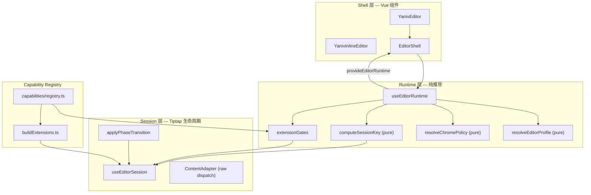
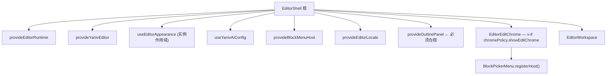

# Yaniv Editor 架构设计

Vue 3 + Tiptap 3 富文本编辑器库的目标架构。

> **状态（已完成）**：本文档描述的重构已于 v0.1.0 完成并落地；后续代码清理（死代码、无人 barrel、`EditorShell` locale 与 `normalizeLocaleCode` 对齐等）亦已完成。对外 API 与迁移说明以 `CHANGELOG.md` 为准；用户文档以 `docs/` 与 `README.md` 为准。下文「删除清单」「实施顺序」「grep 验收」等章节均为**历史验收记录**，不是待办事项。

## 实施约定

- **本文档（仓库根目录 `ARCHITECTURE.md`）是重构的唯一实施依据。**
- 所有代码改动、目录结构、API breaking、验收标准，均以本文档为准；不得偏离或另起一套设计。
- Cursor Plan（`.cursor/plans/*.plan.md`）仅作任务跟踪；若与本文档冲突，**以本文档为准**。
- 实施方式：单 feature branch 一次性彻底重构，不保留旧逻辑与补丁代码。

---

## 重构原则

1. **不兼容旧逻辑** — 不为旧 API、旧 watch、旧补丁保留分支或 fallback。
2. **删除而非包裹** — 旧代码直接删除；禁止新旧并存、临时 adapter、`@deprecated` 导出。
3. **单一实现路径** — 每个 concern 只保留一条代码路径。
4. **一次性交付** — 单 feature branch 全量 merge，仓库中不存在半新半旧状态。
5. **不留兜底尾巴** — 禁止 `v-if` + `v-show` + `classList.toggle` + CSS 四重表达同一语义。唯一例外：session `loading` 骨架层使用 `v-show="sessionStatus !== 'loading'"` 隐藏 Chrome 容器（骨架与 Chrome 是不同语义的两层，不构成双保险；见 Session 章节）。使用 `v-show` 的 chrome 容器内子组件**必须能处理 `editor === null` 状态**，不得假设 editor 已就绪。

---

## 分层总览



> **`useEditorRuntime` 与纯函数的关系**：`runtime/` 目录下有三类代码：
>
> - **纯函数**（零 Vue 依赖）：`resolveEditorProfile`、`resolveChromePolicy`、`computeSessionKey`、`mergeFeatures`；可单独单测。
> - **composable**：`useEditorRuntime` — 接收 reactive props，用 `computed` 包装纯函数，调用 `provideEditorRuntime`。
> - **模块顶层约束**：`runtime/` 与 `capabilities/registry.ts` 模块顶层**禁止访问 `window` / `document`**；扩展内部访问 DOM 必须在 ProseMirrorPlugin view 阶段（client-only 时点）。

| 层           | 职责                                         | 禁止包含                                  |
| ------------ | -------------------------------------------- | ----------------------------------------- |
| **Shell**    | 布局、slot、expose、BlockMenuHost 注册       | `initEditor`、散落 watch、命令式 DOM      |
| **Runtime**  | 从 props 推导 profile / chromePolicy / gates | Tiptap 实例操作、`window`/`document` 访问 |
| **Session**  | sessionKey 重建、phase 切换、受控内容同步    | UI 显隐逻辑                               |
| **Registry** | 能力定义 → 扩展 + toolbar + chrome 映射      | 从 `@/components` import NodeView         |

---

## 配置模型（Runtime Profile）

对外 props 收敛为四条轴，在 Runtime 层合并为不可变 `EditorRuntimeProfile`：

| 轴         | Props                                   | 作用                             |
| ---------- | --------------------------------------- | -------------------------------- |
| Phase      | `mode: 'edit' \| 'preview'`             | 编辑态 vs 只读展示               |
| Preset     | `preset: 'basic' \| 'full' \| 'notion'` | 默认 features + layout + toolbar |
| Appearance | `appearance` + `colorMode`              | 视觉皮肤与亮暗色                 |
| Overrides  | `features`                              | 显式关闭/开启能力                |

**Preview 不是特殊分支**：`mode=preview` 仅使 `chromePolicy.showEditChrome=false` 且 `editable=false`；扩展注册集合不因 phase 变化。

### Preset 默认能力映射（`resolveEditorProfile` 核心逻辑）

`features` prop 为 Overrides 层，与 Preset 默认值**合并**（Overrides 优先）。各 Preset 的默认 feature 集合：

| feature         | basic | full | notion | 说明                                           |
| --------------- | :---: | :--: | :----: | ---------------------------------------------- |
| `table`         |  ❌   |  ✅  |   ✅   | **Breaking**：旧 basic 默认 ✅，重构后默认关闭 |
| `image`         |  ✅   |  ✅  |   ✅   |                                                |
| `video`         |  ❌   |  ✅  |   ❌   | **Breaking**：旧 basic 默认 ✅，重构后默认关闭 |
| `math`          |  ❌   |  ✅  |   ❌   |                                                |
| `ai`            |  ❌   |  ❌  |   ❌   | 始终需要显式 Overrides 开启                    |
| `formatPainter` |  ❌   |  ✅  |   ❌   |                                                |
| `outline`       |  ❌   |  ✅  |   ❌   |                                                |
| `searchReplace` |  ❌   |  ✅  |   ❌   |                                                |
| `officePaste`   |  ❌   |  ✅  |   ❌   |                                                |
| `slashCommand`  |  ❌   |  ❌  |   ✅   | notion preset 核心体验                         |
| `dragHandle`    |  ❌   |  ❌  |   ✅   | notion preset 核心体验                         |

> **实施要求**：`resolveEditorProfile` 中的 Preset 默认值以此表为准，禁止在其他地方散落 preset 判断。Overrides 中值为 `true` 开启、`false` 强制关闭（即使 preset 默认开启也关闭）、`undefined` 继承 preset 默认。
>
> **Breaking 声明**：旧版 `basic` preset 默认开启 `table` / `video`；重构后 `basic` 收紧为"最简编辑器"，仅保留 image。集成方若需保留旧行为，必须显式传 `:features="{ table: true, video: true }"`。此变更须列入 `CHANGELOG.md` "BREAKING CHANGES" 顶部。

### `mergeFeatures` 规范实现（Normative）

`{ ...preset, ...overrides }` spread 会让 `overrides[key] = undefined` **覆盖** preset 的值，与"undefined 继承"承诺不符。必须使用下列规范实现：

```ts
// runtime/resolveEditorProfile.ts
function mergeFeatures(
  preset: Required<FeatureConfig>,
  overrides?: FeatureConfig,
): Required<FeatureConfig> {
  if (!overrides) return { ...preset };
  const merged = { ...preset };
  for (const key of Object.keys(overrides) as Array<keyof FeatureConfig>) {
    const v = overrides[key];
    if (v !== undefined) merged[key] = v; // undefined 不覆盖
  }
  return merged;
}
```

**禁止**在 `resolveEditorProfile` 以外的地方再写 feature 合并逻辑。

---

## ChromePolicy

`resolveChromePolicy(profile, layout, gates)` 是唯一 Chrome 显隐来源。Shell 模板**只读 chromePolicy**，禁止出现 `isPreviewMode` 或 `mode === 'preview'`。

```ts
// 完整签名：
resolveChromePolicy(
  profile: EditorRuntimeProfile,
  layout: PresetLayout,
  gates: ExtensionGates,
): ResolvedChromePolicy
```

> **设计决策：`outlinePanelExpanded` 不进 chromePolicy。**
> 原因：chromePolicy 的语义是"由 props 推导的显隐策略"，是纯函数输出。`outlinePanelExpanded` 是用户 uiState，属于运行时可变状态；若混入 chromePolicy，每次用户展开/收起大纲都会使整个 chromePolicy 引用失效，触发不必要的子组件重渲。
> **大纲展开状态由 `provideOutlinePanel` 持有，模板直接读取 `outlinePanel.expanded.value`，与 chromePolicy 完全解耦。**

| 字段                     | edit                 | preview |
| ------------------------ | -------------------- | ------- |
| `showEditChrome`         | true                 | false   |
| `showHeader`             | layout.header        | false   |
| `showFooter`             | layout.footer        | false   |
| `showOutlineRail`        | `gates.outline`      | false   |
| `showContextualToolbars` | uiFlags              | false   |
| `showBlockPicker`        | slash \|\| drag      | false   |
| `showStatusHints`        | layout.shortcutHints | false   |

> **大纲两层语义**：`showOutlineRail` 决定**容器是否渲染**（gates 与 phase 决定），`outlinePanel.expanded` 决定**面板是否展开**（用户 uiState，由 `provideOutlinePanel` 持有）。
>
> **`outlinePanelExpanded` 默认值**：保持与旧实现一致 `true`（即 outline gate 开启时默认展示大纲）。**不变更默认值**——此前曾考虑改成 `false`（用户主动展开），评估后认为属于隐性 UX 破坏，撤回。如需改变默认行为应另作 minor 版本变更并显式列入 CHANGELOG。

### ChromePolicy 的 host 区分（discriminated union）

`ResolvedChromePolicy` 是 Full 与 Inline 两套 chrome 字段的并集，但 `showOutlineRail`、`showBlockPicker`、`showStatusHints` 在 inline host 下永远 `false`，冗余字段易误用。规范实现：

```ts
interface BaseChromePolicy {
  host: EditorShellHost;
  showEditChrome: boolean;
}

interface FullChromePolicy extends BaseChromePolicy {
  host: "full";
  showHeader: boolean;
  showFooter: boolean;
  showOutlineRail: boolean;
  showContextualToolbars: boolean;
  showBlockPicker: boolean;
  showStatusHints: boolean;
}

interface InlineChromePolicy extends BaseChromePolicy {
  host: "inline";
  showInlineToolbar: boolean;
  showLinkBubble: boolean;
}

export type ResolvedChromePolicy = FullChromePolicy | InlineChromePolicy;
```

Shell 模板通过 `policy.host === 'full'` narrowing 后才能访问 host-specific 字段，编译器锁死"Inline 模板不得引用 `showOutlineRail`"。

---

## ExtensionTier 与 Phase 策略

能力在 Registry 中标注 tier，决定注册与 phase 行为：

| Tier            | 示例                                   | 注册            | Phase                                                         |
| --------------- | -------------------------------------- | --------------- | ------------------------------------------------------------- |
| `core`          | StarterKit、Link、Placeholder          | gate 开即注册   | 无影响                                                        |
| `content`       | Image、Video、Table、Math、OfficePaste | gate 开即注册   | preview 仍展示                                                |
| `interaction`   | DragHandle、Slash、FormatPainter       | gate 开即注册   | 不卸载；由 `buildExtensions` **统一**注入 `withEditableGuard` |
| `auxiliary`     | SearchReplace                          | gate 开即注册   | phase 切换时由订阅方清状态（见下）                            |
| `chromeCoupled` | Outline                                | gate + 宿主 ctx | 无影响                                                        |

> **OfficePaste 归 `content` tier**：OfficePaste 是 paste pipeline 扩展，不依赖 chrome 渲染，paste 行为与 phase 无关；宿主回调通过 `ctx.officePaste` 注入（不进 sessionKey）。`chromeCoupled` 仅保留真正依赖滚动容器等外部宿主 ctx 的扩展（如 Outline）。

#### interaction 扩展的统一守卫

`interaction` tier 扩展在 preview 下需要两类守卫**协同**工作（不是"双保险"，是**不同抽象层的分工**）：

| 层       | 机制                                                                   | 作用                                               |
| -------- | ---------------------------------------------------------------------- | -------------------------------------------------- |
| 事件入口 | `ctx.isEditable` 短路 `onDragStart` / `onActivate` / `handleDOMEvents` | UX：拖拽 ghost / 光标提示根本不出现                |
| 事务兜底 | `filterTransaction` 拦截 `docChanged` 事务                             | 正确性：防止任何代码路径（含程序化命令）绕过事件层 |

> **澄清**：DragHandle / SlashCommand 完成操作时**也会**派发 docChanged 事务（节点移动、块插入），事务守卫并非"无效"，而是 UX 较差（用户看到 ghost 但松手被吞）；事件入口短路负责 UX，事务守卫负责正确性。两层都不可省。

**事务兜底实现**（`capabilities/transactionGuard.ts`，由 `buildExtensions` 对 `interaction` tier 调用）：

```ts
// capabilities/transactionGuard.ts
import { Plugin } from "@tiptap/pm/state";

/**
 * 标记给程序化派发的 tr，用于绕过守卫（如 ContentAdapter.setContent、phase 切换内部命令）。
 * 使用 Symbol 而非字符串：避免与第三方扩展同名 meta key 冲突，且不会被 JSON 序列化误命中。
 */
export const BYPASS_GUARD_META: symbol = Symbol("yaniv:bypassGuard");

/**
 * 通过 addOptions 注入 isEditable getter，避免依赖 `this.editor`（Tiptap 在
 * addProseMirrorPlugins 阶段对 this.editor 的绑定时序在不同版本下不稳定）。
 * 由 buildExtensions 在包装时通过 ctx.isEditable 注入。
 */
function withTransactionGuard(ext: Extension, isEditable: Readonly<Ref<boolean>>): Extension {
  return ext.extend({
    addProseMirrorPlugins() {
      const parent = this.parent?.() ?? [];
      return [
        ...parent,
        new Plugin({
          filterTransaction: (tr) => {
            if (!tr.docChanged) return true; // 只读 tr 放行（选区、装饰）
            if (tr.getMeta(BYPASS_GUARD_META)) return true; // 程序化派发放行
            return isEditable.value; // ← 走外部 Ref，不依赖 this.editor
          },
        }),
      ];
    },
  });
}
```

> **Tiptap 版本约束**：本方案要求 Tiptap ≥ 3.0.0，并以"`this.editor` 在 `addProseMirrorPlugins` 中可能为 undefined"为前置假设；故所有跨阶段需要的引用一律通过 `ctx.*` 外部注入，不依赖 `this.editor`。

**事件入口守卫**：

```ts
// BuildExtensionsCtx 提供响应式标志：
interface BuildExtensionsCtx {
  isEditable: Readonly<Ref<boolean>>;
  // ...
}

// 扩展内部示例（DragHandle）：
extensions: (ctx) => [
  DragHandle.configure({
    onDragStart: (view) => {
      if (!ctx.isEditable.value) return false;
      // ... 正常逻辑
    },
  }),
];
```

`interaction` tier 扩展**禁止**在注册时自行硬编码 `view.editable` 检查，一律通过 `ctx.isEditable` + `withTransactionGuard` 统一管理。

```ts
// 对所有 interaction tier 能力应用事务守卫（DOM 事件类扩展同时消费 ctx.isEditable）
if (cap.tier === "interaction") {
  resolvedExtensions.push(
    ...cap.extensions(ctx).map((ext) => withTransactionGuard(ext, ctx.isEditable)),
  );
}
```

> **`BYPASS_GUARD_META` 调用方约定**（以下场景的事务必须打 meta，否则 preview 下会被守卫拦掉）：
>
> - `ContentAdapter` 内部所有 raw dispatch：必须用 `tr.setMeta(BYPASS_GUARD_META, true)`
> - `applyPhaseTransition` 切换过程中由 Session 层主动派发的命令
> - 外部 `initialContent` 受控回写路径
>
> 宿主业务代码通过 `editor.commands.*` 触发的事务**不打 meta**，因业务命令在 preview 下本就应被拦截。

#### Phase 切换机制与 ContentAdapter 的 raw dispatch（关键修订）

**A1 修订 — ContentAdapter 必须走 raw transaction**：

Tiptap 的 `editor.commands.setContent(...)` 走 CommandManager 链，上层无法为其插入 `BYPASS_GUARD_META`。在 preview 模式下调用 `commands.setContent` 会被 `withTransactionGuard` 静默吞掉，受控回写失效。

`ContentAdapter` 必须绕过 commands，直接构造 raw transaction：

```ts
// core/session/contentAdapter.ts
import { BYPASS_GUARD_META } from "@/capabilities/buildExtensions";

export interface SetContentOptions {
  /** 受控回写默认不进 undo 栈；宿主显式传 true 才记录历史 */
  addToHistory?: boolean;
  /** 受控回写默认 source='external'，订阅方可借此区分用户输入与外部回写 */
  source?: "external" | "phase" | "session-rebuild";
}

function setContent(
  editor: Editor,
  content: JSONContent | string,
  options: SetContentOptions = {},
): void {
  const view = editor.view;

  let doc: ProseMirrorNode;
  try {
    doc =
      typeof content === "string"
        ? DOMParser.fromSchema(view.state.schema).parse(htmlToElement(content))
        : view.state.schema.nodeFromJSON(content);
  } catch {
    console.warn("[ContentAdapter] Failed to parse content, using empty doc");
    doc = view.state.schema.nodes.doc.create(null, [view.state.schema.nodes.paragraph.create()]);
  }

  const tr = view.state.tr
    .setMeta(BYPASS_GUARD_META, true) // ← 必须打 meta（Symbol）
    .setMeta("addToHistory", options.addToHistory ?? false) // ← 默认 false，caller 可显式覆盖
    .setMeta("yaniv:source", options.source ?? "external")
    .replaceWith(0, view.state.doc.content.size, doc.content);

  view.dispatch(tr);
}
```

**所有通过 ContentAdapter 的路径均走此函数，禁止在 ContentAdapter 中出现 `editor.commands.setContent`。**

#### 受控 `initialContent` 回写的去重契约（Normative）

外部 `initialContent` watcher 触发 `ContentAdapter.setContent` 前，**必须**做幂等检查，否则会因"emit → 父组件回写 → 子组件再 setContent"产生光标跳动和重复事务：

```ts
// core/session/useControlledContent.ts
const lastEmittedSignature = ref<string | null>(null);

// 用户输入路径：onUpdate 内更新签名
editor.on("update", ({ editor }) => {
  lastEmittedSignature.value = computeSignature(editor.getJSON(), host);
  emit("update", editor.getJSON());
});

// 受控回写路径：签名相同则直接 return
watch(
  () => props.initialContent,
  (next) => {
    if (!editor.value) return; // session 未 ready
    const incoming = computeSignature(next, host);
    if (!incoming) return;
    if (incoming === lastEmittedSignature.value) return; // 防 emit 回流
    if (incoming === computeSignature(editor.value.getJSON(), host)) return; // 防 no-op 重写
    ContentAdapter.setContent(editor.value, next, { source: "external" });
  },
);
```

`computeSignature(content, host)`：

- `host === 'full'`：`JSON.stringify(json)` 的稳定形式（key 顺序由 ProseMirror schema 决定，已稳定）；
- `host === 'inline'`：`html.trim()` 直接比对字符串。

**禁止**在 ContentAdapter 内做签名缓存——签名由 Session 层持有，ContentAdapter 是无状态写入工具。

**A2 修订 — phase 切换顺序：emit 先，setEditable 后**：

切到 preview 时，订阅方的清理命令（`cancelFormatPainting`、`clearSearch` 等）在 `editable=true` 状态下执行，才不会被守卫拦截。反之，切回 edit 时先 setEditable 再 emit。

```ts
// Session 层 —— applyPhaseTransition
function applyPhaseTransition(
  editor: Editor,
  prevPhase: EditorPhase,
  nextPhase: EditorPhase,
  emitter: PhaseChangeEmitter,
): void {
  if (nextPhase === "preview") {
    // ① 先派发清理事件（此时 editable=true，清理命令不被守卫拦截）
    emitter.emit({ from: prevPhase, to: nextPhase, editor });
    // ② 再关闭编辑
    editor.setEditable(false);
  } else {
    // ① 先开启编辑
    editor.setEditable(true);
    // ② 再通知订阅方（初始化逻辑在 editable=true 时执行）
    emitter.emit({ from: prevPhase, to: nextPhase, editor });
  }
}
```

> **规则**：**edit → preview 切换链路：先 emit，再 `setEditable(false)`；preview → edit 链路：先 `setEditable(true)`，再 emit。** 订阅方一律假设在 editable 允许时刻执行自身命令。

#### Session 未 ready 时的 phase 切换 buffer（关键修订）

`applyPhaseTransition` 直接操作 `editor`，但 sessionStatus 状态机里 `ready → loading` 期间 `editor.value === null`。若用户同时翻 `preset`（触发 rebuild）和 `mode`（触发 phase 切换），phase watcher 进入时 editor 为 null，直接调 `editor.setEditable` 会 NPE。

**规范**：Session 层持有 `pendingPhase: EditorPhase | null` 状态字段，phase 切换链路统一走 `requestPhaseTransition(nextPhase)`，由 Session 内部根据 `editor.value` 是否就绪决定立即执行还是 buffer：

```ts
// useEditorSession 内部
let lastAppliedPhase: EditorPhase | null = null;
let pendingPhase: EditorPhase | null = null;

function requestPhaseTransition(nextPhase: EditorPhase): void {
  if (!editor.value || status.value !== 'ready') {
    pendingPhase = nextPhase;                                      // ← buffer，等 rebuild 完成 flush
    return;
  }
  applyPhaseTransition(editor.value, lastAppliedPhase ?? nextPhase, nextPhase, phaseEmitter);
  lastAppliedPhase = nextPhase;
}

// rebuild 成功后统一 flush 初始 phase + 可能 buffer 的 pending phase
async function rebuild() {
  // ... 创建 editor ...
  editor.value = new Editor({ ... editable: profile.value.mode === 'edit', ... });
  status.value = 'ready';

  // 用 profile.mode 作初始 phase 基线（mode=preview 初始挂载也走这条）
  const targetPhase = pendingPhase ?? profile.value.mode;
  pendingPhase = null;
  if (lastAppliedPhase !== targetPhase) {
    applyPhaseTransition(editor.value, lastAppliedPhase ?? targetPhase, targetPhase, phaseEmitter);
    lastAppliedPhase = targetPhase;
  } else {
    // 即使 phase 不变也派发一次 "ready" 事件，让 auxiliary 扩展自洽初始化
    phaseEmitter.emit({ from: null, to: targetPhase, editor: editor.value, reason: 'ready' });
  }
}

// watch 入口：profile.mode 变化只调 requestPhaseTransition，不直接操作 editor
watch(() => profile.value.mode, (mode) => requestPhaseTransition(mode));
```

**`PhaseChangeEvent` 类型扩充**：

```ts
interface PhaseChangeEvent {
  from: EditorPhase | null; // null 表示首次 ready emit
  to: EditorPhase;
  editor: Editor;
  /** 触发原因：'mode-change' | 'ready'（session rebuild 后初始同步） */
  reason: "mode-change" | "ready";
}
```

> **规则**：
>
> - 订阅方禁止假设 `event.from` 一定非 null；`reason === 'ready'` 表示这是 session 重建后的首次同步，订阅方应做 idempotent 初始化（而非 `clearSearch` 这种破坏性清理）。
> - Phase 切换链路一律走 `requestPhaseTransition`，**禁止** Shell 层直接调用 `editor.setEditable`。

```ts
// Shell 层（EditorShell）订阅：
onPhaseChange(({ to, reason }) => {
  if (reason === "ready") return; // 首次 ready 不需要 hide
  if (to === "preview") blockMenuHost.hide();
});

// auxiliary 扩展（SearchReplace / FormatPainter）订阅：
onPhaseChange(({ to, editor, reason }) => {
  if (reason === "ready") return; // 首次 ready 不做清理，由扩展自身 onCreate 处理
  if (to === "preview") {
    editor.commands.clearSearch?.();
    editor.commands.cancelFormatPainting?.();
  }
});
```

`onPhaseChange` 注册接口由 `useEditorSession` 暴露，通过 provide/inject 传递给各订阅方。

**生命周期规范**：

```ts
// onPhaseChange 返回 off 函数；订阅在 EditorShell 整个生命周期内持久有效，
// 不随 session 重建（sessionKey 变化）失效。
const offPhaseChange = onPhaseChange(({ to, editor }) => { ... });

// 调用方必须在 onBeforeUnmount 中取消订阅，防止内存泄漏：
onBeforeUnmount(() => offPhaseChange());
```

规则：

1. 订阅时机：在 `setup()` 或 `onMounted` 中注册均可，session 尚未 ready 时注册的订阅会在首次 phase 切换时触发
2. session 重建（sessionKey 变化）**不会**使订阅失效，无需重新注册
3. **必须调用 `off` 函数**取消订阅；composable 内部通过 `onBeforeUnmount` 自动注册 off 是推荐写法

| 触发                | Session 层动作                             | 各层钩子响应                     |
| ------------------- | ------------------------------------------ | -------------------------------- |
| edit → preview      | emit `phase:change` → `setEditable(false)` | Shell hide blockMenu；扩展清状态 |
| preview → edit      | `setEditable(true)` → emit `phase:change`  | —                                |
| sessionKey 变化     | destroy → 快照 → create                    | —                                |
| 外部 initialContent | 签名去重 → ContentAdapter.setContent       | —                                |

---

## Session 与 sessionKey

### sessionKey 包含

- **Full**：extensionGates 签名、locale、outline 相关 gate 签名
- **Inline**：toolbar 签名、extraExtensions id、placeholder、影响 schema 的 editorProps

### sessionKey 不包含

- phase、appearance、colorMode
- 受控内容回写
- upload / gallery / templates / aiConfig 等回调（由 `integrationProps` 响应式下发 Chrome）

### sessionKey 签名计算规范（Normative）

extensionGates 签名必须**同时包含** gate 开关布尔与**影响 ProseMirror schema 的 capability 选项**，不得仅用布尔串：

```ts
// runtime/computeSessionKey.ts
function computeSessionKey(
  profile: EditorRuntimeProfile,
  host: EditorShellHost,
  locale: LocaleCode,
  capabilities: ReadonlyArray<CapabilityDefinition>,
): string {
  const enabledCaps = capabilities
    .filter((c) => !c.featureKey || profile.gates[c.featureKey])
    .filter((c) => (host === "inline" ? !!c.inlineToolbarSlugs?.length : true))
    .sort((a, b) => a.order - b.order);

  const gateIds = enabledCaps.map((c) => c.id).join(",");

  // schemaSignature：仅影响 ProseMirror schema 注册的选项（如表格列数限制、heading levels）
  // 影响行为但不影响 schema 的选项（如回调函数）不进签名
  const schemaSignatures = enabledCaps
    .map((c) => c.schemaSignature?.(profile) ?? "")
    .filter(Boolean)
    .join("|");

  return `${host}|${locale}|${gateIds}|${schemaSignatures}`;
}
```

**Capability 类型中必须声明 `schemaSignature`**：

```ts
interface CapabilityDefinition {
  id: string;
  tier: ExtensionTier;
  order: number;
  featureKey?: keyof FeatureConfig;
  /** 影响 ProseMirror schema 的因子，变化时触发 session rebuild */
  schemaSignature?: (profile: EditorRuntimeProfile) => string;
  extensions: (ctx: BuildExtensionsCtx) => AnyExtension[] | Promise<AnyExtension[]>;
  fullToolbarSlugs?: string[];
  inlineToolbarSlugs?: string[];
  chrome?: string[];
}
```

### 异步与竞态

`buildExtensions` 为 async（如 math 懒加载）。`useEditorSession` 使用 generation 计数：过期 async 结果 discard，不赋值 editor。暴露 `sessionStatus: 'idle' | 'loading' | 'ready' | 'error'` 与 `retrySession()`。

#### generation 计数的双重职责

generation 同时承担两个角色，必须显式区分：

1. **rebuild 串行化**：同一组件内 sessionKey 连续变化时，每次 +1；async resolve 后比对 generation，stale 结果 discard。
2. **销毁标志**：`onBeforeUnmount` 时 generation +1 **并设置 `disposed = true`**。任何 in-flight 的 `buildExtensions` resolve 后必须先检查 `disposed`，若为 true 立即 return，**绝不允许创建孤儿 editor**。

```ts
// useEditorSession 伪代码（A3 修订：含 content 快照步骤）
let generation = 0;
let disposed = false;
let contentSnapshot: JSONContent | null = null;

async function rebuild() {
  const myGen = ++generation;
  status.value = 'loading';

  const extensions = await buildExtensions(host, ctx);
  if (disposed || myGen !== generation) return;  // ← 双重检查

  // 使用快照内容（sessionKey 变化前已在 pre flush 阶段快照）
  const initialContent = contentSnapshot ?? EMPTY_DOC;
  contentSnapshot = null;  // 消费后清空

  editor.value = new Editor({ extensions, content: initialContent, ... });
  status.value = 'ready';
}

// sessionKey 变化时的处理（在 watch 回调的同步部分完成快照与 destroy）
watch(sessionKey, (newKey, oldKey) => {
  if (!oldKey || !newKey || newKey === oldKey) return;

  // ① 同步快照内容（editor 尚未 destroy；getJSON 是纯读取，零副作用）
  if (editor.value) {
    contentSnapshot = editor.value.getJSON();
  }

  // ② 同步 destroy 旧 editor，立即切换 editor.value = null（chrome 模板由 sessionStatus 控制 v-show）
  editor.value?.destroy();
  editor.value = null;

  // ③ 异步 rebuild
  void rebuild();
}, { flush: 'pre' });

onBeforeUnmount(() => {
  disposed = true;
  generation += 1;        // 让任何 in-flight resolve 都失效
  editor.value?.destroy();
  editor.value = null;
});
```

> **A3 修订说明**：sessionKey 变化时必须在 destroy 之前同步调用 `editor.getJSON()` 做快照，否则 destroy 后无法取得内容。快照在 watch 回调的同步部分完成，早于任何 async 操作。
>
> **`flush: 'pre'` 而非 `'sync'` 的取舍**：
>
> - `flush: 'sync'` 会让 watcher 在 reactive setter 同步阶段触发，期间执行 `editor.destroy()` 这种非纯副作用会破坏 Vue 调度顺序，并使其他还在执行的 watcher / setup 看到 `editor === null` 但 props 已变化的中间态；
> - `flush: 'pre'`（Vue 3 默认值）在组件更新前异步触发，已经早于 EditorContent 子组件 unmount 看到 `editor.value === null` 的 patch，足以保证 `getJSON()` 在旧 editor 还可读时执行；
> - 唯一前置约束：sessionKey 变化的 watcher 回调内**禁止再写其他 reactive ref**（避免循环触发）；快照只取、不派发。
>
> **关闭某 capability 时（如关闭 table），新 schema 不认识对应节点 → 静默丢失，by design。**此行为须列入 `CHANGELOG.md`。

#### sessionStatus 状态机

| from      | event             | to        | editor.value                                   |
| --------- | ----------------- | --------- | ---------------------------------------------- |
| `idle`    | mount             | `loading` | `null`                                         |
| `loading` | build success     | `ready`   | new Editor                                     |
| `loading` | build fail        | `error`   | `null`                                         |
| `ready`   | sessionKey change | `loading` | `null`（先快照→destroy，与 skeleton 占位配合） |
| `error`   | `retrySession()`  | `loading` | `null`                                         |
| 任意      | unmount           | `idle`    | `null`（disposed=true）                        |

> sessionKey 变化时**先快照→destroy 旧 editor → 进 loading → skeleton 占位 → ready**，不保留旧 editor 做"无缝切换"（避免新旧扩展 schema 冲突 + 内存峰值）。

#### sessionStatus: 'loading' 期间的 UI 策略

sessionKey 变化触发 destroy → rebuild，此期间 `editor = null`，禁止用 `v-if="editor && ..."` 直接卸载 Chrome 组件（会产生白屏闪烁）。**唯一允许使用 `v-show` 的场景**：

```vue
<!-- EditorShell 模板 -->
<div v-show="sessionStatus !== 'loading'" class="yaniv-editor__chrome">
  <EditorEditChrome v-if="chromePolicy.showEditChrome" />
  <!-- ... -->
</div>
<!-- loading 期间显示占位，尺寸与编辑区等高，避免布局抖动 -->
<div v-if="sessionStatus === 'loading'" class="yaniv-editor__skeleton" />
<div v-if="sessionStatus === 'error'" class="yaniv-editor__error">
  {{ sessionError }} <button @click="retrySession">重试</button>
</div>
```

`retrySession()` 语义：重新执行完整的 `buildExtensions` → create 流程，不复用上次扩展列表。`error` 状态下暴露 `sessionError: string | null` 供宿主展示失败原因；连续失败不做退避（调用方负责限速）。

### Teardown 顺序

**`editor.destroy()` 必须在 `onBeforeUnmount` 中调用**，不得放入 `onUnmounted`。原因：ProseMirror/Tiptap 的 `destroy()` 需要 unmount 各 NodeView 实例（NodeView 要访问自身 DOM 节点、解绑事件监听器）；`onUnmounted` 触发时 Vue 已将组件 DOM 从页面移除，此时调用 `destroy()` 会触发 `Cannot read properties of null` 报错并造成事件监听器泄漏。

正确顺序（均在 `onBeforeUnmount` 阶段，DOM 仍在）：

1. **Session（`onBeforeUnmount`，同步入口，内部 async）**：
   - `blockMenuHost.hide()` — 同步，先关弹层
   - `editor.destroy()` — 同步，ProseMirror 解绑 DOM 事件
   - `editor = null` — 同步，切断 provide 引用
   - `void nextTick()` — 可选：若需等待 Vue 渲染清理，fire-and-forget 即可

2. **Shell（`onBeforeUnmount`，同步）**：
   - 调用 `offPhaseChange()` 取消所有 `onPhaseChange` 订阅
   - Appearance composable 的所有 listener / cleanup **在 composable 内部完成**，Shell 不需要任何手动 teardown 调用（见 Appearance 章节）

> Session 的 `useEditorSession` composable 通过 Vue 内部 `onBeforeUnmount` 自动注册销毁逻辑，Shell 无需手动调用；两者通过 provide/inject 共享 `editor` ref，Shell 读到 `null` 即视为已销毁。

---

## Provide / Inject 树

核心 context **必须挂在 EditorShell 根**（永不被 preview `v-if` 切掉）：



BlockMenuHost：Shell 根 provide 接口；BlockPicker 在 mount 时 register，扩展通过 host 调用，**禁止** `blockPickerMenuRef`。

**BlockMenuHost 接口签名（Normative）**：

```ts
interface BlockMenuHost {
  /** BlockPickerMenu 在 mount 时调用，传入 null 时表示卸载 */
  registerInstance(instance: BlockMenuInstance | null): void;
  /** 触发斜杠命令激活 */
  activate(state: SlashCommandState): void;
  /** 触发 DragHandle + 插入菜单 */
  openInsert(context: BlockInsertContext): void;
  /** 隐藏菜单 */
  hide(): void;
  /** 更新斜杠命令查询词 */
  updateQuery(query: string): void;
}
```

当 `instance === null`（未注册或已卸载）时，host 的所有方法**静默 no-op**，不抛错。这是 SlashCommand / DragHandle 在 chrome 不可见时的兜底。

**BlockPicker 生命周期契约（Normative）**：

```ts
// BlockPickerMenu.vue
const host = inject(blockMenuHostKey)!;
onMounted(() => host.registerInstance(api));
onBeforeUnmount(() => host.registerInstance(null));
```

`registerInstance(null)` 必须在 `onBeforeUnmount` 阶段调用——`v-if="chromePolicy.showBlockPicker"` 切换为 false 时 Vue 会卸载 BlockPicker，此时若不主动 deregister，SlashCommand 扩展后续触发 `host.activate(...)` 会调到指向已卸载组件的旧 instance 引用，引发"action 触发但无菜单弹出"的隐形失效。

实施 grep（必须有命中）：

```bash
rg "host\.registerInstance\(null\)" src/components/tools/block-menu/
```

> **`provideOutlinePanel` 必须挂在 EditorShell 根**，不得沉入 `EditorWorkspace`。原因：大纲展开状态由其持有，preview 模式下 Workspace 内部组件可能不渲染，若 provide 在子树则 inject 返回 `undefined`。

---

## Capability Registry

**唯一能力真相源**，替代：

- `resolveExtensionGates.ts`
- `resolveInlineExtensionGates`
- `editorCapabilityMap.ts`
- `coreExtensions.ts` / inline 独立 builder

每条 capability 定义：

```ts
{
  id: 'table',
  tier: 'content',
  order: 40,                    // ProseMirror 扩展顺序
  featureKey: 'table',
  schemaSignature: () => 'table',   // 影响 schema，变化需 rebuild
  extensions: (ctx) => [...],
  fullToolbarSlugs: ['table'],
  inlineToolbarSlugs: ['table'],
  chrome: ['tableToolbar'],
}
```

### `buildExtensions` 规范实现（Normative）

```ts
// capabilities/buildExtensions.ts
async function buildExtensions(
  host: EditorShellHost,
  ctx: BuildExtensionsCtx,
): Promise<Extension[]> {
  const enabled = CAPABILITIES.filter((c) =>
    host === "inline" ? c.id.startsWith("inline-") : !c.id.startsWith("inline-"),
  )
    .filter((c) => {
      if (host === "inline") {
        if (c.inlineAlways) return true;
        if (c.id === "inline-placeholder") return !!ctx.inlinePlaceholder;
        if (!c.inlineToolbarSlugs?.length) return false;
        return c.inlineToolbarSlugs.some((slug) => ctx.gates[slug] === true);
      }
      if (!c.featureKey) return true;
      return ctx.gates[c.featureKey] === true;
    })
    .sort((a, b) => a.order - b.order);

  const result: Extension[] = [];
  for (const cap of enabled) {
    const exts = await cap.extensions(ctx);
    if (cap.tier === "interaction") {
      result.push(...exts.map((ext) => withTransactionGuard(ext, ctx.isEditable)));
    } else {
      result.push(...exts);
    }
  }
  return result;
}
```

此函数同时服务 Full / Inline，通过 `host` 过滤 capability、通过 `tier` 决定是否包装守卫，**禁止在 Full / Inline 各自维护独立的扩展 builder**。

NodeView（如 TableCellWithBackground）迁入 `extensions/`，禁止 `extensions/` import `@/components/`。

### Inline gates 推导规则（Normative）

Full 编辑器的 `gates: ExtensionGates` 由 `profile.features` 推导。**Inline 编辑器没有 `features` prop**，gates 来源是 `toolbar: InlineToolbarConfig` 配置。为避免在 Full / Inline 之间维护两套判断逻辑，统一在 Capability Registry 中声明 `inlineToolbarSlugs`，并由 `resolveInlineGates` 推导出 gate 对象：

```ts
interface CapabilityDefinition {
  // ...
  /** Full 编辑器下用 features[featureKey] 推导 gate；Inline 不使用 */
  featureKey?: keyof FeatureConfig;
  /** Inline 编辑器下用 toolbar 的这些 slug 中任一为 true 时 gate 开启；Full 不使用 */
  inlineToolbarSlugs?: ReadonlyArray<keyof InlineToolbarConfig>;
  // ...
}

// runtime/resolveInlineGates.ts
function resolveInlineGates(
  toolbar: InlineToolbarConfig,
  capabilities: ReadonlyArray<CapabilityDefinition>,
): ExtensionGates {
  const gates = {} as Record<string, boolean>;
  for (const cap of capabilities) {
    if (!cap.inlineToolbarSlugs?.length) continue; // 仅声明 inline slug 的 capability 参与
    const enabled = cap.inlineToolbarSlugs.some((slug) => toolbar[slug] === true);
    if (cap.featureKey) gates[cap.featureKey] = enabled;
    else gates[cap.id] = enabled; // 无 featureKey 的 capability 用 id 作 gate key
  }
  return gates as ExtensionGates;
}
```

**单一规则**：`gates[capability]` 在 Full 下由 `profile.features[featureKey]` 决定，在 Inline 下由 `toolbar[inlineToolbarSlugs].some(true)` 决定；除此之外**不得**存在第三种 gate 推导路径。`computeSessionKey` 接收的 profile 在 Inline 路径下应已经过 `resolveInlineGates` 写入 `profile.gates`，因此 `sessionKey` 计算逻辑保持 host 无关。

### `BuildExtensionsCtx` 中的 stale-closure 约定（B1 修订）

`BuildExtensionsCtx` 中所有可能在运行期变化（不进 sessionKey）的入参，**一律用 getter 函数包装**，避免扩展闭包持有旧引用：

```ts
interface BuildExtensionsCtx {
  /** 当前实例的完整消息对象（静态快照，非响应式；locale 在 sessionKey 中，切换会 rebuild） */
  locale: TiptapLocale;

  /** 响应式可编辑标志，interaction 扩展在 DOM 事件入口检查；withTransactionGuard 也消费它 */
  isEditable: Readonly<Ref<boolean>>;

  /** 媒体上传回调 — getter 模式，每次调用现取最新引用，避免 stale closure */
  upload: {
    image: () => MediaUploadHandler | undefined;
    video: () => MediaUploadHandler | undefined;
  };

  /** 图库数据 — getter 模式 */
  galleryImages: () => GalleryImage[];

  /** Office 粘贴处理 — getter 模式 */
  officePaste: {
    onPasteFromOfficeWithImages: () => (() => void) | undefined;
  };

  /** 大纲滚动容器（chromeCoupled 扩展使用） — late-binding getter，见下文 */
  outline: {
    scrollParent: () => HTMLElement | null;
  };

  /** AI 配置（仅 ai gate 开启时存在） — getter 模式，见下文响应式契约 */
  aiConfig: () => AiConfig | undefined;
}
```

> **约定**：
>
> - `ctx.locale` 是**静态快照**（非 Ref），在 sessionKey 时点冻结；locale 变化会触发 session rebuild，扩展将重新创建并获得新快照。
> - `ctx.upload.image()` / `ctx.galleryImages()` 等 getter 每次调用现取 `integrationProps` 最新值，不缓存。
> - **扩展内部禁止 `import { t } from "@/locales"`**，一律通过 `ctx.locale.xxx` 读取文案，保证多实例 locale 隔离。

扩展内部使用示例：

```ts
extensions: (ctx) => [
  YanivPlaceholder.configure({
    placeholder: ctx.locale.editor.placeholder, // ← 静态快照，直接读
  }),
  DragHandle.configure({
    getMenuLabel: (key) => ctx.locale.dragMenu[key], // ← 同上
    onOpenInsertMenu: (context) => {
      const upload = ctx.upload.image(); // ← getter，事件触发时现取
      // ...
    },
  }),
];
```

### Outline `scrollParent` 的 late-binding 契约（关键修订）

`ctx.outline.scrollParent()` getter 在 `buildExtensions` 阶段被调用时，宿主的 `.document-container` 可能还没挂载（`EditorContent` 与 outline 容器都在 `EditorWorkspace` 内，而 Workspace 渲染晚于 chrome 模板）。`TableOfContents.configure({ scrollParent })` 注册时若拿到 `null`，后续不会自动重试。

**规范**：outline capability 不在 `extensions()` 阶段把 `scrollParent` 写进扩展 options；而是注册一个 ProseMirror Plugin，由 `EditorWorkspace` 在 `onMounted` 后通过 `editor.commands.bindOutlineScrollParent(el)` 注入：

```ts
// capabilities/outline.ts
{
  id: 'outline',
  tier: 'chromeCoupled',
  featureKey: 'outline',
  schemaSignature: () => 'outline',
  extensions: (ctx) => [
    UniqueID.configure({ types: ['heading'] }),
    TableOfContents.configure({
      anchorTypes: ['heading'],
      // 不在此处写 scrollParent；由 Workspace 通过 command 注入
    }),
    OutlineScrollParentBinder,   // 内部 Plugin：暴露 bindOutlineScrollParent command
  ],
}

// EditorWorkspace.vue
onMounted(async () => {
  await nextTick();
  const el = documentContainerRef.value;
  if (el && editor.value) editor.value.commands.bindOutlineScrollParent(el);
});

// 监听 ref 变化（Workspace 内部容器随主题切换可能被替换）
watch(documentContainerRef, (el) => {
  if (el && editor.value) editor.value.commands.bindOutlineScrollParent(el);
});
```

> **禁止**：在 outline 扩展 `configure` 阶段直接调用 `ctx.outline.scrollParent()`。`ctx.outline` getter 仅供"事件触发时按需取"路径使用（例如手动滚动定位 API），不参与扩展初始化。

### AI 配置的响应式下发路径（Normative）

AI 扩展（CustomAiExtension / ContinueWritingExtension 等）的 `apiKey` / `model` / `endpoint` / `timeout` 在 sessionKey 之外可变（不进 sessionKey，避免改 model 就 rebuild 整个 session）。但 Tiptap 的 `.configure(options)` 是 static 选项——如果在 `extensions: (ctx) => [...]` 时点把 `ctx.aiConfig()?.apiKey` 写死，后续宿主改 aiConfig 不会生效。

**规范**：AI 扩展的所有动态配置**通过函数形式声明**，扩展内部在调用点（如发请求时）才 invoke：

```ts
// capabilities/ai.ts
{
  id: 'ai',
  tier: 'content',
  featureKey: 'ai',
  schemaSignature: (profile) => profile.gates.ai ? 'ai' : '',
  extensions: (ctx) => [
    CustomAiExtension.configure({
      // ✅ 全部 getter 形式
      getProvider: () => ctx.aiConfig()?.provider ?? 'openai',
      getApiKey:   () => ctx.aiConfig()?.apiKey,
      getModel:    () => ctx.aiConfig()?.model,
      getEndpoint: () => ctx.aiConfig()?.endpoint,
      getTimeout:  () => ctx.aiConfig()?.timeout ?? 30000,
      // ❌ 禁止：apiKey: ctx.aiConfig()?.apiKey
    }),
    // ...
  ],
}
```

**禁止**在 AI 扩展 setup 时 capture aiConfig 原始值；所有内部 fetch / SDK 调用必须现取 `this.options.getXxx()`。

`ai` gate 本身（开 / 关）仍进 sessionKey（关闭后扩展卸载），但 gate 开启状态下的 config 字段变化不触发 rebuild。

---

## 国际化（Scoped Locale）

消灭 `locales/manager.ts` 模块级 `currentLocale` 写竞争：

- `provideEditorLocale` + `useEditorLocaleContext()` — 每 EditorShell 实例独立 locale
- Chrome（Vue 组件）通过 `inject(EditorLocaleKey)` 读取实例 locale，禁止调用全局 `t()`
- 删除 Inline `:key="localeEpoch"` 与 `localeEpoch` 导出

### Tiptap 扩展（非 Vue 组件）的 locale 集成

Tiptap 扩展无法使用 Vue `inject`，通过 `buildExtensions` 的 `ctx.locale` 传入**已解析的消息对象**（静态快照，见 BuildExtensionsCtx 章节）。

`locales/manager.ts` 中的全局 `t()` 函数**保留但仅供 SSR/非组件场景兜底**，编辑器内部所有路径禁止直接调用全局 `t()`。

---

## Appearance 实例隔离（B5 修订）

**不变量 5**：`customAppearances` Map 与 `activeCustomAppearanceName` 禁止作为模块级单例。重构后移入 `useEditorAppearance` composable 的实例作用域，通过 provide/inject 下发；同页多编辑器各自维护独立的自定义外观状态，互不干扰。

### `useEditorAppearance` 职责

```ts
// appearance/useEditorAppearance.ts
function useEditorAppearance(options: UseEditorAppearanceOptions): UseEditorAppearanceReturn {
  // 实例作用域的自定义外观 Map（不是模块级单例）
  const customAppearances = new Map<string, Record<string, string>>();
  let activeCustomName = "custom";

  // ...

  // 通过 watch + onWatcherCleanup 自动管理 watchSystemColorMode 生命周期
  // Shell 无需手动调用 stopWatchColorMode()
  watch(
    () => options.colorMode.value,
    (mode) => {
      // onWatcherCleanup 在 watch 重新触发或 composable unmount 时自动取消旧监听
      if (mode === "auto") {
        const cleanup = watchSystemColorMode(applyColorMode);
        onWatcherCleanup(cleanup);
      }
    },
    { immediate: true },
  );

  return {
    resolvedMode,
    /** 注册自定义外观（实例方法，不影响其他编辑器实例） */
    registerCustomAppearance(name: string, vars: Record<string, string>): void {
      activeCustomName = name;
      customAppearances.set(name, vars);
      if (options.appearance.value === "custom") syncDom();
    },
  };
}
```

> **Breaking**：模块级 `registerAppearance(name, vars)` 函数从公共 API 删除（违反实例隔离原则）。
>
> **迁移方式**（宿主 public API）：通过 props 注入自定义 CSS 变量；`YanivEditorExpose` 不暴露 appearance 方法：
>
> ```vue
> <YanivEditor appearance="custom" :custom-appearance-vars="{ '--ye-primary': '#6366f1' }" />
> ```
>
> `useEditorAppearance` 返回的 `registerCustomAppearance` 仅供 Shell 内部 / fork 集成，非组件 expose。
>
> 详见 `CHANGELOG.md` 迁移指引。

---

## 宿主组件形态

重构后 `YanivEditor.vue` / `YanivInlineEditor.vue` 为**薄壳**（script 目标 <80 行）：

```vue
<EditorShell :host="'full'" v-bind="props">
  <EditorEditChrome v-if="runtime.chrome.showEditChrome" />
  <EditorWorkspace />
  <EditorStatusChrome v-if="runtime.chrome.showFooter" />
</EditorShell>
```

`EditorShell` 的 `host` prop 类型：

```ts
type EditorShellHost = "full" | "inline";
```

`host` 影响：① ContentAdapter 使用 JSON 还是 HTML 协议；② sessionKey 计算逻辑（Full 含 extensionGates 签名，Inline 含 toolbar 签名）；③ `buildExtensions` 过滤仅 inlineToolbarSlugs 的能力。

- Full：内容协议 JSON（`@update`）
- Inline：内容协议 HTML（`v-model:content`）
- 共用 `useEditorRuntime` + `useEditorSession` + `ContentAdapter`

### ContentAdapter 容错策略（B4 修订）

Inline 编辑器 schema 是 Full 的子集。外部传入内容包含 Inline 不支持的节点（如 Table、Math）时，`ContentAdapter` 的处理规则：

1. **HTML 协议**：Tiptap/ProseMirror `parseHTML` 阶段对 schema 不识别的 mark/node **直接丢弃**（保留文字内容，mark 丢失）。这是 by-design，不抛错。宿主需知晓：**Inline toolbar 关闭某类格式 = 编辑器内对应 mark/node 不被保留**，依赖该格式的内容需自行处理。
2. **JSON 协议降级**：若宿主误传 JSON 给 Inline 编辑器，`ContentAdapter` 先用 **Full schema 的 extensions**（`generateHTML(json, fullExtensions)`）将 JSON 转为 HTML，再按规则 1 处理。**不得使用 Inline schema 做 generateHTML**——用 Inline schema 转换 Full JSON 会导致 Table、Math 等节点在序列化时静默丢失，最终内容与原始 JSON 不一致。Full schema extensions 被 Inline 路径 import 会增加包体积，这是已知取舍，宿主可通过只传 HTML 给 Inline 编辑器来 opt-out。
3. **解析失败**：任何解析异常均 fallback 到空文档 `{ type: 'doc', content: [{ type: 'paragraph' }] }`，并在 console 输出 `warn` 级别日志，不抛出。

---

## 目录结构（目标）

```
src/core/
  runtime/           resolveEditorProfile, resolveChromePolicy, computeSessionKey,
                     mergeFeatures, resolveInlineGates, useEditorRuntime
  session/           useEditorSession, applyPhaseTransition, contentAdapter
  shell/             EditorShell, EditChrome, Workspace, StatusChrome, useBlockMenuHost
  infra/             useEditorLocale
  useYanivAiConfig.ts
  YanivEditor.vue
  YanivInlineEditor.vue
src/capabilities/
  registry.ts
  buildExtensions.ts
  transactionGuard.ts
  applyGatesToToolbarConfig.ts
  resolveShowInlineToolbar.ts
src/locales/
  manager.ts         加载 + scoped locale（`localeGeneration` 为模块内部实现，不 export）
src/appearance/
  useEditorAppearance.ts   (实例作用域，含 registerCustomAppearance)
  applyAppearance.ts       (纯函数，无模块级单例)
```

---

## Public API（Breaking）

| 变更                       | 说明                                                                                                                                                                            |
| -------------------------- | ------------------------------------------------------------------------------------------------------------------------------------------------------------------------------- |
| `@yanivjs/yaniv-editor/ai` | AI 从主入口拆出                                                                                                                                                                 |
| 删除                       | 主入口 `export * from "./features/ai"`                                                                                                                                          |
| 删除                       | `resolveExtensionGates` / `isFeatureEnabled` / `applyExtensionGatesToToolbarConfig` 或改为 registry API                                                                         |
| 删除                       | `buildEditorExtensions`（旧 Full builder）→ 由 `capabilities/buildExtensions` 取代                                                                                              |
| 删除                       | `buildInlineExtensions` / `resolveInlineExtensionGates` / `hasInlineToolbarItems`（旧 Inline builder）→ 统一入 registry                                                         |
| 删除                       | `registerAppearance`（模块级全局 API）→ 改为 `:custom-appearance-vars` prop（见 CHANGELOG #3）                                                                                  |
| 不再 export                | `localeGeneration`（旧 `:key="localeEpoch"` 已废，无需外部读取）                                                                                                                |
| 新增导出                   | 见 `CHANGELOG.md`「新增导出」：`EditorRuntimeProfile`、`ResolvedChromePolicy`、`SessionStatus`、`EditorShellHost`、`resolveEditorProfile`、`buildExtensions`、`CAPABILITIES` 等 |
| **CSS Breaking**           | 删除 `.is-preview` class，外部宿主如有基于 `.is-preview` 的自定义样式覆盖，须迁移到 `[data-phase="preview"]` 选择器                                                             |
| **Preset Breaking**        | `basic` 默认能力收紧（去掉 `table` / `video`），详见"Preset 默认能力映射"章节                                                                                                   |
| **Capability Breaking**    | 关闭 capability 后内容中对应节点静默丢失（如关闭 table 后 JSON 中 table 节点丢失）                                                                                              |
| **Inline schema Breaking** | Inline toolbar 关闭某格式 = 对应 mark/node 不被保留，不再"序列化为 `<p>`"                                                                                                       |

同步更新：`package.json` exports、`vite.config.ts` 多入口、`CHANGELOG.md`。

> **CHANGELOG 迁移指引**（必须包含）：
>
> 1. `.is-preview .my-class { ... }` → `[data-phase="preview"] .my-class { ... }`
> 2. `registerAppearance('mybrand', vars)` → `<YanivEditor appearance="custom" :custom-appearance-vars="vars" />`
> 3. `basic` preset 不再默认开启 `table`/`video`，需显式 `:features="{ table: true, video: true }"`
> 4. Inline 编辑器内容中不支持的 mark/node 会在解析时丢弃（非保留为 `<p>`）
> 5. `outlinePanel.visible` → `outlinePanel.expanded`（API rename，无行为变更，默认仍为 `true`）
> 6. Session 层 `PhaseChangeEvent` 新增 `reason: 'mode-change' | 'ready'` 且 `from` 可能为 `null`；宿主切换 phase 用 `:mode` prop（`YanivEditorExpose` 不暴露 `getPhase` / `onPhaseChange`）

### 内部 `.is-preview` 样式迁移

库内部样式中的 `.is-preview` 选择器分两类处理，不可一刀切删除：

| 旧选择器用途                                                      | 处理方式                                                                                                           |
| ----------------------------------------------------------------- | ------------------------------------------------------------------------------------------------------------------ |
| 纯视觉性（去掉编辑边框、隐藏 placeholder dot、调整背景等）        | **保留语义，仅迁移选择器** `.yaniv-editor.is-preview` → `.yaniv-editor[data-phase="preview"]`                      |
| 隐藏交互组件（`.is-preview .drag-handle { display: none }` 这类） | **整条删除**，由 `chromePolicy.showBlockPicker` / `v-if` 或 `ctx.isEditable` 守卫接管，**不允许靠 CSS 隐藏交互层** |
| `classList.toggle('is-preview')` 命令式写入                       | **整段删除**，phase attribute 通过 `<div :data-phase="profile.mode">` 声明式绑定                                   |

> **验证（已完成）**：`rg "\.is-preview" src/` 为零命中；仅存在 `[data-phase="preview"]` 形式。

---

## 必须删除的旧实现（验收清单，已完成）

`src/` 中以下旧模式 **grep 为零**（当前仓库已满足，无需再执行删除）：

| 删除项                                                                           | 替代                                                                     |
| -------------------------------------------------------------------------------- | ------------------------------------------------------------------------ |
| `useEditorFeatures.ts`                                                           | `useEditorRuntime`                                                       |
| `resolveExtensionGates` / `editorCapabilityMap` / inline gates                   | registry                                                                 |
| `coreExtensions.ts` 单体 builder                                                 | `capabilities/buildExtensions`                                           |
| `inlineExtensions.ts` 独立 builder                                               | `capabilities/buildExtensions` (host='inline')                           |
| `YanivEditor` 内 initEditor / 业务 watch                                         | `useEditorSession`                                                       |
| `blockPickerMenuRef`                                                             | `useBlockMenuHost`                                                       |
| `isPreviewMode` 模板判断                                                         | `chromePolicy`                                                           |
| `classList.toggle('is-preview')`                                                 | Vue `:class` / `:data-phase`                                             |
| FooterNav `v-show`                                                               | `v-if="chromePolicy.showFooter"`                                         |
| `:key="localeEpoch"`                                                             | scoped locale                                                            |
| `.is-preview` 交互隐藏 CSS                                                       | 扩展 `isEditable` 守卫                                                   |
| Demo `:key="editorKey"` / `inlineKey`                                            | sessionKey + 「加载示例文档」                                            |
| 模块级 `registerAppearance` / `customAppearances` / `activeCustomAppearanceName` | `useEditorAppearance` 实例方法                                           |
| 扩展层 `import { t } from "@/locales"`                                           | `ctx.locale.xxx`                                                         |
| `editor.commands.setContent(...)` 在 ContentAdapter 内                           | raw dispatch + `BYPASS_GUARD_META`                                       |
| `applyPhaseTransition` 中先 setEditable 再 emit 的顺序                           | 先 emit 再 setEditable（edit→preview 方向）                              |
| Shell 层直接调用 `editor.setEditable`                                            | 统一走 `useEditorSession.requestPhaseTransition(nextPhase)`              |
| `outlinePanel.visible` 命名                                                      | `outlinePanel.expanded`（语义对齐 chromePolicy 文档）                    |
| outline 扩展 configure 时取 `scrollParent`                                       | late-binding：`editor.commands.bindOutlineScrollParent(el)`              |
| AI 扩展 `.configure({ apiKey: ctx.aiConfig().apiKey })` 静态取值                 | 全部改 getter：`.configure({ getApiKey: () => ctx.aiConfig()?.apiKey })` |
| `BlockPicker onBeforeUnmount` 不 deregister                                      | `host.registerInstance(null)` 必须在 onBeforeUnmount                     |
| `flush: 'sync'` 用于 sessionKey watch                                            | `flush: 'pre'`（Vue 默认）+ pre-flush 阶段同步快照                       |

---

## 架构不变量

1. **DOM** — 根 class 只来自 Vue `:class`；data attribute 只来自 Vue `:attr` 声明式绑定；`applyAppearanceToElement` 只写 `data-color-mode` 与 CSS vars；**禁止**命令式 `setAttribute` 或模块级全局 appearance 状态。根节点的 data attribute 规范：
   - `data-color-mode="light|dark"`：由 `applyAppearanceToElement` 写入
   - `data-phase="edit|preview"`：由 EditorShell 模板 `:data-phase="profile.mode"` 声明式绑定，随 props 响应式更新；宿主可用 `[data-phase="preview"]` 替代已删除的 `.is-preview` 做样式覆盖
2. **Session** — 仅 sessionKey 触发 rebuild；先快照→destroy → loading → create；content 快照在 destroy 之前同步完成（watcher `flush: 'pre'`，回调内 getJSON 早于 EditorContent 卸载）。
3. **Chrome** — 显隐只读 chromePolicy；单一 `v-if`，仅 session loading 骨架允许 `v-show`；`v-show` 内子组件必须能处理 `editor === null`。`outlinePanelExpanded` 不进 chromePolicy，由 `provideOutlinePanel` 直接持有。
4. **Provide** — 核心 context 挂在 EditorShell 根，不沉入会被 preview 卸载的子树；`provideOutlinePanel` 必须提升至 EditorShell 根。
5. **Appearance 实例隔离** — `customAppearances` Map 与相关状态禁止作为模块级单例，移入 `useEditorAppearance` 实例作用域；`watchSystemColorMode` 生命周期由 composable 内部 `onWatcherCleanup` 自动管理，Shell 无需手动 teardown。
6. **ContentAdapter 原子性** — 所有受控内容写入通过 raw transaction + `BYPASS_GUARD_META`（Symbol），禁止 `editor.commands.setContent`；phase 切换的清理命令在 `editable=true` 时刻执行（先 emit 再 setEditable）。
7. **Locale 实例隔离** — 扩展层 / Chrome 组件禁止 `import { t } from "@/locales"`；扩展走 `ctx.locale` 静态快照，Vue 组件走 `inject(EditorLocaleKey)`；全局 `t()` 仅作 SSR/非组件兜底。
8. **零顶层 DOM 副作用** — `runtime/` 与 `capabilities/registry.ts` 模块顶层禁止访问 `window` / `document`；扩展内部 DOM 操作限于 ProseMirror Plugin view 阶段。
9. **Phase 入口单一** — Shell 与扩展**禁止**直接调 `editor.setEditable`；一律通过 `useEditorSession.requestPhaseTransition(nextPhase)`；Session 层负责 buffer（editor 未 ready 时）与首次 `reason: 'ready'` 同步 emit。
10. **Inline gates 单一来源** — Inline gates 仅由 `resolveInlineGates(toolbar, capabilities)` 推导；除此之外不得存在 toolbar→gate 的第二条路径。Full gates 仅由 `profile.features` 推导。
11. **chromeCoupled DOM 注入** — chromeCoupled tier 扩展（outline）禁止在 `configure` 阶段访问 DOM；DOM 容器通过 `editor.commands.bind*(el)` 在 Workspace `onMounted` 后注入。
12. **AI config 动态化** — AI 扩展的所有运行时配置（apiKey / model / endpoint / timeout）必须通过 `getXxx: () => ctx.aiConfig()?.xxx` getter 形式声明，**禁止**在 configure 阶段静态取值。

---

## 实施顺序（单 branch，已完成）

1. ~~创建 `CHANGELOG.md`~~
2. ~~runtime pure 函数先行~~
3. ~~vitest + 纯函数单测~~
4. ~~`capabilities/registry` + `buildExtensions`~~
5. ~~`runtime/` composable + `session/`~~
6. ~~`shell/` + `useBlockMenuHost`~~
7. ~~重写 YanivEditor / YanivInlineEditor~~
8. ~~scoped i18n + appearance 统一~~
9. ~~outline scrollParent late-binding~~
10. ~~breaking exports + docs + examples 重写~~
11. ~~verify-no-tails grep + 验收清单~~

### 最小测试集（步骤 3，已覆盖）

实现文件：

| 组                                   | 文件                                            |
| ------------------------------------ | ----------------------------------------------- |
| 1–5 runtime 纯函数                   | `src/core/runtime/runtime.test.ts`              |
| 6–7 ContentAdapter + 守卫            | `src/core/session/contentAdapter.test.ts`       |
| 8 applyPhaseTransition 顺序          | `src/core/session/applyPhaseTransition.test.ts` |
| 9–10 Session buffer / 竞态 / dispose | `src/core/session/useEditorSession.test.ts`     |

```ts
// 1. resolveEditorProfile：三个 preset × override 合并表
test("basic preset 默认关闭 table", () => {
  expect(resolveEditorProfile({ preset: "basic" }).gates.table).toBe(false);
});
test("features.table=true 覆盖 basic preset 默认值", () => {
  expect(resolveEditorProfile({ preset: "basic", features: { table: true } }).gates.table).toBe(
    true,
  );
});
test("features.table=undefined 不覆盖 full preset 默认值", () => {
  expect(resolveEditorProfile({ preset: "full", features: { table: undefined } }).gates.table).toBe(
    true,
  );
});

// 2. resolveChromePolicy：edit/preview × outline gate × showOutlineRail 矩阵
test("preview 模式 showOutlineRail=false", () => {
  const policy = resolveChromePolicy({ mode: "preview" }, layout, { outline: true });
  expect(policy.showOutlineRail).toBe(false);
});
test("edit 模式 + outline gate 开 → showOutlineRail=true", () => {
  const policy = resolveChromePolicy({ mode: "edit" }, layout, { outline: true });
  expect(policy.showOutlineRail).toBe(true);
});
// outlinePanelExpanded 不在 chromePolicy 中
test("chromePolicy 不含 outlinePanelExpanded", () => {
  const policy = resolveChromePolicy({ mode: "edit" }, layout, { outline: true });
  expect("outlinePanelExpanded" in policy).toBe(false);
});

// 3. computeSessionKey：幂等性 + 不同输入不同 key
test("相同输入 sessionKey 幂等", () => {
  expect(computeSessionKey(p, "full", "zh-CN", CAPS)).toBe(
    computeSessionKey(p, "full", "zh-CN", CAPS),
  );
});
test("不同 locale 产生不同 sessionKey", () => {
  expect(computeSessionKey(p, "full", "zh-CN", CAPS)).not.toBe(
    computeSessionKey(p, "full", "en-US", CAPS),
  );
});

// 4. mergeFeatures：undefined 不覆盖
test("features[key]=undefined 不覆盖 preset 默认值", () => {
  expect(mergeFeatures({ ...PRESET_DEFAULT_FEATURES.full }, { table: undefined }).table).toBe(true);
});
test("features[key]=false 覆盖 preset 默认值", () => {
  expect(mergeFeatures({ ...PRESET_DEFAULT_FEATURES.full }, { table: false }).table).toBe(false);
});

// 5. resolveInlineGates：toolbar 推导 gate
test("Inline toolbar.link=true → gates.link=true", () => {
  expect(resolveInlineGates({ link: true }, CAPS).link).toBe(true);
});
test("Inline toolbar.link 未传 → gates.link=false（opt-in）", () => {
  expect(resolveInlineGates({}, CAPS).link).toBe(false);
});

// 6. ContentAdapter：raw dispatch 在 editable=false 下生效
test("ContentAdapter.setContent 在 editor.setEditable(false) 后仍能写入", async () => {
  const editor = createTestEditor({ extensions: buildWithGuard() });
  editor.setEditable(false);
  ContentAdapter.setContent(editor, {
    type: "doc",
    content: [
      /* ... */
    ],
  });
  expect(editor.getJSON()).toMatchObject({
    type: "doc",
    content: [
      /* ... */
    ],
  });
});
test("普通业务 commands 在 editable=false 下被守卫拦截", () => {
  const editor = createTestEditor({ extensions: buildWithGuard() });
  editor.setEditable(false);
  const before = editor.getJSON();
  editor.commands.setContent("<p>hi</p>"); // 不走 ContentAdapter
  expect(editor.getJSON()).toEqual(before); // 被 filterTransaction 吞
});

// 7. applyPhaseTransition：调用顺序
test("edit → preview：先 emit 再 setEditable(false)", () => {
  const calls: string[] = [];
  const editor = { setEditable: () => calls.push("setEditable") } as unknown as Editor;
  const emitter = { emit: () => calls.push("emit") } as PhaseChangeEmitter;
  applyPhaseTransition(editor, "edit", "preview", emitter);
  expect(calls).toEqual(["emit", "setEditable"]);
});
test("preview → edit：先 setEditable(true) 再 emit", () => {
  const calls: string[] = [];
  const editor = { setEditable: () => calls.push("setEditable") } as unknown as Editor;
  const emitter = { emit: () => calls.push("emit") } as PhaseChangeEmitter;
  applyPhaseTransition(editor, "preview", "edit", emitter);
  expect(calls).toEqual(["setEditable", "emit"]);
});

// 8. requestPhaseTransition：editor=null 时 buffer，rebuild 完 flush
test("session 未 ready 时 phase 切换被 buffer，rebuild 后回放", async () => {
  const session = useEditorSessionForTest();
  session.requestPhaseTransition("preview");
  expect(session.editor.value).toBeNull();
  await session.completeRebuild();
  expect(session.editor.value!.isEditable).toBe(false);
});

// 9. generation 双重检查：stale resolve 不赋值
test("stale buildExtensions resolve 后不创建 editor", async () => {
  const session = useEditorSessionForTest();
  session.triggerRebuild(); // gen=1，await 中
  session.triggerRebuild(); // gen=2，覆盖
  await session.flushAllPending();
  expect(session.editor.value).not.toBeNull(); // 只有 gen=2 的 editor 存在
  expect(session.editorCreations).toBe(1); // 不是 2
});

// 10. unmount 后 in-flight resolve 不创建孤儿 editor
test("onBeforeUnmount 后 buildExtensions resolve 被 discard", async () => {
  const session = useEditorSessionForTest();
  session.triggerRebuild();
  session.unmount();
  await session.flushAllPending();
  expect(session.editor.value).toBeNull();
});
```

---

## 验收清单

**功能**（2026-05-22 验收：`pnpm run verify` + demo 手验 `http://localhost:9527`）

- [x] preview ↔ edit：Chrome 正确、内容不丢、无 ghost DOM — demo `#/full-editor`：`data-phase` 随模式切换；preview 下顶栏/底栏隐藏、`contenteditable=false`
- [x] 冷启动 preview → edit：DragHandle / Slash 可用 — `useEditorSession` rebuild 后 `requestPhaseTransition` flush；BlockPicker `registerInstance` 重绑
- [x] edit → preview：BlockPicker / SearchReplace / FormatPainter 状态已清；preview 下光标可点击选中文字 — `onPhaseChange` + `blockMenuHost.hide()`；扩展层 `ctx.isEditable` 守卫（DragHandle DOM 仍挂载，交互被守卫拦截）
- [x] preset / features 快速切换：无竞态，内容保留（content 快照正确） — `useEditorSession` generation + `flush:'pre'` 快照
- [x] Inline toolbar 变化：扩展同步更新 — demo `#/inline-editor` toolbar 开关与 `resolveInlineGates` / `sessionKey` 联动
- [x] 同页两编辑器不同 locale：互不覆盖 — demo `#/multi-instance`：A 顶栏中文 / B 顶栏 English
- [x] 同页两编辑器各自 custom appearance：CSS vars 互不覆盖，切换一个不影响另一个 — demo `#/multi-instance`：A `#6366f1`+light / B `#059669`+dark 实时探测
- [x] colorMode=auto：正确跟随系统亮暗，切换不影响其他编辑器实例 — `useEditorAppearance` + `onWatcherCleanup`（手验可在 `#/multi-instance` 将单实例设为 auto）
- [x] ContentAdapter 受控回写在 preview 模式下正常生效（不被守卫拦截） — vitest `contentAdapter.test.ts`
- [x] edit → preview 清理命令（cancelFormatPainting、clearSearch）正常执行 — `applyPhaseTransition` 先 emit 再 `setEditable(false)`
- [x] upload / gallery 回调在不重建 session 情况下变化后，下次上传/打开图库使用新引用 — `buildCtx` getter 模式
- [x] **mode=preview 初始挂载**：editor 创建后 editable=false，无 NPE，无未捕获 phase 切换 — `new Editor({ editable: profile.mode === 'edit' })` + `pendingPhase` buffer
- [x] **同时改 preset + mode**：session loading 期间 phase 切换被 buffer，rebuild 完成后正确生效 — `pendingPhase` + rebuild flush
- [x] **session ready 后自动派发 `reason: 'ready'`**：auxiliary 扩展能完成初始化（idempotent） — `phaseEmitter.emit({ reason: 'ready' })`
- [x] **`props.initialContent` 受控回写**：父组件接收 emit 后回写同样内容，编辑器不再次 setContent，光标稳定 — `useControlledContent` 签名去重
- [x] **outline scrollParent late-binding**：Workspace mount 后 outline 跟随滚动正常工作，无 "scroll container not ready" 警告 — `bindOutlineScrollParent` in `EditorWorkspace.vue`
- [x] **AI config 热更新**：宿主修改 `aiConfig.model` 后下次发请求使用新 model，无需重建 session — registry `getModel: () => ctx.aiConfig()?.model`
- [x] **BlockPicker 卸载→重建**：preview → edit 切换后 `host.registerInstance` 重新绑定，SlashCommand 可弹出菜单 — `BlockPickerMenu.vue` `onBeforeUnmount → registerInstance(null)`

**无尾巴（合并门槛，已完成）** — 下列为 2026-05-22 验收时的 grep 记录，仅供复查参考，非待执行清单

```bash
# 旧模式：均应无命中（CHANGELOG / 本文档除外）；统一限定 ts/vue，避免误伤 markdown
rg -t ts -t vue "isPreviewMode|blockPickerMenuRef|localeEpoch|useEditorFeatures|resolveInlineExtensionGates|editorCapabilityMap" src/
# ✅ 0 命中

rg -t ts -t vue "classList\.toggle\(['\"]is-preview" src/
# ✅ 0 命中（DragHandle 菜单 classList.toggle 与 phase 无关，不在此 pattern 内）

rg -t ts -t vue "v-show.*preview" src/
# ✅ 0 命中

rg -t ts -t vue "\.is-preview" src/
# ✅ 0 命中

rg -t ts -t vue "coreExtensions\b|buildEditorExtensions\b|buildInlineExtensions\b" src/
# ✅ 0 命中

rg -t ts -t vue "inlineExtensions\b" src/
# ✅ 0 命中

rg -t ts -t vue "isInitializing|isFirstInit" src/
# ✅ 0 命中

rg -t ts -t vue "v-show.*[Ff]ooter|v-show.*[Nn]av" src/
# ✅ 0 命中

rg -t ts -t vue "editorError\b" src/
# ✅ 0 命中

rg -t ts -t vue "registerAppearance\b|activeCustomAppearanceName\b" src/
# ✅ 0 命中

rg -t ts -t vue "customAppearances" src/
# ✅ 1 命中，仅 useEditorAppearance.ts（实例作用域，符合不变量 5）

rg -t ts -t vue "commands\.setContent" src/core/session src/capabilities
# ✅ 0 命中

rg -t ts -t vue "setEditable.*emit|emit.*setEditable" src/core/session
# ✅ 0 命中（顺序在 applyPhaseTransition.ts 分分支保证）

rg -t css "\.is-preview" src/
# ✅ 0 命中

rg -t css "v-show|v-if" src/
# ✅ 0 命中

rg -t vue "v-if.*v-show|v-show.*v-if" src/
# ✅ 0 命中（同元素双重表达）

rg -t ts -t vue "editor\.setEditable" src/core/shell src/core/YanivEditor.vue src/core/YanivInlineEditor.vue
# ✅ 0 命中

rg -t ts "scrollParent\s*:\s*ctx\.outline\.scrollParent" src/capabilities
# ✅ 0 命中

rg -t ts "apiKey\s*:\s*ctx\.aiConfig\(\)" src/capabilities
# ✅ 0 命中

rg "host\.registerInstance\(null\)" src/components/tools/block-menu/
# ✅ 1 命中 BlockPickerMenu.vue

rg "BYPASS_GUARD_META\s*=\s*['\"]" src/
# ✅ 0 命中

rg "BYPASS_GUARD_META\s*:\s*symbol\s*=\s*Symbol\(" src/capabilities
# ✅ 1 命中 transactionGuard.ts

rg -t ts -t vue "from\s+[\"']@/locales[\"']" src/extensions src/components/tools src/features
# ✅ 0 命中

rg -t ts -t vue "outlinePanel\.visible\b" src/
# ✅ 0 命中

rg -t ts -t vue "lastEmittedContentSignature" src/
# ✅ 0 命中

rg -t ts -t vue "resolveScrollContainer" src/
# ✅ 0 命中

rg -t ts -t vue "normalizeInitialContent" src/
# ✅ 1 命中 useControlledContent.ts（受控回写规范化，非旧散落 helper）

rg -t ts -t vue "hasInlineToolbarItems|applyExtensionGatesToToolbarConfig|editorCapabilityMap" src/
# ✅ 0 命中（已替换为 applyGatesToToolbarConfig / resolveShowInlineToolbar）
```

---

## 重构后清理（已完成）

| 项                                                                                                                               | 处理                                                                                      |
| -------------------------------------------------------------------------------------------------------------------------------- | ----------------------------------------------------------------------------------------- |
| `src/utils/clipboard.ts` 死代码                                                                                                  | 已删除                                                                                    |
| 无人引用的 barrel（`utils/index`、`extensions/index`、`components/editor/index`、`configs/index`、`features/ai/adapters/index`） | 已删除；`core/runtime/index` 已删除，`src/index.ts` 改为直引子模块                        |
| `EditorShell` locale 与 `normalizeLocaleCode` 不一致                                                                             | 已统一：`provideEditorLocale(localeSource)` + `localeContext.locale` 供 runtime / session |
| `outlinePanel.expanded` 默认 `true`                                                                                              | 已与文档对齐（`useOutlinePanel.ts`）                                                      |

---

## 不在本次范围

- SSR / Shadow DOM 全面适配
- 协同编辑 / Yjs
- Playwright E2E（vitest + demo 手验即可）
