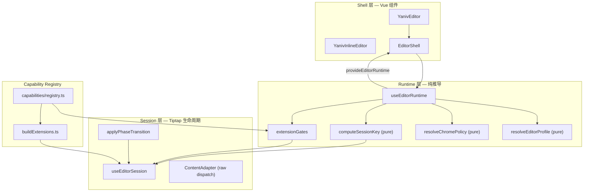
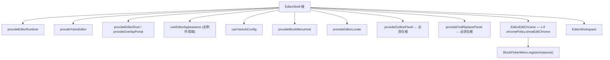

# Yaniv Editor 架构设计

Vue 3 + Tiptap 3 富文本编辑器库的分层架构（对应 v0.2.0）。

> **状态（已完成）**：本文档描述的重构已于 v0.1.0（2026-05-22）完成并落地。「架构不变量」共 25 条，其中第 14 – 25 条为 v0.1.4 之后新增（能力按 gate 代码分割、禁止模块级可变状态、HTML 惰性解析、URL 白名单单一入口、无障碍基线、流式响应跨 chunk 缓冲、节点位置从选区推导、序列化标签与 schema 一致、节点视图渲染当前节点、DOM watcher 的 flush 时机、换实例退订旧实例、节点属性避开 HTML 全局属性名），同样具备约束力。各版本的增量变更见 `CHANGELOG.md`。
>
> **阅读约定**：文中标注 **Normative** 的代码块与 `src/` 逐字对齐，改实现必须同步改这里；未标注的块是**意图示意**，可能含伪代码。文档与 `src/` 冲突时以 `src/` 为准，并立即回改本文。
>
> 对外 API 与迁移说明以 `CHANGELOG.md` 为准；用户文档以 `docs/` 与 `README.md` 为准。下文「Public API（Breaking）」「历史迁移」「验收清单」等章节均为**历史记录**，不是待办事项。

## 实施约定

- **本文档（仓库根目录 `ARCHITECTURE.md`）是分层设计的唯一依据。**
- 所有代码改动、目录结构、API breaking、验收标准，均以本文档为准；不得偏离或另起一套设计。
- 本文档与 `src/` 冲突时，以 `src/` 为准并**立即回改本文档**——文档失真比缺文档更有害。
- 重构本身已于 v0.1.0 一次性完成，不保留旧逻辑与补丁代码。

---

## 重构原则

1. **不兼容旧逻辑** — 不为旧 API、旧 watch、旧补丁保留分支或 fallback。
2. **删除而非包裹** — 旧代码直接删除；禁止新旧并存、临时 adapter、`@deprecated` 导出。
3. **单一实现路径** — 每个 concern 只保留一条代码路径。
4. **一次性交付** — 单 feature branch 全量 merge，仓库中不存在半新半旧状态。
5. **不留兜底尾巴** — 禁止 `v-if` + `v-show` + `classList.toggle` + CSS 四重表达同一语义。唯一例外：session `loading` 骨架层使用 `v-show="sessionStatus !== 'loading'"` 隐藏 Chrome 容器（骨架与 Chrome 是不同语义的两层，不构成双保险；见 Session 章节）。使用 `v-show` 的 chrome 容器内子组件**必须能处理 `editor === null` 状态**，不得假设 editor 已就绪。

---

## 分层总览


```mermaid
flowchart TB
  subgraph shell [Shell 层 — Vue 组件]
    YanivEditor
    YanivInlineEditor
    EditorShell
  end

  subgraph runtime [Runtime 层 — 纯推导]
    useEditorRuntime
    Profile["resolveEditorProfile (pure)"]
    ChromePolicy["resolveChromePolicy (pure)"]
    SessionKeyFn["computeSessionKey (pure)"]
    Gates["extensionGates"]
  end

  subgraph session [Session 层 — Tiptap 生命周期]
    useEditorSession
    PhaseTransition["applyPhaseTransition"]
    ContentAdapter["ContentAdapter (raw dispatch)"]
  end

  subgraph registry [Capability Registry]
    CapRegistry["capabilities/registry.ts"]
    BuildExt["buildExtensions.ts"]
  end

  YanivEditor --> EditorShell
  EditorShell --> useEditorRuntime
  useEditorRuntime --> Profile
  useEditorRuntime --> ChromePolicy
  useEditorRuntime --> SessionKeyFn
  useEditorRuntime --> Gates
  useEditorRuntime --> |provideEditorRuntime| EditorShell
  Gates --> useEditorSession
  SessionKeyFn --> useEditorSession
  PhaseTransition --> useEditorSession
  CapRegistry --> Gates
  CapRegistry --> BuildExt
  BuildExt --> useEditorSession
```

> **`useEditorRuntime` 与纯函数的关系**：`runtime/` 目录下有三类代码：
>
> - **纯函数**（零 Vue 依赖）：`resolveEditorProfile`、`resolveChromePolicy`、`computeSessionKey`、`mergeFeatures`；可单独单测。
> - **composable**：`useEditorRuntime` — 接收 reactive props，用 `computed` 包装纯函数，调用 `provideEditorRuntime`。
> - **模块顶层约束**：`runtime/` 与 `capabilities/registry.ts` 模块顶层**禁止访问 `window` / `document`**；扩展内部访问 DOM 必须在 ProseMirrorPlugin view 阶段（client-only 时点）。

| 层           | 职责                                         | 禁止包含                                  |
| ------------ | -------------------------------------------- | ----------------------------------------- |
| **Shell**    | 布局、slot、expose、BlockMenuHost 注册       | `initEditor`、散落 watch、命令式 DOM      |
| **Runtime**  | 从 props 推导 profile / chromePolicy / gates | Tiptap 实例操作、`window`/`document` 访问 |
| **Session**  | sessionKey 重建、phase 切换、受控内容同步    | UI 显隐逻辑                               |
| **Registry** | 能力定义 → 扩展 + toolbar + chrome 映射      | 从 `@/components` import NodeView         |

---

## 配置模型（Runtime Profile）

对外 props 收敛为四条轴，在 Runtime 层合并为不可变 `EditorRuntimeProfile`：

| 轴         | Props                                   | 作用                             |
| ---------- | --------------------------------------- | -------------------------------- |
| Phase      | `mode: 'edit' \| 'preview'`             | 编辑态 vs 只读展示               |
| Preset     | `preset: 'basic' \| 'full' \| 'notion'` | 默认 features + layout + toolbar |
| Appearance | `appearance` + `colorMode`              | 视觉皮肤与亮暗色                 |
| Overrides  | `features`                              | 显式关闭/开启能力                |

**Preview 不是特殊分支**：`mode=preview` 仅使 `chromePolicy.showEditChrome=false` 且 `editable=false`；扩展注册集合不因 phase 变化。

### Preset 默认能力映射（`resolveEditorProfile` 核心逻辑）

`features` prop 为 Overrides 层，与 Preset 默认值**合并**（Overrides 优先）。各 Preset 的默认 feature 集合：

| feature         | basic | full | notion | 说明                                           |
| --------------- | :---: | :--: | :----: | ---------------------------------------------- |
| `table`         |  ❌   |  ✅  |   ✅   | **Breaking**：旧 basic 默认 ✅，重构后默认关闭 |
| `image`         |  ✅   |  ✅  |   ✅   |                                                |
| `video`         |  ❌   |  ✅  |   ✅   | **Breaking**：旧 basic 默认 ✅，重构后默认关闭 |
| `math`          |  ❌   |  ✅  |   ✅   |                                                |
| `ai`            |  ❌   |  ❌  |   ✅   | full/basic 需显式 Overrides；notion 默认开启   |
| `formatPainter` |  ❌   |  ✅  |   ❌   | notion 不对齐 Notion 产品，保持关闭            |
| `outline`       |  ❌   |  ✅  |   ✅   |                                                |
| `searchReplace` |  ❌   |  ✅  |   ✅   |                                                |
| `officePaste`   |  ❌   |  ✅  |   ✅   |                                                |
| `slashCommand`  |  ❌   |  ❌  |   ✅   | notion preset 核心体验                         |
| `dragHandle`    |  ❌   |  ❌  |   ✅   | notion preset 核心体验                         |

> **实施要求**：`resolveEditorProfile` 中的 Preset 默认值以此表为准，禁止在其他地方散落 preset 判断。Overrides 中值为 `true` 开启、`false` 强制关闭（即使 preset 默认开启也关闭）、`undefined` 继承 preset 默认。
>
> **Breaking 声明**：旧版 `basic` preset 默认开启 `table` / `video`；重构后 `basic` 收紧为"最简编辑器"，仅保留 image。集成方若需保留旧行为，必须显式传 `:features="{ table: true, video: true }"`。此变更须列入 `CHANGELOG.md` "BREAKING CHANGES" 顶部。

### `mergeFeatures` 规范实现（Normative）

`{ ...preset, ...overrides }` spread 会让 `overrides[key] = undefined` **覆盖** preset 的值，与"undefined 继承"承诺不符。必须使用下列规范实现：

```ts
// runtime/mergeFeatures.ts（由 resolveEditorProfile 调用，并从主入口导出）
export function mergeFeatures(
  preset: Required<FeatureConfig>,
  overrides?: FeatureConfig,
): Required<FeatureConfig> {
  if (!overrides) return { ...preset };
  const merged = { ...preset };
  for (const key of Object.keys(overrides) as Array<keyof FeatureConfig>) {
    const v = overrides[key];
    if (v !== undefined) merged[key] = v; // undefined 不覆盖
  }
  return merged;
}
```

**禁止**在 `resolveEditorProfile` 以外的地方再写 feature 合并逻辑。

---

## ChromePolicy

`resolveChromePolicy(input)` 是唯一 Chrome 显隐来源。Shell 模板**只读 chromePolicy**，禁止出现 `isPreviewMode` 或 `mode === 'preview'`。

```ts
// 完整签名（实现对齐 src/core/runtime/resolveChromePolicy.ts）：
resolveChromePolicy(input: ResolveChromePolicyInput): ResolvedChromePolicy

interface ResolveChromePolicyInput {
  profile: EditorRuntimeProfile;
  layout: PresetLayout;
  gates: ExtensionGates;
  uiFlags: UiFlags;
  host: EditorShellHost;
  showInlineToolbar?: boolean;
}
```

> **设计决策：`outlinePanelExpanded` 不进 chromePolicy。**
> 原因：chromePolicy 的语义是"由 props 推导的显隐策略"，是纯函数输出。`outlinePanelExpanded` 是用户 uiState，属于运行时可变状态；若混入 chromePolicy，每次用户展开/收起大纲都会使整个 chromePolicy 引用失效，触发不必要的子组件重渲。
> **大纲展开状态由 `provideOutlinePanel` 持有，模板直接读取 `outlinePanel.expanded.value`，与 chromePolicy 完全解耦。**

| 字段                     | edit                 | preview |
| ------------------------ | -------------------- | ------- |
| `showEditChrome`         | true                 | false   |
| `showHeader`             | layout.header        | false   |
| `showFooter`             | layout.footer        | false   |
| `showOutlineRail`        | `gates.outline`      | false   |
| `showContextualToolbars` | uiFlags              | false   |
| `showBlockPicker`        | slash \|\| drag      | false   |
| `showStatusHints`        | layout.shortcutHints | false   |

> **大纲两层语义**：`showOutlineRail` 决定**容器是否渲染**（gates 与 phase 决定），`outlinePanel.expanded` 决定**面板是否展开**（用户 uiState，由 `provideOutlinePanel` 持有）。
>
> **`outlinePanelExpanded` 默认值**：v0.1.1 起默认 `false`（outline gate 开启时面板默认收起）。宿主可通过 `:default-outline-expanded="true"` 恢复初始展开；该 prop 由 `EditorShell` 传入 `provideOutlinePanel(defaultOutlineExpanded ?? false)`，**不进 chromePolicy**、**不触发 session rebuild**。

### ChromePolicy 的 host 区分（discriminated union）

`ResolvedChromePolicy` 是 Full 与 Inline 两套 chrome 字段的并集，但 `showOutlineRail`、`showBlockPicker`、`showStatusHints` 在 inline host 下永远 `false`，冗余字段易误用。规范实现：

```ts
interface BaseChromePolicy {
  host: EditorShellHost;
  showEditChrome: boolean;
}

interface FullChromePolicy extends BaseChromePolicy {
  host: "full";
  showHeader: boolean;
  showFooter: boolean;
  showOutlineRail: boolean;
  showContextualToolbars: boolean;
  showBlockPicker: boolean;
  showStatusHints: boolean;
}

interface InlineChromePolicy extends BaseChromePolicy {
  host: "inline";
  showInlineToolbar: boolean;
  showLinkBubble: boolean;
}

export type ResolvedChromePolicy = FullChromePolicy | InlineChromePolicy;
```

Shell 模板通过 `policy.host === 'full'` narrowing 后才能访问 host-specific 字段，编译器锁死"Inline 模板不得引用 `showOutlineRail`"。

---

## ExtensionTier 与 Phase 策略

能力在 Registry 中标注 tier，决定注册与 phase 行为：

| Tier            | 示例                                   | 注册            | Phase                                                            |
| --------------- | -------------------------------------- | --------------- | ---------------------------------------------------------------- |
| `core`          | StarterKit、Link、Placeholder          | gate 开即注册   | 无影响                                                           |
| `content`       | Image、Video、Table、Math、OfficePaste | gate 开即注册   | preview 仍展示                                                   |
| `interaction`   | DragHandle、Slash、FormatPainter       | gate 开即注册   | 不卸载；由 `buildExtensions` **统一**注入 `withTransactionGuard` |
| `auxiliary`     | SearchReplace                          | gate 开即注册   | 扩展自身在 plugin `view.update` 检测 editable 变化并自清状态     |
| `chromeCoupled` | Outline                                | gate + 宿主 ctx | 无影响                                                           |

> **OfficePaste 归 `content` tier**：OfficePaste 是 paste pipeline 扩展，不依赖 chrome 渲染，paste 行为与 phase 无关；宿主回调通过 `ctx.officePaste` 注入（不进 sessionKey）。`chromeCoupled` 仅保留真正依赖滚动容器等外部宿主 ctx 的扩展（如 Outline）。

#### interaction 扩展的统一守卫

`interaction` tier 扩展在 preview 下需要两类守卫**协同**工作（不是"双保险"，是**不同抽象层的分工**）：

| 层       | 机制                                                                                    | 作用                                               |
| -------- | --------------------------------------------------------------------------------------- | -------------------------------------------------- |
| 事件入口 | 短路：registry 回调用 `ctx.isEditable.value`，插件内部的 DOM handler 用 `view.editable` | UX：拖拽 ghost / 光标提示根本不出现                |
| 事务兜底 | `filterTransaction` 拦截 `docChanged` 事务                                              | 正确性：防止任何代码路径（含程序化命令）绕过事件层 |

> **两个可编辑标志是同一个真相源。** `ctx.isEditable` 是 Shell 从 `profile.mode` 推导的 `computed`，
> `view.editable` 是 `editor.setEditable()` 写进 view 的实时值，而 `setEditable` 只由
> `applyPhaseTransition` 调用（不变量 9）。选哪个取决于取值处能拿到什么：
> registry 里配置回调时只有 `ctx`，插件的 `view.update` / `handleDOMEvents` 里天然有 `view`。

> **澄清**：DragHandle / SlashCommand 完成操作时**也会**派发 docChanged 事务（节点移动、块插入），事务守卫并非"无效"，而是 UX 较差（用户看到 ghost 但松手被吞）；事件入口短路负责 UX，事务守卫负责正确性。两层都不可省。

**事务兜底实现**（`capabilities/transactionGuard.ts`，由 `buildExtensions` 对 `interaction` tier 调用）：

```ts
// capabilities/transactionGuard.ts
import { Plugin } from "@tiptap/pm/state";

/**
 * 标记给程序化派发的 tr，用于绕过守卫（如 ContentAdapter.setContent、phase 切换内部命令）。
 * 使用 Symbol 而非字符串：避免与第三方扩展同名 meta key 冲突，且不会被 JSON 序列化误命中。
 */
export const BYPASS_GUARD_META: symbol = Symbol("yaniv:bypassGuard");

/**
 * `isEditable` 由 buildExtensions 以**闭包参数**传入，而不是从 `this.editor` 读：
 * Tiptap 在 addProseMirrorPlugins 阶段对 `this.editor` 的绑定时序在不同版本下不稳定。
 */
function withTransactionGuard(ext: Extension, isEditable: Readonly<Ref<boolean>>): Extension {
  return ext.extend({
    addProseMirrorPlugins() {
      // 被包装扩展自身的插件必须保留
      const self = this as { parent?: () => Plugin[] };
      const parent = self.parent?.() ?? [];
      return [
        ...parent,
        new Plugin({
          filterTransaction: (tr) => {
            if (!tr.docChanged) return true; // 只读 tr 放行（选区、装饰）
            // getMeta 的签名只收 string | PluginKey，Symbol 需要显式断言
            if (tr.getMeta(BYPASS_GUARD_META as unknown as string)) return true;
            return isEditable.value; // ← 走外部 Ref，不依赖 this.editor
          },
        }),
      ];
    },
  });
}
```

> **Tiptap 版本约束**：本方案要求 Tiptap ≥ 3.0.0，并以"`this.editor` 在 `addProseMirrorPlugins` 中可能为 undefined"为前置假设；故所有跨阶段需要的引用一律通过 `ctx.*` 外部注入，不依赖 `this.editor`。

**事件入口守卫**：

```ts
// BuildExtensionsCtx 提供响应式标志：
interface BuildExtensionsCtx {
  isEditable: Readonly<Ref<boolean>>;
  // ...
}

// registry 侧示例（与实现一致）：回调里只有 ctx，用 ctx.isEditable
extensions: async (ctx) => [
  DragHandleExtension.configure({
    onOpenInsertMenu: (context) => {
      if (!ctx.isEditable.value) return;
      ctx.blockMenuHost.openInsert(context);
    },
    onCloseInsertMenu: () => ctx.blockMenuHost.hide(),
  }),
];

// 扩展内部示例（DragHandleExtension 的 dragstart handler）：这里有 view，直接读 view.editable
handle.addEventListener("dragstart", (event) => {
  if (!view.editable || !currentTarget || !event.dataTransfer) return;
  // ... 正常逻辑
});
```

`interaction` tier 扩展**禁止**用第三条判断可编辑性的路径（自建标志位、读 props、缓存快照等）：
要么 `ctx.isEditable`，要么 `view.editable`，二者背后都是 `applyPhaseTransition` 一处写入。
无论事件入口怎么写，`withTransactionGuard` 都由 `buildExtensions` 统一包上，不需要扩展自己处理。

```ts
// 对所有 interaction tier 能力应用事务守卫（extensions() 允许返回 Promise，必须 await）
const exts = await cap.extensions(ctx);
if (cap.tier === "interaction") {
  result.push(...exts.map((ext) => withTransactionGuard(ext, ctx.isEditable)));
} else {
  result.push(...exts);
}
```

> **`BYPASS_GUARD_META` 调用方约定**（以下场景的事务必须打 meta，否则 preview 下会被守卫拦掉）：
>
> - `ContentAdapter` 内部所有 raw dispatch：必须用 `tr.setMeta(BYPASS_GUARD_META, true)`
> - `applyPhaseTransition` 切换过程中由 Session 层主动派发的命令
> - 外部 `initialContent` 受控回写路径
>
> 宿主业务代码通过 `editor.commands.*` 触发的事务**不打 meta**，因业务命令在 preview 下本就应被拦截。

#### Phase 切换机制与 ContentAdapter 的 raw dispatch（关键修订）

**A1 修订 — ContentAdapter 必须走 raw transaction**：

Tiptap 的 `editor.commands.setContent(...)` 走 CommandManager 链，上层无法为其插入 `BYPASS_GUARD_META`。在 preview 模式下调用 `commands.setContent` 会被 `withTransactionGuard` 静默吞掉，受控回写失效。

`ContentAdapter` 必须绕过 commands，直接构造 raw transaction：

```ts
// core/session/contentAdapter.ts
import { BYPASS_GUARD_META } from "@/capabilities/transactionGuard";
// 主入口 re-export：import { BYPASS_GUARD_META } from "@yanivjs/yaniv-editor"

export interface SetContentOptions {
  /** 受控回写默认不进 undo 栈；宿主显式传 true 才记录历史 */
  addToHistory?: boolean;
  /** 受控回写默认 source='external'，订阅方可借此区分用户输入与外部回写 */
  source?: "external" | "phase" | "session-rebuild";
}

function setContent(
  editor: Editor,
  content: JSONContent | string,
  options: SetContentOptions = {},
): void {
  const view = editor.view;

  // JSON 路径先 adaptJsonToSchema，再 nodeFromJSON；HTML 走 DOMParser
  const doc = parseContentToDoc(content, view.state.schema);

  const tr = view.state.tr
    .setMeta(BYPASS_GUARD_META, true) // ← 必须打 meta（Symbol）
    .setMeta("addToHistory", options.addToHistory ?? false) // ← 默认 false，caller 可显式覆盖
    .setMeta("yaniv:source", options.source ?? "external")
    .replaceWith(0, view.state.doc.content.size, doc.content);

  view.dispatch(tr);
}
```

**所有通过 ContentAdapter 的路径均走此函数，禁止在 ContentAdapter 中出现 `editor.commands.setContent`。**

#### 受控 `initialContent` 回写的去重契约（Normative）

外部 `initialContent` watcher 触发 `ContentAdapter.setContent` 前，**必须**做幂等检查，否则会因"emit → 父组件回写 → 子组件再 setContent"产生光标跳动和重复事务：

```ts
// core/session/useControlledContent.ts（与实现逐字对齐）
const lastEmittedSignature = ref<string | null>(null);

// 用户输入路径：editor 换实例时重新挂 update 监听，并在回调里更新签名
watch(
  editor,
  (e, prev, onCleanup) => {
    if (!e) {
      if (prev) lastEmittedSignature.value = null; // 旧 editor 的签名不能带到新 session
      return;
    }
    const handler = () => {
      const payload = host === "inline" ? e.getHTML() : e.getJSON();
      lastEmittedSignature.value = computeSignature(payload, host);
      onUpdate(payload);
    };
    e.on("update", handler);
    onCleanup(() => e.off("update", handler));
  },
  { flush: "post" },
);

// 受控源：Inline 是 `content`，Full 是 `initialContent`
const controlledSource = content ?? initialContent;

function applyControlledContent(next: string | JSONContent | undefined): void {
  if (!editor.value || !sessionReady.value) return; // session 未 ready 时不写
  const incoming = computeSignature(next, host);
  if (!incoming) return;
  if (incoming === lastEmittedSignature.value) return; // 防 emit 回流
  const current = computeSignature(
    host === "inline" ? editor.value.getHTML() : editor.value.getJSON(),
    host,
  );
  if (incoming === current) return; // 防 no-op 重写
  ContentAdapter.setContent(editor.value, normalizeInitialContent(next), { source: "external" });
  lastEmittedSignature.value = incoming; // 写入不触发 update，签名要手动补
}

watch(controlledSource, (next) => applyControlledContent(next));
// rebuild 期间到达的回写会被上面的 sessionReady 挡掉，ready 后补投一次
watch(sessionReady, (ready) => {
  if (ready) applyControlledContent(controlledSource.value);
});
```

`computeSignature(content, host)`：

- `host === 'full'`：`JSON.stringify(json)`（key 顺序由 ProseMirror schema 决定，已稳定）；
- `host === 'inline'`：`html.trim()` 直接比对字符串；
- 序列化失败或内容为空一律返回 `""`，调用方按「无输入」处理。

`normalizeInitialContent` 兜住非 `doc` 型 JSON：空值与 `type !== "doc"` 的对象都退化为单空段落。

**禁止**在 ContentAdapter 内做签名缓存——签名由 Session 层持有，ContentAdapter 是无状态写入工具。

**A2 修订 — phase 切换顺序：emit 先，setEditable 后**：

切到 preview 时，订阅方的清理命令（如 `cancelFormatPainting`、`setSearchReplaceTerm("")`）在 `editable=true` 状态下执行，才不会被守卫拦截。反之，切回 edit 时先 setEditable 再 emit。顺序本身已实现（见 `session/applyPhaseTransition.ts`），当前只是还没有订阅方利用它。

```ts
// Session 层 —— applyPhaseTransition（与实现逐字对齐）
function applyPhaseTransition(
  editor: Editor,
  prevPhase: EditorPhase | null, // null 表示首次同步
  nextPhase: EditorPhase,
  emitter: PhaseChangeEmitter,
  reason: "mode-change" | "ready" = "mode-change",
): void {
  if (nextPhase === "preview") {
    // ① 先派发清理事件（此时 editable=true，清理命令不被守卫拦截）
    emitter.emit({ from: prevPhase, to: nextPhase, editor, reason });
    // ② 再关闭编辑
    editor.setEditable(false);
  } else {
    // ① 先开启编辑
    editor.setEditable(true);
    // ② 再通知订阅方（初始化逻辑在 editable=true 时执行）
    emitter.emit({ from: prevPhase, to: nextPhase, editor, reason });
  }
}
```

> **规则**：**edit → preview 切换链路：先 emit，再 `setEditable(false)`；preview → edit 链路：先 `setEditable(true)`，再 emit。** 订阅方一律假设在 editable 允许时刻执行自身命令。

#### Session 未 ready 时的 phase 切换 buffer（关键修订）

`applyPhaseTransition` 直接操作 `editor`，但 sessionStatus 状态机里 `ready → loading` 期间 `editor.value === null`。若用户同时翻 `preset`（触发 rebuild）和 `mode`（触发 phase 切换），phase watcher 进入时 editor 为 null，直接调 `editor.setEditable` 会 NPE。

**规范**：Session 层持有 `pendingPhase: EditorPhase | null` 状态字段，phase 切换链路统一走 `requestPhaseTransition(nextPhase)`，由 Session 内部根据 `editor.value` 是否就绪决定立即执行还是 buffer：

```ts
// useEditorSession 内部
let lastAppliedPhase: EditorPhase | null = null;
let pendingPhase: EditorPhase | null = null;

function requestPhaseTransition(nextPhase: EditorPhase): void {
  if (!editor.value || status.value !== 'ready') {
    pendingPhase = nextPhase;                                      // ← buffer，等 rebuild 完成 flush
    return;
  }
  applyPhaseTransition(editor.value, lastAppliedPhase ?? nextPhase, nextPhase, phaseEmitter);
  lastAppliedPhase = nextPhase;
}

// rebuild 成功后统一 flush 初始 phase + 可能 buffer 的 pending phase
async function rebuild() {
  // ... 创建 editor ...
  editor.value = new Editor({ ... editable: profile.value.mode === 'edit', ... });
  status.value = 'ready';

  // 用 profile.mode 作初始 phase 基线（mode=preview 初始挂载也走这条）
  const targetPhase = pendingPhase ?? profile.value.mode;
  pendingPhase = null;
  if (lastAppliedPhase !== targetPhase) {
    applyPhaseTransition(editor.value, lastAppliedPhase ?? targetPhase, targetPhase, phaseEmitter);
    lastAppliedPhase = targetPhase;
  } else {
    // 即使 phase 不变也派发一次 "ready" 事件，让 auxiliary 扩展自洽初始化
    phaseEmitter.emit({ from: null, to: targetPhase, editor: editor.value, reason: 'ready' });
  }
}

// watch 入口：profile.mode 变化只调 requestPhaseTransition，不直接操作 editor
watch(() => profile.value.mode, (mode) => requestPhaseTransition(mode));
```

**`PhaseChangeEvent` 类型扩充**：

```ts
interface PhaseChangeEvent {
  from: EditorPhase | null; // null 表示首次 ready emit
  to: EditorPhase;
  editor: Editor;
  /** 触发原因：'mode-change' | 'ready'（session rebuild 后初始同步） */
  reason: "mode-change" | "ready";
}
```

> **规则**：
>
> - 订阅方禁止假设 `event.from` 一定非 null；`reason === 'ready'` 表示这是 session 重建后的首次同步，订阅方应做 idempotent 初始化（而非 `clearSearch` 这种破坏性清理）。
> - Phase 切换链路一律走 `requestPhaseTransition`，**禁止** Shell 层直接调用 `editor.setEditable`。

```ts
// Shell 层（EditorShell）订阅 —— 当前代码中唯一的订阅方：
const offPhaseChange = onPhaseChange(({ to, reason }) => {
  if (reason === "ready") return; // 首次 ready 不需要 hide
  if (to === "preview") blockMenuHost.hide();
});
```

`onPhaseChange` 注册接口由 `useEditorSession` 暴露，通过 provide/inject 传递给各订阅方。

> **状态清理归属：扩展自身，而非外部订阅。**
> `SearchReplace` / `FormatPainter` 的搜索词、命中集合、格式刷激活态与光标样式都归各自扩展所有，
> 因此复位也在扩展内部完成：其 ProseMirror plugin 的 `view.update` 检测 `view.editable`
> 由 `true` 变为 `false` 时执行清理。
>
> 这样做而非让 Shell 订阅 `onPhaseChange` 逐个调命令，有三个好处：
> ① Shell 不需要知道具体有哪些扩展（避免层次污染）；
> ② 自定义 Shell / 直接用 `buildExtensions` 的集成方同样受益；
> ③ 顶栏在 preview 下被 `v-if` 卸载时不会走面板的 onClose，外部订阅本就容易漏。
>
> `applyPhaseTransition` 的「先 emit 再 setEditable」顺序仍然保留，供需要在 editable
> 尚为 true 时执行命令的订阅方使用；目前 Shell 的订阅只做 `blockMenuHost.hide()`。

**生命周期规范**：

```ts
// onPhaseChange 返回 off 函数；订阅在 EditorShell 整个生命周期内持久有效，
// 不随 session 重建（sessionKey 变化）失效。
const offPhaseChange = onPhaseChange(({ to, editor }) => { ... });

// 调用方必须在 onBeforeUnmount 中取消订阅，防止内存泄漏：
onBeforeUnmount(() => offPhaseChange());
```

规则：

1. 订阅时机：在 `setup()` 或 `onMounted` 中注册均可，session 尚未 ready 时注册的订阅会在首次 phase 切换时触发
2. session 重建（sessionKey 变化）**不会**使订阅失效，无需重新注册
3. **必须调用 `off` 函数**取消订阅；composable 内部通过 `onBeforeUnmount` 自动注册 off 是推荐写法

| 触发                | Session 层动作                             | 各层钩子响应                                    |
| ------------------- | ------------------------------------------ | ----------------------------------------------- |
| edit → preview      | emit `phase:change` → `setEditable(false)` | Shell hide blockMenu；扩展经 `view.update` 自清 |
| preview → edit      | `setEditable(true)` → emit `phase:change`  | —                                               |
| sessionKey 变化     | destroy → 快照 → create                    | —                                               |
| 外部 initialContent | 签名去重 → ContentAdapter.setContent       | —                                               |

---

## Session 与 sessionKey

### sessionKey 包含

- **Full**：host、locale、已启用 capability 的 id 列表、已开启 gate 的键名列表、各 capability 的 `schemaSignature`
- **Inline**：同上（gates 由 `resolveInlineGates` 从 toolbar 推导），外加 `runtimeSignature` —— `placeholder` 与 `extraExtensions` 的扩展名列表

### sessionKey 不包含

- phase、appearance、colorMode、`zIndexBase`、`defaultOutlineExpanded`
- 受控内容回写
- upload / gallery / templates / aiConfig 等回调（由 `buildCtx()` 的 getter 现取）
- Inline 的 `editorProps`：它在 `EditorShell` 的 setup 阶段一次性读取并传给 `useEditorSession`，
  **既不进签名也不响应式**；需要改它请自行换 `key` 重挂组件

### sessionKey 签名计算规范（Normative）

extensionGates 签名必须**同时包含** gate 开关布尔与**影响 ProseMirror schema 的 capability 选项**，不得仅用布尔串：

```ts
// runtime/computeSessionKey.ts
function computeSessionKey(
  profile: EditorRuntimeProfile,
  host: EditorShellHost,
  locale: LocaleCode,
  capabilities: ReadonlyArray<CapabilityDefinition>,
  runtimeSignature = "",
): string {
  const enabledCaps = capabilities
    .filter((c) => !c.featureKey || profile.gates[c.featureKey])
    .filter((c) => (host === "inline" ? !!c.inlineToolbarSlugs?.length : true))
    .sort((a, b) => a.order - b.order);

  const gateIds = enabledCaps.map((c) => c.id).join(",");

  // schemaSignature：仅影响 ProseMirror schema 注册的选项（如表格列数限制、heading levels）
  // 影响行为但不影响 schema 的选项（如回调函数）不进签名
  const schemaSignatures = enabledCaps
    .map((c) => c.schemaSignature?.(profile) ?? "")
    .filter(Boolean)
    .join("|");

  return `${host}|${locale}|${gateIds}|${enabledGateEntries}|${schemaSignatures}|${runtimeSignature}`;
}
```

`enabledGateEntries` 为已开启 gate 的键名列表；Inline 路径下 `runtimeSignature` 包含 `placeholder` 与 `extraExtensions` 扩展名。

**Capability 类型中必须声明 `schemaSignature`**：

```ts
interface CapabilityDefinition {
  id: string;
  tier: ExtensionTier;
  order: number;
  featureKey?: keyof FeatureConfig;
  /** 影响 ProseMirror schema 的因子，变化时触发 session rebuild */
  schemaSignature?: (profile: EditorRuntimeProfile) => string;
  extensions: (ctx: BuildExtensionsCtx) => AnyExtension[] | Promise<AnyExtension[]>;
  fullToolbarSlugs?: string[];
  inlineToolbarSlugs?: ReadonlyArray<string>;
  chrome?: string[];
  /** Inline host 下始终注册（当前仅 inline-starter） */
  inlineAlways?: boolean;
}
```

### 异步与竞态

`buildExtensions` 为 async（如 math 懒加载）。`useEditorSession` 使用 generation 计数：过期 async 结果 discard，不赋值 editor。暴露 `sessionStatus: 'idle' | 'loading' | 'ready' | 'error'` 与 `retrySession()`。

#### generation 计数的双重职责

generation 同时承担两个角色，必须显式区分：

1. **rebuild 串行化**：同一组件内 sessionKey 连续变化时，每次 +1；async resolve 后比对 generation，stale 结果 discard。
2. **销毁标志**：`onScopeDispose`（effect scope 停止，早于 DOM 移除）时 generation +1 **并设置 `disposed = true`**。任何 in-flight 的 `buildExtensions` resolve 后必须先检查 `disposed`，若为 true 立即 return，**绝不允许创建孤儿 editor**。

```ts
// useEditorSession 伪代码（A3 修订：含 content 快照步骤）
let generation = 0;
let disposed = false;
let contentSnapshot: JSONContent | null = null;

async function rebuild() {
  const myGen = ++generation;
  status.value = 'loading';

  const extensions = await buildExtensions(host, ctx);
  if (disposed || myGen !== generation) return;  // ← 双重检查

  // 使用快照内容（sessionKey 变化前已在 pre flush 阶段快照），并按新 schema 清洗
  const initialContent = ContentAdapter.prepareEditorContent(contentSnapshot ?? EMPTY_DOC, extensions);
  contentSnapshot = null;  // 消费后清空

  editor.value = new Editor({ editable: profile.value.mode === 'edit', extensions, content: initialContent, ... });
  status.value = 'ready';
  // 失败分支：写 sessionError + status='error' + editor=null（同样先过 disposed/generation 双重检查）
}

// sessionKey 变化时的处理（快照同步完成，destroy 延后到 nextTick）
watch(sessionKey, async (newKey, oldKey) => {
  if (!oldKey || !newKey || newKey === oldKey) return;

  // ① 同步快照内容（editor 尚未 destroy；getJSON/getHTML 是纯读取，零副作用）
  //    full 存 JSON（属性更完整），inline 存 HTML
  if (editor.value) {
    contentSnapshot = host === 'inline' ? editor.value.getHTML() : editor.value.getJSON();
  }

  // ② 先切断引用并进 loading，等一次 nextTick 让 EditorContent 先卸载，
  //    再 destroy —— 避免在子组件仍持有旧 view 时解绑 DOM
  const oldEditor = editor.value;
  editor.value = null;
  status.value = 'loading';
  await nextTick();
  if (disposed) return;
  oldEditor?.destroy();

  // ③ 异步 rebuild
  void rebuild();
});   // flush 用 Vue 默认的 'pre'

onScopeDispose(() => {
  disposed = true;
  generation += 1;        // 让任何 in-flight resolve 都失效
  editor.value?.destroy();
  editor.value = null;
  status.value = 'idle';
  phaseHandlers.clear();
});
```

> **A3 修订说明**：sessionKey 变化时必须在 destroy 之前调用 `editor.getJSON()` / `getHTML()` 做快照，否则 destroy 后无法取得内容。快照在 watch 回调的**同步部分**完成，早于 `await nextTick()` 与任何 async 操作；destroy 本身则被推迟到 nextTick 之后。
>
> **`flush: 'pre'` 而非 `'sync'` 的取舍**：
>
> - `flush: 'sync'` 会让 watcher 在 reactive setter 同步阶段触发，期间执行 `editor.destroy()` 这种非纯副作用会破坏 Vue 调度顺序，并使其他还在执行的 watcher / setup 看到 `editor === null` 但 props 已变化的中间态；
> - `flush: 'pre'`（Vue 3 默认值）在组件更新前异步触发，已经早于 EditorContent 子组件 unmount 看到 `editor.value === null` 的 patch，足以保证 `getJSON()` 在旧 editor 还可读时执行；
> - 唯一前置约束：sessionKey 变化的 watcher 回调内**禁止再写其他 reactive ref**（避免循环触发）；快照只取、不派发。
>
> **关闭某 capability 时（如关闭 table），JSON 快照中的未知节点由 `adaptJsonToSchema` 剥离结构并提升子内容（单元格文本保留为段落），不是整段内容消失。**此行为须列入 `CHANGELOG.md`。

#### sessionStatus 状态机

| from      | event             | to        | editor.value                                                    |
| --------- | ----------------- | --------- | --------------------------------------------------------------- |
| `idle`    | mount             | `loading` | `null`                                                          |
| `loading` | build success     | `ready`   | new Editor                                                      |
| `loading` | build fail        | `error`   | `null`                                                          |
| `ready`   | sessionKey change | `loading` | `null`（先快照→置 null→nextTick→destroy，与 skeleton 占位配合） |
| `error`   | `retrySession()`  | `loading` | `null`                                                          |
| 任意      | unmount           | `idle`    | `null`（disposed=true）                                         |

> sessionKey 变化时**先快照→destroy 旧 editor → 进 loading → skeleton 占位 → ready**，不保留旧 editor 做"无缝切换"（避免新旧扩展 schema 冲突 + 内存峰值）。

#### sessionStatus: 'loading' 期间的 UI 策略

sessionKey 变化触发 destroy → rebuild，此期间 `editor = null`，禁止用 `v-if="editor && ..."` 直接卸载 Chrome 组件（会产生白屏闪烁）。**唯一允许使用 `v-show` 的场景**：

```vue
<!-- EditorShell 模板 -->
<div v-show="sessionStatus !== 'loading'" class="yaniv-editor__chrome">
  <EditorEditChrome v-if="chromePolicy.showEditChrome" />
  <!-- ... -->
</div>
<!--
  loading 期间显示占位。注意：`.yaniv-editor__skeleton` / `.yaniv-editor__error`
  目前**没有任何库内样式**，只是带 class 的纯文本节点；需要「与编辑区等高、避免布局抖动」
  的宿主请自行给这两个 class 写样式。
-->
<div v-if="sessionStatus === 'loading'" class="yaniv-editor__skeleton">正在加载编辑器...</div>
<div v-if="sessionStatus === 'error'" class="yaniv-editor__error">
  {{ sessionError }} <button type="button" @click="retrySession">重试</button>
</div>
```

`retrySession()` 语义：重新执行完整的 `buildExtensions` → create 流程，不复用上次扩展列表。`error` 状态下暴露 `sessionError: string | null` 供宿主展示失败原因；连续失败不做退避（调用方负责限速）。

### Teardown 顺序

**`editor.destroy()` 必须在组件 DOM 仍存在时调用**，不得放入 `onUnmounted`。实现里 `useEditorSession` 用 `onScopeDispose` 注册销毁逻辑（组件 effect scope 停止时触发，DOM 仍可访问），效果等价且不要求 composable 一定在 `setup()` 顶层的组件上下文里使用。原因：ProseMirror/Tiptap 的 `destroy()` 需要 unmount 各 NodeView 实例（NodeView 要访问自身 DOM 节点、解绑事件监听器）；`onUnmounted` 触发时 Vue 已将组件 DOM 从页面移除，此时调用 `destroy()` 会触发 `Cannot read properties of null` 报错并造成事件监听器泄漏。

正确顺序（均在 `onBeforeUnmount` 阶段，DOM 仍在）：

1. **Session（`onScopeDispose`，同步）**：
   - `disposed = true` + `generation += 1` — 让任何 in-flight `buildExtensions` resolve 失效
   - `editor.destroy()` — 同步，ProseMirror 解绑 DOM 事件
   - `editor = null` — 同步，切断 provide 引用
   - `status = 'idle'`、`phaseHandlers.clear()`

2. **Shell（`onBeforeUnmount`，同步）**：
   - 调用 `offPhaseChange()` 取消 `onPhaseChange` 订阅
   - `useYanivAiConfig` 内部的 `onBeforeUnmount` 归还 `setHostAiConfig(null, owner)`（owner 隔离，不会误清其他实例）
   - Appearance composable 的所有 listener / cleanup **在 composable 内部完成**，Shell 不需要任何手动 teardown 调用（见 Appearance 章节）

> Session 的 `useEditorSession` composable 通过 `onScopeDispose` 自动注册销毁逻辑，Shell 无需手动调用；两者通过 provide/inject 共享 `editor` ref，Shell 读到 `null` 即视为已销毁。`blockMenuHost.hide()` 由 `BlockPickerMenu` 自身的 `registerInstance(null)` 覆盖，Session 层不再重复调用。

---

## Provide / Inject 树

核心 context **必须挂在 EditorShell 根**（永不被 preview `v-if` 切掉）：


```mermaid
flowchart TB
  EditorShell["EditorShell 根"]
  EditorShell --> runtime["provideEditorRuntime"]
  EditorShell --> editor["provideYanivEditor"]
  EditorShell --> editorRoot["provideEditorRoot / provideOverlayPortal"]
  EditorShell --> appearance["useEditorAppearance (实例作用域)"]
  EditorShell --> ai["useYanivAiConfig"]
  EditorShell --> blockHost["provideBlockMenuHost"]
  EditorShell --> locale["provideEditorLocale"]
  EditorShell --> outline["provideOutlinePanel ← 必须在根"]
  EditorShell --> findReplace["provideFindReplacePanel ← 必须在根"]
  EditorShell --> EditChrome["EditorEditChrome — v-if chromePolicy.showEditChrome"]
  EditorShell --> Workspace["EditorWorkspace"]
  EditChrome --> BlockPicker["BlockPickerMenu.registerInstance()"]
```

BlockMenuHost：Shell 根 provide 接口；BlockPicker 在 mount 时 register，扩展通过 host 调用，**禁止** `blockPickerMenuRef`。

**BlockMenuHost 接口签名（Normative）**：

```ts
interface BlockMenuHost {
  /** BlockPickerMenu 在 mount 时调用，传入 null 时表示卸载 */
  registerInstance(instance: BlockMenuInstance | null): void;
  /** 触发斜杠命令激活 */
  activate(state: SlashCommandState): void;
  /** 触发 DragHandle + 插入菜单 */
  openInsert(context: BlockInsertContext): void;
  /** 隐藏菜单 */
  hide(): void;
  /** 更新斜杠命令查询词 */
  updateQuery(query: string): void;
}
```

当 `instance === null`（未注册或已卸载）时，host **不抛错**，但也不是一律 no-op：

- `activate` / `openInsert`：**缓冲最后一次请求**（`pendingOpen`），`registerInstance(inst)` 时立即补投。
  `BlockPickerMenu` 是 `defineAsyncComponent`，chunk 解析完成前实例为 null；若此时直接丢弃，
  用户敲下的第一个 `/` 或点的第一次 + 号就白费了。只保留最后一次——菜单是单例浮层，更早的请求已无意义。
- `hide`：清空缓冲，然后 no-op。
- `updateQuery`：no-op（不缓冲；补投的 `activate` 已携带最新 query）。

**BlockPicker 生命周期契约（Normative）**：

```ts
// BlockPickerMenu.vue
const host = inject(blockMenuHostKey)!;
onMounted(() => host.registerInstance(api));
onBeforeUnmount(() => host.registerInstance(null));
```

`registerInstance(null)` 必须在 `onBeforeUnmount` 阶段调用——`v-if="chromePolicy.showBlockPicker"` 切换为 false 时 Vue 会卸载 BlockPicker，此时若不主动 deregister，SlashCommand 扩展后续触发 `host.activate(...)` 会调到指向已卸载组件的旧 instance 引用，引发"action 触发但无菜单弹出"的隐形失效。

实施 grep（必须有命中）：

```bash
rg "host\.registerInstance\(null\)" src/components/tools/block-menu/
```

> **`provideOutlinePanel` 必须挂在 EditorShell 根**，不得沉入 `EditorWorkspace`。原因：大纲展开状态由其持有，preview 模式下 Workspace 内部组件可能不渲染，若 provide 在子树则 inject 返回 `undefined`。
>
> **`provideFindReplacePanel` 同理挂在根**：面板开关状态被 `FindReplaceDialog`（挂 `EditorEditChrome`，只看 `gates.searchReplace`）与 `FindReplaceButton`（挂顶栏，看 `toolbarConfig.searchReplace`）两个位置共享，二者的挂载条件并不相同。拆成一层 provide 才让「面板 + Ctrl/Cmd+F」不依赖顶栏——此前二者揉在一个组件里，隐藏顶栏的 `notion` preset 连快捷键都注册不上。

---

## Capability Registry

**唯一能力真相源**，替代：

- `resolveExtensionGates.ts`
- `resolveInlineExtensionGates`
- `editorCapabilityMap.ts`
- `coreExtensions.ts` / inline 独立 builder

每条 capability 定义：

```ts
{
  id: 'table',
  tier: 'content',
  order: 40,                    // ProseMirror 扩展顺序
  featureKey: 'table',
  schemaSignature: () => 'table',   // 影响 schema，变化需 rebuild
  extensions: (ctx) => [...],
  fullToolbarSlugs: ['table'],
  inlineToolbarSlugs: ['table'],
  chrome: ['tableToolbar'],
}
```

### `buildExtensions` 规范实现（Normative）

```ts
// capabilities/buildExtensions.ts
async function buildExtensions(
  host: EditorShellHost,
  ctx: BuildExtensionsCtx,
): Promise<Extension[]> {
  const enabled = CAPABILITIES.filter((c) =>
    host === "inline" ? c.id.startsWith("inline-") : !c.id.startsWith("inline-"),
  )
    .filter((c) => {
      if (host === "inline") {
        if (c.inlineAlways) return true;
        if (c.id === "inline-placeholder") return !!ctx.inlinePlaceholder;
        if (!c.inlineToolbarSlugs?.length) return false;
        return c.inlineToolbarSlugs.some((slug) => ctx.gates[slug] === true);
      }
      if (!c.featureKey) return true;
      return ctx.gates[c.featureKey] === true;
    })
    .sort((a, b) => a.order - b.order);

  const result: Extension[] = [];
  for (const cap of enabled) {
    const exts = await cap.extensions(ctx);
    if (cap.tier === "interaction") {
      result.push(...exts.map((ext) => withTransactionGuard(ext, ctx.isEditable)));
    } else {
      result.push(...exts);
    }
  }

  // 宿主自带扩展追加在最末（仅 Inline 生效）：既不参与 gate 过滤，也不包守卫
  if (host === "inline" && ctx.extraExtensions?.length) {
    result.push(...ctx.extraExtensions);
  }

  return result;
}
```

此函数同时服务 Full / Inline，通过 `host` 过滤 capability、通过 `tier` 决定是否包装守卫，**禁止在 Full / Inline 各自维护独立的扩展 builder**。

扩展实现（含自定义节点扩展如 `TableCellWithBackground`）放在 `extensions/`，禁止 `extensions/` import `@/components/`。

### Inline gates 推导规则（Normative）

Full 编辑器的 `gates: ExtensionGates` 由 `profile.features` 推导。**Inline 编辑器没有 `features` prop**，gates 来源是 `toolbar: InlineToolbarConfig` 配置。为避免在 Full / Inline 之间维护两套判断逻辑，统一在 Capability Registry 中声明 `inlineToolbarSlugs`，并由 `resolveInlineGates` 推导出 gate 对象：

```ts
interface CapabilityDefinition {
  // ...
  /** Full 编辑器下用 features[featureKey] 推导 gate；Inline 不使用 */
  featureKey?: keyof FeatureConfig;
  /**
   * Inline 编辑器下用 toolbar 的这些 slug 中任一为 true 时 gate 开启；Full 不使用。
   * 实现（`capabilities/types.ts`）里的声明类型是 `ReadonlyArray<string>`，
   * 但取值必须是 `InlineToolbarConfig` 的键——消费方 `resolveInlineGates` /
   * `resolveShowInlineToolbar` 都按该键去查 toolbar。
   */
  inlineToolbarSlugs?: ReadonlyArray<string>;
  // ...
}

// core/runtime/resolveInlineGates.ts
function resolveInlineGates(
  toolbar: InlineToolbarConfig,
  capabilities: ReadonlyArray<CapabilityDefinition>,
): ExtensionGates {
  const gates = {} as ExtensionGates & Record<string, boolean>;

  for (const cap of capabilities) {
    if (!cap.inlineToolbarSlugs?.length) continue; // 仅声明 inline slug 的 capability 参与

    // ① 每个 slug 自身也写成 gate key —— buildExtensions 的 inline 分支与
    //    inline-starter 内部（g.heading / g.list / g.textFormat ...）直接读它们
    for (const slug of cap.inlineToolbarSlugs) {
      gates[slug] = toolbar[slug as keyof InlineToolbarConfig] === true;
    }

    // ② capability 级 gate：任一 slug 为 true 即开启
    const enabled = cap.inlineToolbarSlugs.some(
      (slug) => toolbar[slug as keyof InlineToolbarConfig] === true,
    );
    if (cap.featureKey) {
      gates[cap.featureKey] = enabled;
    } else if (!cap.id.startsWith("inline-")) {
      // inline-* capability 不再额外写 id gate（其 slug gate 已足够）
      gates[cap.id] = enabled;
    }
  }

  return gates;
}
```

> 注意 ①：`buildExtensions` 的 inline 分支判断的是 `ctx.gates[slug]`（slug 级），不是 capability id；`inline-starter` 还会读 `gates.heading` / `gates.list` / `gates.textFormat` / `gates.undoRedo` 决定 StarterKit 内部子扩展开关。因此 slug 级 gate 是必需的，不能只写 capability 级。

**单一规则**：`gates[capability]` 在 Full 下由 `profile.features[featureKey]` 决定，在 Inline 下由 `toolbar[inlineToolbarSlugs].some(true)` 决定；除此之外**不得**存在第三种 gate 推导路径。`computeSessionKey` 接收的 profile 在 Inline 路径下应已经过 `resolveInlineGates` 写入 `profile.gates`，因此 `sessionKey` 计算逻辑保持 host 无关。

### `BuildExtensionsCtx` 中的 stale-closure 约定（B1 修订）

`BuildExtensionsCtx` 中所有可能在运行期变化（不进 sessionKey）的入参，**一律用 getter 函数包装**，避免扩展闭包持有旧引用：

```ts
// capabilities/types.ts（此处与实现逐字对齐）
interface BuildExtensionsCtx {
  /** 当前实例的完整消息对象（静态快照，非响应式；locale 在 sessionKey 中，切换会 rebuild） */
  locale: TiptapLocale;

  /** 由 profile.features（Full）或 resolveInlineGates（Inline）推导 */
  gates: ExtensionGates;

  /** 响应式可编辑标志，interaction 扩展在 DOM 事件入口检查；withTransactionGuard 也消费它 */
  isEditable: Readonly<Ref<boolean>>;

  /** 块菜单宿主，供 SlashCommand / DragHandle 调用（Inline 下不触发） */
  blockMenuHost: BlockMenuHost;

  /** 媒体上传回调 — getter 模式，每次调用现取最新引用，避免 stale closure */
  upload: {
    image: () => MediaUploadHandler | undefined;
    video: () => MediaUploadHandler | undefined;
  };

  /** 图库数据 — getter 模式 */
  galleryImages: () => GalleryImage[];

  /** `@` 提及候选项 — getter 模式；返回 undefined / 空数组时扩展回退内置占位数据 */
  mentionItems: () => MentionItem[] | undefined;

  /** Office 粘贴处理 — getter 模式 */
  officePaste: {
    onPasteFromOfficeWithImages: () => (() => void) | undefined;
  };

  /** 大纲滚动容器（chromeCoupled 扩展使用） — late-binding getter + setter，见下文 */
  outline: {
    scrollParent: () => HTMLElement | null;
    bindScrollParent: (el: HTMLElement | null) => void;
  };

  /** AI 配置（宿主 ai-config prop） — getter 模式，见下文响应式契约 */
  aiConfig: () => YanivEditorAiConfig | undefined;

  /** Inline 专用：placeholder 文案，非空时注册 inline-placeholder capability */
  inlinePlaceholder?: string;

  /** Inline 专用：追加到扩展列表末尾（仅 host === 'inline' 生效） */
  extraExtensions?: AnyExtension[];
}
```

> **约定**：
>
> - `ctx.locale` 是**静态快照**（非 Ref），在 sessionKey 时点冻结；locale 变化会触发 session rebuild，扩展将重新创建并获得新快照。
> - `ctx.upload.image()` / `ctx.galleryImages()` 等 getter 每次调用现取 `integrationProps` 最新值，不缓存。
> - **扩展内部禁止 `import { t } from "@/locales"`**，一律通过 `ctx.locale.xxx` 读取文案，保证多实例 locale 隔离。

扩展内部使用示例：

```ts
extensions: (ctx) => [
  YanivPlaceholder.configure({
    // 按节点类型返回不同占位；ctx.locale 是静态快照，直接读
    placeholder: ({ node }) =>
      node.type.name === "heading"
        ? ctx.locale.placeholder.heading
        : ctx.gates.slashCommand
          ? ctx.locale.placeholder.paragraphWithSlash
          : ctx.locale.placeholder.paragraph,
  }),
  DragHandleExtension.configure({
    // 实现里是 dot-path 解析（"dragMenu.deleteBlock" → ctx.locale.dragMenu.deleteBlock），
    // 查不到时原样返回 key
    getMenuLabel: (key: string) => resolveDotPath(ctx.locale, key),
    onOpenInsertMenu: (context) => {
      if (!ctx.isEditable.value) return; // ← 事件入口守卫
      ctx.blockMenuHost.openInsert(context);
    },
  }),
];
```

### Outline `scrollParent` 注入（实现对齐）

outline capability 定义在 `capabilities/registry.ts`（无独立 `outline.ts`）。Workspace 挂载前 `.document-container` 尚不可用，故采用 **getter + command 绑定** 混合策略：

```ts
// capabilities/registry.ts — outline capability（basic 默认关闭 → 必须动态 import）
{
  id: "outline",
  tier: "chromeCoupled",
  order: 60,
  featureKey: "outline",
  schemaSignature: () => "outline",
  fullToolbarSlugs: ["outline"],
  chrome: ["outlinePanel"],
  extensions: async (ctx) => {
    const [{ default: UniqueID }, { default: TableOfContents }, { createOutlineScrollParentBinder }] =
      await Promise.all([
        import("@tiptap/extension-unique-id"),
        import("@tiptap/extension-table-of-contents"),
        import("@/extensions/outlineScrollParentBinder"),
      ]);
    return [
      UniqueID.configure({ types: ["heading"] }),
      TableOfContents.configure({
        anchorTypes: ["heading"],
        // getter：bind 前 fallback 到 window，避免 null 导致 TOC 初始化失败
        scrollParent: () =>
          ctx.outline.scrollParent() ??
          (typeof window !== "undefined" ? window : (null as unknown as Window)),
      }),
      // 工厂函数：把 bindScrollParent 注入进去，暴露 bindOutlineScrollParent command
      createOutlineScrollParentBinder({ bindScrollParent: ctx.outline.bindScrollParent }),
    ];
  },
}
```

> **禁止**：在 outline 扩展 `configure` **求值阶段**直接调用 `ctx.outline.scrollParent()`；只能放进 getter 里、运行时再取。

> **单一存储：写读都走 `ctx.outline`（实例作用域）。**
> `createOutlineScrollParentBinder({ bindScrollParent })` 由 registry 注入
> `ctx.outline.bindScrollParent`；`EditorWorkspace` mount 后调用
> `editor.commands.bindOutlineScrollParent(el)` 写入，registry 的 `scrollParent`
> getter 从同一处读取，未绑定前回退 `window`。扩展 `onDestroy` 时归还 `null`。
>
> 早期版本曾用 `outlineScrollParentBinder.ts` 的模块级 `boundScrollParent` 存储，
> 与 getter 读的 `ctx.outline` 互不相通（导致 scrollParent 恒为 `window`），
> 且同页多个开启 outline 的编辑器会互相覆盖 —— 该模块级单例已删除。

### AI 配置的响应式下发路径（Normative）

AI 扩展（CustomAiExtension / ContinueWritingExtension 等）的 `apiKey` / `model` / `endpoint` / `timeout` 在 sessionKey 之外可变（不进 sessionKey，避免改 model 就 rebuild 整个 session）。但 Tiptap 的 `.configure(options)` 是 static 选项——如果在 `extensions: (ctx) => [...]` 时点把 `ctx.aiConfig()?.apiKey` 写死，后续宿主改 aiConfig 不会生效。

**规范**：AI 扩展的所有动态配置**通过函数形式声明**，扩展内部在调用点（如发请求时）才 invoke：

```ts
// capabilities/registry.ts — ai capability
{
  id: 'ai',
  tier: 'content',
  featureKey: 'ai',
  schemaSignature: (profile) => profile.gates.ai ? 'ai' : '',
  // 实现里是 `async (ctx) => { const {...} = await import("@/features/ai"); return [...] }`
  // （ai 在 basic 下默认关闭，必须动态 import）；此处省略以突出 getter 写法
  extensions: (ctx) => [
    CustomAiExtension.configure({
      // ✅ 全部 getter 形式，且**直透宿主原值、不填兜底**（见下方「兜底只能有一处」）
      getProvider: () => ctx.aiConfig()?.provider,
      getApiKey:   () => ctx.aiConfig()?.apiKey,
      getModel:    () => ctx.aiConfig()?.model,
      getEndpoint: () => ctx.aiConfig()?.endpoint,
      getTimeout:  () => ctx.aiConfig()?.timeout,
      getStorageMode: () => ctx.aiConfig()?.storageMode,
      // ❌ 禁止：apiKey: ctx.aiConfig()?.apiKey        （静态取值）
      // ❌ 禁止：getProvider: () => ... ?? 'openai'     （填兜底 → 回退链失效）
    }),
    // ...
  ],
}
```

**禁止**在 AI 扩展 setup 时 capture aiConfig 原始值；所有内部 fetch / SDK 调用必须现取 `this.options.getXxx()`（实现见 `features/ai/shared/extensionOptions.ts` 的 `createConfiguredAiClient`）。

`ai` gate 本身（开 / 关）仍进 sessionKey（关闭后扩展卸载），但 gate 开启状态下的 config 字段变化不触发 rebuild。

> **兜底只能有一处：`getAiConfig()`。**
> `client.ts` 的 `getAiConfig()` 是配置解析的唯一入口，命中即返回，四级依次为：
> ① `resolveConfig()`（宿主 `ai-config`，实例作用域）→ ② `getAiRequestConfig()`
> （宿主托管副本，否则 localStorage；内部校验 `enabled` / `apiKey`）→ ③ `getHostAiConfig()`
> （②因校验不过而落空、但确实登记过宿主配置时的兜底，**不再**下沉到 `.env`）→
> ④ `loadAiConfig()`（`VITE_AI_*`）。它靠 override 返回值**是否带 provider**判断"宿主已托管"。
> ②③ 用的是无 owner 的查询，同页多个传 `ai-config` 的实例时都会落空（见不变量 15）。
>
> 因此上游各层（registry getter、`resolveAiExtensionOptions`）**禁止**填兜底值：
> 早期 `getProvider` 写了 `?? "openai"`，使 override 恒带 provider，后两级回退永远走不到，
> AI 设置弹窗存进 localStorage 的配置完全不生效。现在 getter 一律直透宿主原值，
> `resolveAiExtensionOptions` 在无 provider 时返回 `null`。
>
> 缺省值（provider 默认 endpoint / model、`timeout` 60s）统一在 `getAiConfig()` 内补齐。
> 回归护栏见 `src/features/ai/aiConfigResolution.test.ts`。

---

## 国际化（Scoped Locale）

消灭 `locales/manager.ts` 模块级 `currentLocale` 写竞争：

- `provideEditorLocale` + `useEditorLocaleContext()` — 每 EditorShell 实例独立 locale
- Chrome（Vue 组件）通过 `inject(EditorLocaleKey)` 读取实例 locale，禁止调用全局 `t()`
- 删除 Inline `:key="localeEpoch"` 与 `localeEpoch` 导出

### Tiptap 扩展（非 Vue 组件）的 locale 集成

Tiptap 扩展无法使用 Vue `inject`，通过 `buildExtensions` 的 `ctx.locale` 传入**已解析的消息对象**（静态快照，见 BuildExtensionsCtx 章节）。

`locales/manager.ts` 中的全局 `t()` 函数**保留但仅供 SSR/非组件场景兜底**，编辑器内部所有路径禁止直接调用全局 `t()`。

---

## Appearance 实例隔离（B5 修订）

**不变量 5**：`customAppearances` Map 与 `activeCustomAppearanceName` 禁止作为模块级单例。重构后移入 `useEditorAppearance` composable 的实例作用域，通过 provide/inject 下发；同页多编辑器各自维护独立的自定义外观状态，互不干扰。

### `useEditorAppearance` 职责

```ts
// appearance/useEditorAppearance.ts
function useEditorAppearance(options: UseEditorAppearanceOptions): UseEditorAppearanceReturn {
  // 实例作用域的自定义外观 Map（不是模块级单例）
  const customAppearances = new Map<string, Record<string, string>>();
  let activeCustomName = "custom";

  // ...

  // 通过 watch + onWatcherCleanup 自动管理 watchSystemColorMode 生命周期
  // Shell 无需手动调用 stopWatchColorMode()
  watch(
    () => options.colorMode.value,
    (mode) => {
      // onWatcherCleanup 在 watch 重新触发或 composable unmount 时自动取消旧监听
      if (mode === "auto") {
        const cleanup = watchSystemColorMode(applyColorMode);
        onWatcherCleanup(cleanup);
      }
    },
    { immediate: true },
  );

  return {
    resolvedMode,
    /** provide 出去的 appearance context（含 registerCustom） */
    appearanceContext,
    /** 注册自定义外观（实例方法，不影响其他编辑器实例） */
    registerCustomAppearance: appearanceContext.registerCustom!,
  };
}
```

> **Breaking**：模块级 `registerAppearance(name, vars)` 函数从公共 API 删除（违反实例隔离原则）。
>
> **迁移方式**（宿主 public API）：通过 props 注入自定义 CSS 变量；`YanivEditorExpose` 不暴露 appearance 方法：
>
> ```vue
> <YanivEditor appearance="custom" :custom-appearance-vars="{ '--ye-primary': '#6366f1' }" />
> ```
>
> `useEditorAppearance` 返回的 `registerCustomAppearance` 仅供 Shell 内部 / fork 集成，非组件 expose。
>
> 详见 `CHANGELOG.md` 迁移指引。

---

## 宿主组件形态

重构后 `YanivEditor.vue` / `YanivInlineEditor.vue` 为**薄壳**（script 目标 <80 行）。Chrome 布局全在 `EditorShell.vue` 内，入口组件只传 props：

```vue
<!-- YanivEditor.vue（~34 行） -->
<EditorShell host="full" :full-props="props" @update="$emit('update', $event)" />

<!-- YanivInlineEditor.vue -->
<EditorShell host="inline" :inline-props="props" @update:content="$emit('update:content', $event)">
  <template #toolbar="{ editor, config }">
    <slot name="toolbar" :editor="editor" :config="config">
      <InlineToolbar v-if="editor && config" :editor="editor" :config="config" />
    </slot>
  </template>
</EditorShell>
```

`EditorShell` 内部按 `chromePolicy` 渲染 `EditorEditChrome` / `EditorWorkspace` / `EditorStatusChrome`；Inline 通过 `#toolbar` slot 挂载工具栏。

`EditorShell` 的 `host` prop 类型：

```ts
type EditorShellHost = "full" | "inline";
```

`host` 影响：① ContentAdapter 使用 JSON 还是 HTML 协议；② sessionKey 计算逻辑（Full 含 extensionGates 签名，Inline 含 toolbar 签名）；③ `buildExtensions` 过滤仅 inlineToolbarSlugs 的能力。

- Full：内容协议 JSON（`@update`）
- Inline：内容协议 HTML（`v-model:content`）
- 共用 `useEditorRuntime` + `useEditorSession` + `ContentAdapter`

### ContentAdapter 容错策略（B4 修订 — 与实现对齐）

Inline 编辑器对外 props **仅接受 HTML**（`content?: string`，`v-model:content`）；Full 编辑器使用 JSON（`initialContent` + `@update`）。`ContentAdapter.setContent` 统一处理两种输入：

1. **HTML 字符串**（Inline 主路径 / Full 也可传 HTML）：`DOMParser.fromSchema(view.state.schema).parse(...)`。Inline schema 是 Full 子集；不识别的 mark/node **静默丢弃**（保留文字，丢失格式）。**Inline toolbar 关闭某类格式 = 对应 mark/node 不被保留**。
2. **JSON 对象**（仅 Full 受控回写 / session rebuild 路径）：先 `adaptJsonToSchema(content, schema)`（剥离未知 mark；未知节点提升子内容并 `coalesceInlines`），再 `schema.nodeFromJSON(...)`。`prepareEditorContent` 在 `new Editor` 前对 JSON 做同样清洗。Inline 公共 API 不接受 JSON；库内**未**实现 `generateHTML(json, fullExtensions)` 自动降级。若宿主需向 Inline 传入 Full 专有节点（Table、Math 等），须自行先用 Full schema 序列化为 HTML，或改用 Full 编辑器。
3. **解析失败**：任何解析异常均 fallback 到空段落，并 `console.warn("[ContentAdapter] Failed to parse content, using empty doc")`，不抛出。

---

## 目录结构

```
src/core/
  runtime/           resolveEditorProfile, resolveChromePolicy, computeSessionKey,
                     mergeFeatures, resolveInlineGates, useEditorRuntime,
                     editorRuntimeContext, types
  session/           useEditorSession, useControlledContent, applyPhaseTransition,
                     contentAdapter, types
  shell/             EditorShell, EditorEditChrome, EditorWorkspace, EditorStatusChrome,
                     useBlockMenuHost, exposeTypes
  infra/             useEditorLocale
  editorContext.ts   provideYanivEditor / provideEditorRoot / provideOverlayPortal
  overlayPortal.ts   overlay portal 的 DOM 约定（无 Vue 依赖）
  overlayFeedback.ts Toast / Notice（替代 antd 静态 message/notification）
  aiContext.ts       provide/inject「是否显示 AI 设置入口」
  editorTypes.ts     Full Editor 对外类型
  useEditorPagination.ts
  useYanivAiConfig.ts
  YanivEditor.vue
  YanivInlineEditor.vue
src/capabilities/
  registry.ts
  buildExtensions.ts
  transactionGuard.ts
  applyGatesToToolbarConfig.ts
  resolveShowInlineToolbar.ts
  types.ts
src/locales/
  manager.ts         加载 + 全局兜底 t()（`localeGeneration` 为模块内部实现，不 export）
src/appearance/
  useEditorAppearance.ts   (实例作用域，含 registerCustomAppearance)
  applyAppearance.ts       (纯函数，无模块级单例)
src/shared/
  antd.ts                  Ant Design Vue 的唯一入口（局部注册）
  gatedAsyncComponent.ts   门控组件的异步加载包装（失败时留诊断）
```

---

## Public API（Breaking）

| 变更                       | 说明                                                                                                                                                                            |
| -------------------------- | ------------------------------------------------------------------------------------------------------------------------------------------------------------------------------- |
| `@yanivjs/yaniv-editor/ai` | AI 从主入口拆出                                                                                                                                                                 |
| 删除                       | 主入口 `export * from "./features/ai"`                                                                                                                                          |
| 删除                       | `resolveExtensionGates` / `isFeatureEnabled` / `applyExtensionGatesToToolbarConfig` 或改为 registry API                                                                         |
| 删除                       | `buildEditorExtensions`（旧 Full builder）→ 由 `capabilities/buildExtensions` 取代                                                                                              |
| 删除                       | `buildInlineExtensions` / `resolveInlineExtensionGates` / `hasInlineToolbarItems`（旧 Inline builder）→ 统一入 registry                                                         |
| 删除                       | `registerAppearance`（模块级全局 API）→ 改为 `:custom-appearance-vars` prop（见 CHANGELOG #3）                                                                                  |
| 不再 export                | `localeGeneration`（旧 `:key="localeEpoch"` 已废，无需外部读取）                                                                                                                |
| 新增导出                   | 见 `CHANGELOG.md`「新增导出」：`EditorRuntimeProfile`、`ResolvedChromePolicy`、`SessionStatus`、`EditorShellHost`、`resolveEditorProfile`、`buildExtensions`、`CAPABILITIES` 等 |
| **CSS Breaking**           | 删除 `.is-preview` class，外部宿主如有基于 `.is-preview` 的自定义样式覆盖，须迁移到 `[data-phase="preview"]` 选择器                                                             |
| **Preset Breaking**        | `basic` 默认能力收紧（去掉 `table` / `video`），详见"Preset 默认能力映射"章节                                                                                                   |
| **Capability Breaking**    | 关闭 capability 后，未知节点经 `adaptJsonToSchema` 剥离结构并提升子内容（如关闭 table 后 table 结构消失，单元格文本保留为段落）                                                 |
| **Inline schema Breaking** | Inline toolbar 关闭某格式 = 对应 mark/node 不被保留，不再"序列化为 `<p>`"                                                                                                       |

同步更新：`package.json` exports、`vite.config.ts` 多入口、`CHANGELOG.md`。

> **CHANGELOG 迁移指引**（必须包含）：
>
> 1. `.is-preview .my-class { ... }` → `[data-phase="preview"] .my-class { ... }`
> 2. `registerAppearance('mybrand', vars)` → `<YanivEditor appearance="custom" :custom-appearance-vars="vars" />`
> 3. `basic` preset 不再默认开启 `table`/`video`，需显式 `:features="{ table: true, video: true }"`
> 4. Inline 编辑器内容中不支持的 mark/node 会在解析时丢弃（非保留为 `<p>`）
> 5. `outlinePanel.visible` → `outlinePanel.expanded`（API rename）；v0.1.1 起默认 `false`，可用 `:default-outline-expanded="true"` 恢复展开
> 6. Session 层 `PhaseChangeEvent` 新增 `reason: 'mode-change' | 'ready'` 且 `from` 可能为 `null`；宿主切换 phase 用 `:mode` prop（`YanivEditorExpose` 不暴露 `getPhase` / `onPhaseChange`）

### 内部 `.is-preview` 样式迁移

库内部样式中的 `.is-preview` 选择器分两类处理，不可一刀切删除：

| 旧选择器用途                                                      | 处理方式                                                                                                           |
| ----------------------------------------------------------------- | ------------------------------------------------------------------------------------------------------------------ |
| 纯视觉性（去掉编辑边框、隐藏 placeholder dot、调整背景等）        | **保留语义，仅迁移选择器** `.yaniv-editor.is-preview` → `.yaniv-editor[data-phase="preview"]`                      |
| 隐藏交互组件（`.is-preview .drag-handle { display: none }` 这类） | **整条删除**，由 `chromePolicy.showBlockPicker` / `v-if` 或 `ctx.isEditable` 守卫接管，**不允许靠 CSS 隐藏交互层** |
| `classList.toggle('is-preview')` 命令式写入                       | **整段删除**，phase attribute 通过 `<div :data-phase="profile.mode">` 声明式绑定                                   |

> **验证（已完成）**：`rg "\.is-preview" src/` 为零命中；仅存在 `[data-phase="preview"]` 形式。

---

## 历史迁移（已完成）

旧 API 与实现模式的删除/替换记录见 [CHANGELOG.md](./CHANGELOG.md)。`src/` 中上述旧符号已无引用；日常回归以 `pnpm run verify` 为准。

---

## 架构不变量

1. **DOM** — 根 class 只来自 Vue `:class`；data attribute 只来自 Vue `:attr` 声明式绑定；`applyAppearanceToElement` 只写 `data-color-mode` 与 CSS vars；**禁止**命令式 `setAttribute` 或模块级全局 appearance 状态。根节点的 data attribute 规范：
   - `data-color-mode="light|dark"`：由 `applyAppearanceToElement` 写入
   - `data-phase="edit|preview"`：由 EditorShell 模板 `:data-phase="profile.mode"` 声明式绑定，随 props 响应式更新；宿主可用 `[data-phase="preview"]` 替代已删除的 `.is-preview` 做样式覆盖
2. **Session** — 仅 sessionKey 触发 rebuild；先快照 → loading → nextTick → destroy → create；content 快照在 watcher 回调的同步部分完成（`flush: 'pre'`，getJSON/getHTML 早于任何 await）。
3. **Chrome** — 显隐只读 chromePolicy；单一 `v-if`，仅 session loading 骨架允许 `v-show`；`v-show` 内子组件必须能处理 `editor === null`。`outlinePanelExpanded` 不进 chromePolicy，由 `provideOutlinePanel` 直接持有。
4. **Provide** — 核心 context 挂在 EditorShell 根，不沉入会被 preview 卸载的子树；`provideOutlinePanel` 与 `provideFindReplacePanel` 必须提升至 EditorShell 根（前者持有大纲展开态，后者让「面板 + Ctrl/Cmd+F」与顶栏按钮解耦）。
5. **Appearance 实例隔离** — `customAppearances` Map 与相关状态禁止作为模块级单例，移入 `useEditorAppearance` 实例作用域；`watchSystemColorMode` 生命周期由 composable 内部 `onWatcherCleanup` 自动管理，Shell 无需手动 teardown。
6. **ContentAdapter 原子性** — 所有**受控内容写入**（`initialContent` / `v-model:content` 回写、session 重建灌入）一律走 `ContentAdapter` 的 raw transaction + `BYPASS_GUARD_META`（Symbol），`ContentAdapter` 内部禁止出现 `editor.commands.setContent`；phase 切换的清理命令在 `editable=true` 时刻执行（先 emit 再 setEditable）。用户主动触发、本就该进 undo 栈且本就该在 preview 下被守卫拦掉的写入不受此约束——目前仅 Word 导入（`wordImport.ts`）走 `chain().setContent()`。
7. **Locale 实例隔离** — 扩展层 / Chrome 组件禁止 `import { t } from "@/locales"`；扩展走 `ctx.locale` 静态快照，Vue 组件走 `inject(EditorLocaleKey)`；全局 `t()` 仅作 SSR/非组件兜底。
   既拿不到 `ctx.locale` 也拿不到 inject 的模块（`config/useAiConfig.ts` 这类纯 composable / 纯函数）**只返回语言包 key**，由上层持有解析器的组件翻译；需要自己产出文案的模块（`features/ai/client.ts`）通过入参接收实例解析器（`createAiClient({ getLocaleText })`），并只在解析器缺席时退回英文兜底串。**禁止**在这类模块里写中文常量。
   用**独立 `createApp`** 挂载的浮层（如 `aiSuggestionManager` 的 AI 弹层）继承不到 EditorShell 的 provide，必须把 `t` 作为**显式 prop** 传入，**禁止**自铺一份 `provide(editorLocaleKey)`——那样 `locale` / `messages` 只能填假值，读它们的组件会拿到与实例不符的语言。被这样挂载的组件同时保留 `useEditorT()` 回退，以兼容宿主在组件树内直接使用。
   **语言包是异步加载的，实例 locale 只有一个加载方**：`provideEditorLocale` 的 watch 里 `await` 的结果
   必须过陈旧守卫（`onCleanup` 置位后丢弃），否则快速切换 locale 时先发起的那次会「后发先至」覆盖新结果，
   界面语言与 `locale` 对不上且不会自愈。EditorShell **禁止**另起 watch 再加载一份语言包——
   两份状态会各自竞态到不同结果；需要 `messages` 时直接用 `provideEditorLocale` 返回的 `ctx.messages`。
   实例 `t()` 不做跨语言兜底（未命中返回 key），因此**禁止**为「兜底」额外预载 en-US 包：没有读取方，
   且内置两包的 key 集合由 `localeParity.test.ts` 保证一致，兜底包不可能补上缺失的 key。
   带 `{占位符}` 的文案统一由 `interpolate`（`locales/resolveMessage.ts`）替换，全局 `t()` 与实例 `t()`
   共用同一份实现，**禁止**在调用点手写 `.replace("{x}", …)`；漏传 params 由 `localeParams.test.ts` 静态拦截。
8. **零顶层 DOM 副作用** — `runtime/` 与 `capabilities/registry.ts` 模块顶层禁止访问 `window` / `document`；扩展内部 DOM 操作限于 ProseMirror Plugin view 阶段。
9. **Phase 入口单一** — Shell 与扩展**禁止**直接调 `editor.setEditable`；一律通过 `useEditorSession.requestPhaseTransition(nextPhase)`；Session 层负责 buffer（editor 未 ready 时）与首次 `reason: 'ready'` 同步 emit。
10. **Inline gates 单一来源** — Inline gates 仅由 `resolveInlineGates(toolbar, capabilities)` 推导；除此之外不得存在 toolbar→gate 的第二条路径。Full gates 仅由 `profile.features` 推导。
11. **chromeCoupled DOM 注入** — outline 滚动容器在 Workspace mount 后经 `editor.commands.bindOutlineScrollParent(el)` 注入，写读统一走 `ctx.outline`（实例作用域，禁止模块级单例）；`TableOfContents` 的 `scrollParent` 必须是 getter（`ctx.outline.scrollParent() ?? window`），**禁止**在 configure 求值阶段直接取值。
12. **AI config 动态化** — AI 扩展的所有运行时配置（apiKey / model / endpoint / timeout）必须通过 `getXxx: () => ctx.aiConfig()?.xxx` getter 形式声明，**禁止**在 configure 阶段静态取值。
13. **浮层与 z-index** — 全局浮层（bubble menu、BlockPicker、mention、AI popover、Ant Design Dropdown/Select/Popover/Modal/Tooltip、自建 Toast/Notice 等）必须挂载在 `EditorShell` 内的 `.yaniv-editor__overlay-portal`，**禁止** teleport / appendTo / `getPopupContainer` / `getContainer` 回退到 `document.body`（HTML5 drag preview 与隐藏 file input 除外）；**禁止** Ant Design 静态 `message` / `notification`（全局单例 + body）。`--ye-z-*` token 仅定义在 `.yaniv-editor`，`zIndexBase` prop 写入 `--ye-z-base`；JS 通过 `getYeZIndex(token, root)` 读取 portal token，**禁止** `:root` fallback。统一入口：`useOverlayMountTarget` / `useOverlayBubbleMenu`（`src/composables/useOverlayMount.ts`）、`useOverlayFeedback` / `showOverlayToast` / `showOverlayNotice`（`src/core/overlayFeedback.ts`）。
14. **能力按 gate 代码分割** — `capabilities/registry.ts` 中**默认 preset（`basic`）关闭的能力一律 `await import()`**，只有 `basic` 已开启的（core / image）才允许静态 import。gate 必须同时决定「运行时是否注册」与「是否进入 bundle」；否则 `preset` / `features` 只是运行时开关，接入方仍要下载全部能力。同理，`ToolbarNav` / `EditorEditChrome` 中由 gate 控制显隐的组件必须用 `defineAsyncComponent`。CI 有产物断言守着（主 chunk 不得出现 `dragHandle` / `slashCommand` / `searchReplace` / AI 适配器的特征串）。
15. **禁止模块级可变状态** — 库需支持同页多实例，`let x = ...` 形式的模块级配置会让实例互相覆盖。所有实例相关状态走 provide/inject 或 **owner 键控注册表**（每实例一个 `Symbol`）。历史事故：outline `scrollParent`、AI `hostConfig`（未传 `ai-config` 的实例会静默复用另一实例的密钥）、`aiSuggestionManager` 的构建期 `bindLocale`。无 owner 的查询在存在多个登记方时必须**显式返回 null 并告警**，不得任选其一——任选其一正是缺陷本身。
    确有跨 session 存活的单例（`aiSuggestionManager`）时，**清理必须由它自己订阅 `editor.on("destroy")` 触发，并持有显式反订阅句柄**（换实例时先摘旧监听）：Session 层只 destroy editor，不会通知功能层；而反过来让 Session 层去调功能层的 `destroy()` 会把门控能力拉回主 chunk，违反不变量 14。同理，凡触碰 editor 的方法都要经存活判断取用（`liveEditor()`），异步回调必须在**回调发生时**重取——销毁后 `editor.state` 仍可读，但凡走到 `editor.view` 的一律抛错。
16. **HTML 入口惰性解析** — 传入的 HTML 字符串必须经 `DOMParser.parseFromString(..., "text/html")` 解析（惰性文档，无 browsing context）。**禁止** `element.innerHTML = html`：那样节点建在活动文档中，`` / `<svg onload>` 会立即执行、外链资源会真实请求。Inline 的 `v-model:content` 直接接收宿主 HTML，是 UGC 场景的存储型 XSS 面。
17. **URL 白名单单一入口** — 链接走 `normalizeSafeUrl`、图片/视频走 `normalizeSafeMediaUrl`、iframe 走 `normalizeSafeFrameUrl`（比链接更严格：仅 http/https，且不做 `https://` 自动补全）。节点属性（如 `embed.provider`）**不构成安全边界**——它可由粘贴的 JSON 直接指定，域名判断只是选择渲染形态，真正的边界永远是白名单函数。iframe 必须带 `sandbox`，`allow` 按需最小化。
    **白名单必须落在「属性进入文档」处，而不只是 DOM 边界**：节点的 `parseHTML` / `renderHTML` 只覆盖「从 HTML 解析进来 / 渲染成 DOM 出去」，JSON 内容与 `setImage()` / `setVideo()` / `insertContent()` 这两条路径根本不经过 DOM——`renderHTML` 会把输出洗干净，于是危险值虽然进了 `attrs`，`getHTML()` 却看不出来，而 `getJSON()`（公开 API）会把它原样交给宿主。因此媒体 src 的强制点有三处，缺一不可：① 节点 `parseHTML` / `renderHTML`；② `adaptJsonToSchema`（所有 JSON 内容的唯一漏斗）逐节点调 `sanitizeMediaSrcAttrs`；③ `createMediaSrcGuardPlugin` 的 `appendTransaction` 事务级兜底。见 `src/utils/mediaSrcPolicy.ts` 与 `src/utils/mediaSrcPolicy.test.ts`（四条入口逐一断言）。
    **链接 href 同理**：`createLinkExtension()` 的 `isAllowedUri` 只覆盖 HTML 解析 / 粘贴 / 自动链接 / `setLink()`，JSON 内容这条不经过它。危险 href 落进 mark attrs 后，TipTap 在 renderHTML 侧会把输出洗成 `href=""`，`getHTML()` 看不出异常，而 `getJSON()` 会把 `javascript:alert(1)` 原样交给宿主；编辑器自身的链接气泡「打开链接」读的也是 `attrs.href`（`window.open("javascript:…")` 会执行）。强制点同样三处：① `isAllowedUri`；② `adaptJsonToSchema` 调 `sanitizeLinkHrefMarks`；③ `createLinkHrefGuardPlugin` 的 `appendTransaction`。处置与 HTML 路径一致——**丢掉整个 link mark、保留文字**，且合法 href 不做归一化改写。见 `src/utils/linkHrefPolicy.ts`。
    凡是「从 attrs 取 URL 再交给浏览器」的调用点（`window.open` / `location.href` / `<a href>` 手工赋值）都必须再过一次白名单：attrs 可能来自宿主注入的 JSON。
18. **无障碍基线** — 交互元素一律用原生语义标签（`div` + `@click` 会被 `eslint-plugin-vuejs-accessibility` 拦下，例外须写明理由）；图标按钮必须有 `aria-label`（`a-tooltip` 的 `title` 只进浮层，不构成可访问名称）；切换按钮用 `aria-pressed`，下拉用 `aria-haspopup` / `aria-expanded`。`role="toolbar"` 按 WAI-ARIA APG 收敛为**单一 tab stop**，内部方向键移动（`useRovingTabindex`）。焦点留在正文的弹层（斜杠命令、提及）用 `listbox` / `option` + 正文上的 `aria-activedescendant`（`useVirtualFocusPopup`），关闭时必须清除引用。容器上监听子元素聚焦须用会冒泡的 `focusin` / `focusout`，`focus` / `blur` 不冒泡。
19. **流式响应必须跨 chunk 缓冲** — `ReadableStream` 的分片边界与数据的语义边界（字符、行）无关，
    网络分片位置不可预测。解码一律 `decoder.decode(value, { stream: true })`，让解码器把跨 chunk
    劈开的多字节字符续上；按 `\n` 切分时最后一段可能是**半行**，必须留在缓冲区等下一个 chunk 拼接，
    流结束后再冲刷无换行的残行。历史事故：三个 AI adapter 各写一份 SSE 解析、同一个 bug 复制三遍，
    实测表现不是「多字节字符变 �」而是**整段增量凭空消失**。统一实现见
    `features/ai/adapters/readStreamLines.ts`，**禁止**在 adapter 里另写一份切分逻辑；
    回归用例必须按**字节**切分构造 chunk，按整行切分覆盖不到这条路径。
20. **节点位置一律从选区推导** — **禁止**拿节点**对象**去 `doc.descendants` 里反查位置。两个原因：
    「复制块」走 `node.copy(node.content)`，副本与原块**共享同一批子节点实例**，文档里两处节点
    真的 `===`；而 `descendants` 回调返回 `false` 只表示「不再向下递归」、**并不终止遍历**，
    用它做「找到就停」会拿到最后一个匹配。位置要从选区推出：`NodeSelection` 直接取 `$anchor.pos`，
    否则 `nodeAfter` 起于 `$anchor.pos`、`nodeBefore` 止于 `$anchor.pos`。参照实现见
    `components/tools/video-toolbar/VideoToolbar.vue` 与 `components/tools/image-toolbar/imageToolbarActions.ts`。
    同一节点内的位置算术用 `$pos.end(depth)` 表示内容末尾，**禁止** `$pos.start(depth) + parent.nodeSize`
    ——`nodeSize` 含首尾两个标记、比 `content.size` 大 2，选区会越过本块伸进下一个。
21. **序列化标签必须与 schema 的 inline/block 一致** — 声明为 `inline: true` 的节点只会出现在段落等
    inline 容器里，其 `renderHTML` **必须**输出 phrasing content（`span` / `a` / `code` 等），
    **禁止**按属性切成 `div` / `p` 这类块级标签。否则 `getHTML()` 产出 `<p><div …></div></p>`
    这种非法 HTML，回读时解析器会在该处劈开父段落——本库 HTML 是一等内容通路
    （`setHtml` / `v-model:content` 都收 HTML 串），于是每存读一轮就多出两个空段落并逐轮累积，
    公式插在句中还会把整句拦腰截断。历史事故：`MathExtension` 的块级公式。
    「块级展示」由 NodeView 的 class + CSS `display` 表达，与序列化标签无关；
    `parseHTML` 可以保留旧的块级标签变体，以便读回已落库的历史内容。
22. **节点视图必须渲染「当前」节点** — `update(updatedNode)` 返回 `true` 等于告诉 ProseMirror
    「已自行处理」，PM 就不再重建视图；此时渲染若仍读创建时捕获的 `node`，新属性**永远**画不出来，
    且不会自愈。ProseMirror 只在本节点属性变化时才调 `update()`（无关按键与选区变化都不会），
    因此在 `update()` 里无条件重渲是安全的，**不需要**为了省事沿用旧闭包。写法：视图内持有
    `let currentNode = node`，`update()` 里先推进它再渲染。参照实现见 `extensions/video.ts`、
    `extensions/resizableImage.ts`、`extensions/toggle`、`extensions/callout`。
    历史事故：`EmbedExtension` 的两个渲染函数都读旧 `node`，改 `url` / 切 `provider` 后
    页面纹丝不动。包裹元素上的属性镜像同理，且属性被清空时必须 `removeAttribute`。
23. **读「本次更新刚渲染出的 DOM」的 watcher 必须 `flush: "post"`** — Vue 默认的 `pre` 时机跑在
    组件重渲**之前**，此刻 DOM 还是上一版：本次新增的元素尚未创建，`ref` 也可能还是 `null`。
    这类 watcher 通常还带「值没变就提前返回」的去重守卫（`id === prevId`），于是**下一轮补不回来**，
    副作用被永久跳过。历史事故：`OutlinePanel` 的高亮项自动滚动——新敲出的标题按钮在 watcher
    执行时还不存在，`scrollIntoView` 一次都没调用，直到用户把光标移到别的标题上。
24. **组件订阅编辑器事件时，换实例必须退订「上一个」实例** — `watch(editor, cb)` 的回调触发时
    `editor.value` **已经是新实例**，在回调里读它去 `off()` 只会打在刚换上的实例上（那上面还没有监听），
    旧实例的监听一个也摘不掉。一律用 watch 的第二个参数：
    `watch(editor, (next, prev) => { detach(prev); attach(next); }, { immediate: true })`。
    另一种正确写法是 `watch(editor, (e, _prev, onCleanup) => { e.on(...); onCleanup(() => e.off(...)) })`
    ——`onCleanup` 的闭包捕获的是**当次**实例。参照实现见 `OutlinePanel` / `ZoomBar`（prev 参数）
    与 `HeadingControl` / `useControlledContent`（onCleanup）。这与不变量 15 的单例清理是同一条
    原则在组件层的投影：**谁订阅谁按被订阅对象的身份退订**。
    该形状一次性存在过 4 处，静态护栏见 `composables/editorListenerScope.test.ts`。
    同理，**订阅不要放进 `nextTick`**：退订跑在它之前会摘空，随后又把监听挂到已被弃用的实例上。
    还要覆盖**组件卸载**这一半：只处理 `prev` 参数的写法在组件卸载时不会跑（watcher 只是停止），
    监听就永久留在那个仍然活着的编辑器上。因此**首选 `onCleanup`**——它换实例和卸载都会触发；
    用 `prev` 参数的必须另配 `onBeforeUnmount` 退订。`ZoomBar` 踩过：底栏在 `mode` 切到 preview
    时卸载（`resolveChromePolicy` 的 `showFooter`），而 `computeSessionKey` **不含 mode**、
    编辑器不重建，实测 edit↔preview 每来回一次监听数 4 → 6 → 8 单调增长。
25. **节点属性不得裸用 HTML 全局属性名** — Tiptap 的默认属性渲染把属性原样写成同名 HTML 属性。
    名字撞上 `id` / `class` / `style` 时，文档内容会溢出到宿主页面的语义层：`id` 重复或与宿主
    元素撞车会劫持 `getElementById` / `:target`，`class` 覆盖节点视图自己的类名，`style` 等于
    让内容注入任意 CSS。这类属性**必须**自带 `renderHTML` 显式选定输出名（本仓库约定 `data-*`），
    `parseHTML` 相应地读同一个名字。历史事故：`MentionExtension` 的 `id` / `label` 走默认渲染，
    同一页面被提及两次即产生重复 DOM id。静态护栏见 `extensions/nodeAttributeNames.test.ts`。
26. **token 表必须完整，不能靠继承或特异性巧合补齐** — 三种失效形状，都不会报错、只会悄悄画出错误的颜色：
    ① **派生 token 在声明处求值**。自定义属性的 `var()` 在**声明它的元素**上替换，不是在使用处。
    `:root` 上写 `--ye-table-border: var(--ye-border)`，`var()` 就在 `:root` 上算成浅色字面量再继承下来；
    编辑器根节点的 `[data-color-mode="dark"]` 再改 `--ye-border` 已经晚了。因此 `:root` 里凡是值形如
    `var(--ye-X)`、而 `--ye-X` 在深色段被改写的 token，**必须在深色段原样再声明一遍**。
    ② **外观浅色段盖住全局深色段**。`.yaniv-editor.appearance-X`（0,2,0）比 `[data-color-mode="dark"]`
    （0,1,0）特异性高，外观浅色段声明过的 token，全局深色那份永远轮不上；需要深色下保持浅色值
    （Notion 的透明引用块、Word 蓝）也**必须显式写进外观自己的深色段**，把意图落到纸面上。
    ③ **派生 token 只在 `:root` 上求值，跟不上实例作用域的覆盖**（形状 ① 的浅色 / 外观版本）。
    改基础 token 的三条路径全都落在**编辑器根节点**这一个元素上——外观类
    （`.yaniv-editor.appearance-word`）、深色属性（`[data-color-mode="dark"]`）、以及
    `appearance="custom"` 的内联变量（`applyCustomAppearanceToElement` 用
    `target.style.setProperty` 直接写在该元素上）。而别名声明在 `:root`（= `<html>`，祖先元素），
    `var()` 在那里就替换掉了。深色路径当时没暴露，正是因为形状 ① 已在深色段补过一遍。
    因此 `:root` 上的纯别名**必须在 `.yaniv-editor` 实例作用域再声明一次**——与 z-index 用
    `.yaniv-editor` 承载 `--ye-z-base` 派生是同一个道理。

    浏览器实测：形状 ① 补齐前，深色下 `--ye-table-border` 解析为 `rgb(233, 234, 236)`，三套外观的
    表格网格线在深色底上全是接近纯白；`appearance-word` 的行内代码是 `#333` 压在 `#2d2d2d` 上
    （对比度约 1.06:1）。形状 ③ 补齐前，`appearance-word` **浅色**下 `--ye-border` 已是 word 的
    `#d4d4d4`，而 `--ye-table-border` 仍解析为全局 `#e9eaec`（单元格边框实测 `rgb(233, 234, 236)`），
    `--ye-caret` 是全局 `#3370ff` 而非 word 的 `#0078d4`，`--ye-link-hover` 是 `#1456f0` 而非
    `#106ebe`；word 与 notion 合计 19 个 token 断在这里，`appearance="custom"` 则是**全断**。
    补齐后实测：word 浅色单元格边框 `rgb(212, 212, 212)`，custom 内联 `--ye-border: #ff0000`
    时 8 个派生 token 全部跟着变红；深色三套与 default 浅色一处未变。
    静态护栏见 `styles/darkTokenAliases.test.ts`。

27. **`appearance: none` 必须配套重置 `background`** — 它只关掉原生控件绘制，**不会**清掉 UA 样式表的
    `button { background-color: ButtonFace }`。浏览器实测：只写 `appearance: none` 的 `<button>`
    计算出的 `background-color` 仍是 `rgb(239, 239, 239)`，补 `background: none` 才变透明。
    `TemplateButton` 的 `.template-card` 漏过这条——注释写着「需重置浏览器默认按钮样式」，
    却只重置了 `font` / `color` / `text-align` / `appearance`，于是深色下卡片标题 `#e0e0e0`
    压在 UA 灰底 `#efefef` 上，对比度约 1.15:1。静态护栏见 `styles/uaResetScope.test.ts`。
28. **浮层容器的基础皮肤属于结构层，不能整个推给 appearance** — 拖拽块菜单、斜杠命令菜单、
    浮动工具栏这些浮在正文之上的不透明面板，必须在自己的结构层样式表里就用 `--ye-*` token
    给出一套所有外观都能用的皮肤；appearance 只在需要**偏离 token** 时覆盖。
    `drag-handle.css` / `block-picker.css` 的文件头一度写着「视觉皮肤见 appearance/styles/」，
    而 `appearance-word` 一条 chrome 样式都没写——浏览器实测 word 外观下这两个菜单的
    `background-color` 都是 `rgba(0, 0, 0, 0)`，即透明面板压在正文上，`.drag-handle__dot`
    也没有背景色、六个拖拽点整个看不见。同时 `appearance-default` 那两份副本与 token 基础层
    **逐字相同**，等于把同一份皮肤抄了三遍还漏了一遍。静态护栏见 `styles/overlayBaseSkin.test.ts`。

    附带一条注意：浮层元素自身带 `data-color-mode`（`DragHandleExtension` 命令式复制，
    Vue 浮层用 `:data-color-mode` 绑定），因此全局 `[data-color-mode="dark"]` 的 token 表会
    直接落在**浮层元素本身**上，盖过从编辑器根节点继承来的 appearance 深色 token。
    实测 word 深色下菜单文字取到全局的 `#e5e5e5` 而非 word 的 `#d4d4d4`——差异极小，
    但意味着浮层用的是全局深色调色板；appearance 若要浮层完全跟随自己的主题，
    必须写 `.x.appearance-y[data-color-mode="dark"]` 复合规则（notion 就是这么做的）。

29. **`@media` 块必须写在它想覆盖的基础规则之后** — 媒体查询只是条件包裹，**不提升特异性**。
    同选择器、同特异性时只看源码顺序，媒体块写在前面就会被后面的基础规则整块盖掉，
    而 stylelint 只管属性顺序、devtools 也只在真正切到该断点时才看得出来。
    `toolbar-dropdown.css` 曾把窄屏压缩块放在文件开头：浏览器实测 375px 视口下
    `matchMedia("(max-width: 768px)")` 命中，但下拉按钮算出的仍是 `height: 32px` /
    图标 `18px` / 文字 `14px`（媒体块想要的是 28 / 14 / 12），三条声明整块失效。
    「同值」的媒体声明同样按死代码处理——留着只会让人误以为窄屏做了特化。
    静态护栏见 `styles/mediaQueryOrder.test.ts`。
30. **SFC 编译期伪类只能写在 `<style scoped>` 里** — `:deep()` / `:slotted()` / `::v-deep`
    不是 CSS 规范里的东西，是 `@vue/compiler-sfc` 在编译 **scoped** 样式时消费掉的标记。
    写进普通 `.css`（经 `index.css` `@import`）或没带 `scoped` 的 `<style>` 就没人转换它，
    会原样打进 `dist/style.css`，浏览器当成未知伪类**丢弃整条规则**，连 CSSOM 都进不去。
    `table.css` 曾有 12 条带 `:deep()`：浏览器实测 `document.styleSheets` 的 829 条 style rule 里
    **一条都找不到**，`table.table-border-outer` 想要的 `border: 2px solid #333` 算出来是 `0px none`。
    其中 `table-border-*` 三组全仓零引用直接删，两条图标字号压缩改回普通后代选择器。
    `/deep/` 与 `>>>` 是 Vue 2 遗留写法，Vue 3 已移除，一并禁用。
    静态护栏见 `styles/scopedPseudoScope.test.ts`。
31. **深色规则里 `.yaniv-editor` 不能写成 `[data-color-mode]` 的后代** — 该属性由
    `applyAppearanceToElement` 写在**编辑器根节点自身**上，因此只有两种正确形态：
    `[data-color-mode="dark"] .某个编辑器内部后代`，或 `.yaniv-editor[data-color-mode="dark"] …`。
    写成 `[data-color-mode="dark"] .yaniv-editor …` 等于要求另有一个外层祖先持有该属性——
    宿主页面不在契约里，实际永远匹配不到。`image-toolbar.css` 曾有一条：深色 resize handle
    想要 `#1f1f1f`，浏览器实测算出的一直是 `rgb(26, 26, 26)`（即 `--ye-bg`，本就已是正确深色，
    该规则删除即可）。这类错误不变量 26 的同值检查抓不到——它压根匹配不上浅色规则。
    静态护栏见 `styles/darkOverrides.test.ts`。
32. **`String.replace` 的替换串不得是运行时变量** — 字符串形式的替换参数里 `$&`、`` $` ``、
    `$'`、`$1` 是**替换模式**而非字面量，会被展开。替换串来自选项或宿主输入时，攻击面就是
    「把刚摘掉的原文再塞回去」：`replaceImageWithPlaceholder` 把公开选项 `imagePlaceholderHtml`
    直接当替换串，宿主传 `<span>$&</span>` 时实测 `` 变成
    `<span></span>`——占位彻底失效。写成函数形式（`() => placeholder`）
    没有任何展开语义，是根因修法。静态护栏见 `utils/htmlRegexSafety.test.ts`。
33. **用正则从 HTML 摘标签时属性区必须引号感知** — 朴素的 `[^>]*` 在**引号内**的第一个 `>`
    处收尾：`b" src="x.png">` 只匹配到 ``
    作为**可见文本**留在文档里（实测），既是脏内容，也会把 Word 图片的本地路径
    （`file:///C:/Users/…`）泄漏成正文。统一用 `src/utils/htmlTagPattern.ts` 的 `TAG_INNARDS`
    拼属性区。静态护栏见 `utils/htmlRegexSafety.test.ts`。
34. **外部输入驱动的结构生成必须钳制取值范围** — 剪贴板与宿主传入的数值直接驱动建树循环时，
    畸形值等于拒绝服务。`transformLists` 用 `mso-list` 里的 `level{N}` 直接跑
    `while (level > stack.length)` 建嵌套列表，`level5000` 实测创建 5000 层嵌套 `<ul>`，
    序列化时 parse5 递归**爆栈抛 `RangeError`**（耗时 2.4s）；而 `transformPastedHTML`
    抛异常会让整次粘贴失败。按业务上限钳制（Word 列表最深 9 级），越界收敛而不是照单全收。
35. **设计 token 只能由 CSS 分层写，JS 不得内联覆盖** — `--ye-*` 由 `variables.css` 给基础值、
    `appearance/styles/*.css` 三套外观各自覆盖；元素上的内联 style 优先级高于**任何**选择器，
    JS 写一次就把整套外观按死。`useEditorPagination.initPageCssVariables()` 曾把 A4 常量
    （794 / 96 / 96 / 931）写到 `.document-container` 上，浏览器实测三套外观的文档尺寸
    **全部失效**：default 的 900px 页宽被压成 794px、48px 内边距被压成 96px，
    notion 的 708px 同样被压成 794px，连 word 自己的 939px 最小高度也被改成 931px。
    该函数已删除；正当的写入路径只有两条——custom 外观的变量注入，
    以及 `--ye-z-base`（公开 prop `zIndexBase` 的实现）。
    静态护栏见 `styles/designTokenWriteScope.test.ts`。
36. **ProseMirror 的 meta 键不能用 `Symbol()`** — 存取实现是
    `this.meta[typeof key == "string" ? key : key.key]`：symbol 走后一支，而 symbol
    没有 `.key` 属性，于是**所有** symbol 键共用 `meta["undefined"]` 这一个槽。
    实测任意 symbol、任意没有 `.key` 的裸对象、乃至字符串 `"undefined"` 都能读写它——
    `BYPASS_GUARD_META` 原本是 `Symbol()`，意味着只读事务守卫可被**任何**第三方 meta
    意外解除，而它还是公开导出的 API。改成带命名空间前缀的字符串（`"yaniv:bypassGuard"`）后
    类型也变诚实了：调用点不再需要 `as unknown as string`。

37. **`transaction` 是 `update` / `selectionUpdate` 的超集，同一个 handler 不得重复订阅** —
    实测（tiptap 3）：插入文本三个事件各发 1 次；只改选区发 `transaction` + `selectionUpdate`；
    `toggleBold` 发 `transaction` + `update`；纯 meta 事务只发 `transaction`；
    **唯一的例外是 `setEditable`——它不产生事务，只 emit `update`**。
    因此「同一 handler 既订 `transaction` 又订 `update` / `selectionUpdate`」在除
    `setEditable` 外的每一次编辑里都会白跑一到两遍。`OutlinePanel` 曾三个都订，
    每次按键 `syncItems` 跑 3 次、每次对所有标题 `getBoundingClientRect()`（三倍强制回流）。
    真要覆盖 `setEditable` 就用**另一个** handler 单独订 `update`。
    护栏 `composables/editorListenerScope.test.ts`。

38. **编辑器销毁时的清理要写在扩展的 `onDestroy`，不能写在 plugin view 的 `destroy`** —
    ProseMirror 在**插件集合变化**时会销毁并重建全部 plugin view
    （`updatePluginViews` → `destroyPluginViews`），而 `editor.registerPlugin()` 就走这条路
    ——`@tiptap/vue-3` 挂气泡菜单时正好会调它。实测把「通知外部浮层关闭」写进 plugin view 的
    `destroy` 会在每次注册插件时误发，把 `blockMenuHost` 缓冲的 `pendingOpen` 清掉，
    斜杠菜单再也弹不出来。`editor.isDestroyed` 不能用来区分：它在 plugin view 的 `destroy` 里
    三种路径下都还是 `false`。扩展的 `onDestroy` 只在 `editor.destroy()` 时触发一次
    （`registerPlugin` / `unregisterPlugin` / `setEditable` / `setOptions` 均不触发）。
    只有**归扩展自己所有、随编辑器一起消失**的状态（storage、装饰）才可以在 view 里清；
    通知活在编辑器之外的浮层必须走 `onDestroy`。

39. **command 里组合多个候选必须用注入的 `commands`，不能写 `editor.commands.x()`** —
    后者各自**立即 dispatch** 一个独立事务，而外层 `chain` / `first` 还持有一个基于**旧 state**
    的 tr，收尾 dispatch 它就抛 `RangeError: Applying a mismatched transaction`。
    `ListShortcuts` 的 `Shift-Enter` 曾这样写：代码块内每按一次就抛一次，
    而换行本身是成功的（第一个命令已独立 dispatch 过），异常也不冒泡到按键处理器
    ——文档完全看不出问题，只会变成一条未捕获错误刷控制台、被宿主的错误监控当成线上故障。
    正确写法：`editor.commands.first(({ commands }) => [() => commands.a(), () => commands.b()])`。

40. **antd 组件上的状态样式要按 `:where(…):not(:disabled):hover` 的 (0,3,0) 来算** —
    antd v5 是 CSS-in-JS，规则**不在** `dist/style.css` 里，只看本仓库 CSS 会把
    `.ye-dropdown-btn.is-active:hover` 误判成与 `.is-active` 重复的死声明。
    实际 `:where()` 特异性为 0、`:not(:disabled)` 计一个伪类，antd 的
    `.ant-btn-text:not(:disabled):hover` 是 (0,3,0)，**高于** `.is-active` 的 (0,2,0)；
    要压住它必须同为 (0,3,0) 且排在 antd 样式表之后。
    判定办法：起 examples dev server，把 `:hover` 等价替换成一个类（特异性不变）后做删 / 留对照。

41. **ESM 产物不压缩，但只有「附着在被输出节点上」的注释才进产物** —
    `vite.config.ts` 的 `minify: "terser"` 只对 CJS 生效：Vite 的 `vite:terser` 插件对
    `build.lib && format === "es"` 直接 `return null`（有意设计，保留 `/*#__PURE__*/`
    标注让接入方自行压缩）。CI 量的正是 `dist/EditorShell*.js` 这个 **ESM** 文件。
    但「不压缩」**不等于**「每行注释都进产物」：Rollup 重新生成代码时只保留挂在输出
    AST 节点上的 leading comment，语句与语句之间的游离注释会被丢掉。第 11 棒实测
    （同一次 build 内做过有效性对照——把一个运行时字符串加长 40 字符，hash 变、
    gzip +5B，证明构建确实响应源码改动）：

    | 注释位置                         | 30 行中文注释的代价 | 文本进产物 |
    | -------------------------------- | ------------------: | ---------- |
    | `.ts` 语句之间                   |             **0 B** | 否         |
    | `.vue` `<script setup>` 语句之间 |             **0 B** | 否         |
    | 对象字面量的属性上               |           **209 B** | 是         |

    所以吃预算的是 `addAttributes()` / `addKeyboardShortcuts()` 这类**返回对象字面量**
    里逐属性写的注释（`lineHeight.ts` 就是这种），普通的函数体内、语句间注释是免费的。
    ⚠️ 本条原先记作「每行注释都原样进产物，10 行吃掉 471B」，是**错误归因**：
    同一条里就写着「单独还原 `listShortcuts.ts` 只差 2B」——那 471B 来自整批的**代码**
    改动，被算到注释头上了。定位涨幅不能只还原单个文件（chunk 划分是全局优化结果），
    但也不能因此把整批的差额归给其中任意一项，**必须逐项单独验证**。

42. **定义了的 `--ye-*` token 必须有人 `var()` 引用** — 零消费方的 token 不报错、
    没有任何视觉表现，只会一直躺在 `variables.css` 里冒充「设计系统」，
    还会诱导后来者去覆盖它——覆盖一个没人读的自定义属性完全没有效果。
    一次扫出 16 个，三类都不是笔误而是「写了一半」：**同名近似的重复定义**
    （`--ye-table-selected` / `--ye-outline-offset`，真正在用的是 `*-bg` / `--ye-media-*`）、
    **成套定义但整套没用**（`--ye-spacing-xs/sm/md/lg/xl` 全部零引用，间距一律硬编码）、
    **配了值却没写规则**（`--ye-border-focus` 三套外观各配了色而编辑区有意 `outline: none`；
    `--ye-selection` 配了亮/暗两套却没有任何 `::selection` 规则）。
    判据双向：CSS 的 `var()` 与 JS 里字符串形式的读写都算消费；
    扫描范围含 `examples/`——demo 是宿主用法的正式示范，被它用到就有对外价值
    （`--ye-radius-lg` 正是这种情况）。护栏 `styles/tokenConsumers.test.ts`。

43. **编辑器的持久状态不得存在组件本地 ref 里** — 工具栏组件会被卸载重挂，而编辑器实例
    与它的历史栈、选区、内容都活得更久。把「编辑器发生过什么」记在组件本地，重挂一次就归零，
    UI 于是与编辑器真实状态脱节。`UndoRedoButton` 曾用一个 `hasRealEdit`
    （首次收到 `update` 才置 true）与 `can().undo()` 相与，本意是挡「初始化时的误判」——
    而那个场景根本不存在：空文档、带 `content`、带多段内容三种建法下
    `can().undo()` 初始都是 `false`。它挡住的反而是真场景：`mode` 在 edit / preview
    之间往返会把整个编辑 chrome 卸载重挂（`showEditChrome = mode === "edit"`，
    而 `sessionKey` **不含** `mode`，编辑器实例与历史原样活着），
    重挂出来的撤销按钮却因为标记归零而变灰，用户撤销不了自己刚写的东西。
    按钮可用性这类派生 UI 状态**只能**从编辑器当场问出来（`can()` / `isActive()`），
    组件本地 ref 只配缓存那次询问的结果，不能参与判定。
    反例辨析：`LinkBubbleMenu` 换实例时关掉 modal、`useControlledContent`
    换实例时清空内容签名，重置的都是**瞬态 UI / 新实例的新基线**，不是编辑器的持久事实。

44. **`rebuild()` 一旦把旧编辑器从 `editor.value` 摘下来，就要对它负责到底** —
    摘走之后除了这一次 rebuild 再没有人持有它：更新的那次 rebuild 读到的
    `editor.value` 已是 `null`，`onScopeDispose` 同理。因此**取内容快照**与
    **销毁旧实例**都必须由 rebuild 自己完成，且不能写在取消检查（`myGen !== generation`）
    之后——切换语言时两次 rebuild 必然重叠（语言**代码**同步变、语言**包**异步落地），
    被取代的那次直接 `return`，曾因此留下 `isDestroyed === false` 的完整编辑器，
    带着 ProseMirror 插件、DOM 监听与扩展定时器常驻，每切一次语言泄漏一个。
    快照同理：它曾是「调用方先设好、rebuild 再读」的隐含契约，三个调用点只有一个遵守，
    于是切语言时用户内容整份丢失。**`await nextTick()` 也必须在 `try` 内**：
    它交出的是当次 flush 的 promise，这一轮里任何组件更新抛错都会让它 reject，
    而调用点是 `void rebuild()`——异常无人接管，`status` 永久停在 `"loading"`（白屏骨架）。
    建不出来是允许的，但必须落到 `"error"` 这个确定终态并让用户能重试。

45. **把 DOM 搬进 overlay portal 的浮层，其「编辑器是否存在」的条件要在父级判一次** —
    `bubble-menu` 系组件（`ImageToolbar` / `VideoToolbar` / `LinkBubbleMenu` /
    `TableToolbar` / `FloatingMenu`）通过 `appendTo` 把自己的 DOM 移到 portal，
    Vue 的 vnode 树却仍以为它在原位。session 重建时 `EditorEditChrome` 的
    `:key` 变化与 `editor` 置 null 同时发生，若让 chrome 带着 `editor === null`
    再渲染一帧，这些浮层要在**已被摘走的容器**上补插 `v-if` 的注释占位符，
    抛出 `Cannot read properties of null (reading 'insertBefore')`。
    这一帧本就没有意义——`EditorEditChrome` 里每个子节点都写着 `&& editor`，
    说明整个组件都依赖它，条件应该提到父级判一次，而不是在 9 个子节点各写一遍。
    与不变量 44 合起来才完整：44 保证这个错误不再让 session 永久卡死，45 让它不再发生。

---

## CSS 分层

样式分为 token、结构、功能 chrome、appearance 四层（详见 `docs/contributing/project-structure.md`）：

| 层          | 位置                                                   | 职责                                                                                                  |
| ----------- | ------------------------------------------------------ | ----------------------------------------------------------------------------------------------------- |
| Token       | `src/styles/variables.css`                             | `--ye-*` 设计 token；颜色字面量在 `:root`，**派生别名与 z-index 在 `.yaniv-editor`**（见不变量 26 ③） |
| 结构        | `content.css` / `table.css` / `code-block.css`         | ProseMirror 边框、背景、交互语义                                                                      |
| 功能 chrome | `src/styles/*.css`、工具组件 CSS、`overlay-portal.css` | 工具栏、菜单、拖拽手柄、浮层挂载容器等                                                                |
| Appearance  | `src/appearance/styles/*.css`                          | 仅 token 与排版（margin / font-size / padding）                                                       |

- 两个入口都以 `variables.css` 开头（token 必须最先）；`inline.css` 只引 Inline 用得到的子集，
  不含 document-layout / 表格 / 拖拽手柄 / 大纲，也**不含任何 appearance 文件**。
- 唯一的排序硬约束：`content.css` 必须排在 `appearance/styles/*.css` 之前（只有 `index.css` 引后者）。
- appearance 禁止对结构层已声明的选择器使用 `border` / `background` shorthand 重声明。
- `block-hover.css` 打入 Full 包，选择器限定 `.appearance-notion`（Notion 块 hover 高亮）。
- 浮层 z-index 基准 `--ye-z-base` 默认 `1000`，由 `zIndexBase` prop 写入根节点；详见 `docs/guide/z-index.md`。

---

## 测试与验收

架构重构已于 2026-05 完成。功能验收与 demo 手验记录见下方清单；旧符号 grep 复查已通过 `pnpm run verify`。

### 最小测试集

本节列出的是**架构层的必备用例**，不是全部测试：下面这四个文件覆盖它们，此外仓库里还有
三十多个测试文件覆盖扩展、组件、无障碍、公开 API 表面与安全边界。以
`pnpm run test` / `pnpm run test:coverage` 的实际结果为准（覆盖率阈值见 `vitest.config.ts`）。

| 组                                   | 文件                                            |
| ------------------------------------ | ----------------------------------------------- |
| 1–5 runtime 纯函数                   | `src/core/runtime/runtime.test.ts`              |
| 6–7 ContentAdapter + 守卫            | `src/core/session/contentAdapter.test.ts`       |
| 8 applyPhaseTransition 顺序          | `src/core/session/applyPhaseTransition.test.ts` |
| 9–10 Session buffer / 竞态 / dispose | `src/core/session/useEditorSession.test.ts`     |

> 下面的代码块是**用例意图的示意**（部分为伪代码，如 `useEditorSessionForTest()`），
> 真实断言以上表四个文件为准。

```ts
// 1. resolveEditorProfile：三个 preset × override 合并表
test("basic preset 默认关闭 table", () => {
  expect(resolveEditorProfile({ preset: "basic" }).gates.table).toBe(false);
});
test("features.table=true 覆盖 basic preset 默认值", () => {
  expect(resolveEditorProfile({ preset: "basic", features: { table: true } }).gates.table).toBe(
    true,
  );
});
test("features.table=undefined 不覆盖 full preset 默认值", () => {
  expect(resolveEditorProfile({ preset: "full", features: { table: undefined } }).gates.table).toBe(
    true,
  );
});

// 2. resolveChromePolicy：edit/preview × outline gate × showOutlineRail 矩阵
test("preview 模式 showOutlineRail=false", () => {
  const profile = resolveEditorProfile({ preset: "full", mode: "preview" });
  const policy = resolveChromePolicy({
    profile,
    layout: fullLayout,
    gates: profile.gates,
    uiFlags: { linkBubble: true, tableTools: true, image: true, video: true, floatingMenu: true },
    host: "full",
  });
  expect(policy.showOutlineRail).toBe(false);
});
test("edit 模式 + outline gate 开 → showOutlineRail=true", () => {
  const profile = resolveEditorProfile({ preset: "full", mode: "edit" });
  const policy = resolveChromePolicy({
    profile,
    layout: fullLayout,
    gates: profile.gates,
    uiFlags: { linkBubble: true, tableTools: true, image: true, video: true, floatingMenu: true },
    host: "full",
  });
  expect(policy.showOutlineRail).toBe(true);
});
// outlinePanelExpanded 不在 chromePolicy 中
test("chromePolicy 不含 outlinePanelExpanded", () => {
  const profile = resolveEditorProfile({ preset: "full", mode: "edit" });
  const policy = resolveChromePolicy({
    profile,
    layout: fullLayout,
    gates: profile.gates,
    uiFlags: { linkBubble: true, tableTools: true, image: true, video: true, floatingMenu: true },
    host: "full",
  });
  expect("outlinePanelExpanded" in policy).toBe(false);
});

// 3. computeSessionKey：幂等性 + 不同输入不同 key
test("相同输入 sessionKey 幂等", () => {
  expect(computeSessionKey(p, "full", "zh-CN", CAPS)).toBe(
    computeSessionKey(p, "full", "zh-CN", CAPS),
  );
});
test("不同 locale 产生不同 sessionKey", () => {
  expect(computeSessionKey(p, "full", "zh-CN", CAPS)).not.toBe(
    computeSessionKey(p, "full", "en-US", CAPS),
  );
});

// 4. mergeFeatures：undefined 不覆盖
test("features[key]=undefined 不覆盖 preset 默认值", () => {
  expect(mergeFeatures({ ...PRESET_DEFAULT_FEATURES.full }, { table: undefined }).table).toBe(true);
});
test("features[key]=false 覆盖 preset 默认值", () => {
  expect(mergeFeatures({ ...PRESET_DEFAULT_FEATURES.full }, { table: false }).table).toBe(false);
});

// 5. resolveInlineGates：toolbar 推导 gate
test("Inline toolbar.link=true → gates.link=true", () => {
  expect(resolveInlineGates({ link: true }, CAPS).link).toBe(true);
});
test("Inline toolbar.link 未传 → gates.link=false（opt-in）", () => {
  expect(resolveInlineGates({}, CAPS).link).toBe(false);
});

// 6. ContentAdapter：raw dispatch 在 editable=false 下生效
test("ContentAdapter.setContent 在 editor.setEditable(false) 后仍能写入", async () => {
  const editor = createTestEditor({ extensions: buildWithGuard() });
  editor.setEditable(false);
  ContentAdapter.setContent(editor, {
    type: "doc",
    content: [/* ... */],
  });
  expect(editor.getJSON()).toMatchObject({
    type: "doc",
    content: [/* ... */],
  });
});
test("普通业务 commands 在 editable=false 下被守卫拦截", () => {
  const editor = createTestEditor({ extensions: buildWithGuard() });
  editor.setEditable(false);
  const before = editor.getJSON();
  editor.commands.setContent("<p>hi</p>"); // 不走 ContentAdapter
  expect(editor.getJSON()).toEqual(before); // 被 filterTransaction 吞
});

// 7. applyPhaseTransition：调用顺序
test("edit → preview：先 emit 再 setEditable(false)", () => {
  const calls: string[] = [];
  const editor = { setEditable: () => calls.push("setEditable") } as unknown as Editor;
  const emitter = { emit: () => calls.push("emit") } as PhaseChangeEmitter;
  applyPhaseTransition(editor, "edit", "preview", emitter);
  expect(calls).toEqual(["emit", "setEditable"]);
});
test("preview → edit：先 setEditable(true) 再 emit", () => {
  const calls: string[] = [];
  const editor = { setEditable: () => calls.push("setEditable") } as unknown as Editor;
  const emitter = { emit: () => calls.push("emit") } as PhaseChangeEmitter;
  applyPhaseTransition(editor, "preview", "edit", emitter);
  expect(calls).toEqual(["setEditable", "emit"]);
});

// 8. requestPhaseTransition：editor=null 时 buffer，rebuild 完 flush
test("session 未 ready 时 phase 切换被 buffer，rebuild 后回放", async () => {
  const session = useEditorSessionForTest();
  session.requestPhaseTransition("preview");
  expect(session.editor.value).toBeNull();
  await session.completeRebuild();
  expect(session.editor.value!.isEditable).toBe(false);
});

// 9. generation 双重检查：stale resolve 不赋值
test("stale buildExtensions resolve 后不创建 editor", async () => {
  const session = useEditorSessionForTest();
  session.triggerRebuild(); // gen=1，await 中
  session.triggerRebuild(); // gen=2，覆盖
  await session.flushAllPending();
  expect(session.editor.value).not.toBeNull(); // 只有 gen=2 的 editor 存在
  expect(session.editorCreations).toBe(1); // 不是 2
});

// 10. unmount 后 in-flight resolve 不创建孤儿 editor
test("onBeforeUnmount 后 buildExtensions resolve 被 discard", async () => {
  const session = useEditorSessionForTest();
  session.triggerRebuild();
  session.unmount();
  await session.flushAllPending();
  expect(session.editor.value).toBeNull();
});
```

---

## 验收清单

**功能**（2026-05-22 验收：`pnpm run verify` + demo 手验 `http://localhost:9527`）

- [x] preview ↔ edit：Chrome 正确、内容不丢、无 ghost DOM — demo `#/full-editor`：`data-phase` 随模式切换；preview 下顶栏/底栏隐藏、`contenteditable=false`
- [x] 冷启动 preview → edit：DragHandle / Slash 可用 — `useEditorSession` rebuild 后 `requestPhaseTransition` flush；BlockPicker `registerInstance` 重绑
- [x] edit → preview：BlockPicker 已关闭；preview 下光标可点击选中文字 — `onPhaseChange` + `blockMenuHost.hide()`；扩展层 `ctx.isEditable` 守卫（DragHandle DOM 仍挂载，交互被守卫拦截）
- [x] edit → preview：SearchReplace / FormatPainter 状态已清 — 扩展在 plugin `view.update` 中检测 editable 变化自清（demo 手验：带搜索词切 preview 后 `.search-result` 装饰数归零）
- [x] preset / features 快速切换：无竞态，内容保留（content 快照正确） — `useEditorSession` generation + `flush:'pre'` 快照
- [x] Inline toolbar 变化：扩展同步更新 — demo `#/inline-editor` toolbar 开关与 `resolveInlineGates` / `sessionKey` 联动
- [x] 同页两编辑器不同 locale：互不覆盖 — demo `#/multi-instance`：A 顶栏中文 / B 顶栏 English
- [x] 同页两编辑器各自 custom appearance：CSS vars 互不覆盖，切换一个不影响另一个 — demo `#/multi-instance`：A `#6366f1`+light / B `#059669`+dark 实时探测
- [x] colorMode=auto：正确跟随系统亮暗，切换不影响其他编辑器实例 — `useEditorAppearance` + `onWatcherCleanup`（手验可在 `#/multi-instance` 将单实例设为 auto）
- [x] ContentAdapter 受控回写在 preview 模式下正常生效（不被守卫拦截） — vitest `contentAdapter.test.ts`
- [x] `applyPhaseTransition` 顺序正确（edit → preview 先 emit 再 `setEditable(false)`） — vitest `applyPhaseTransition.test.ts`
- [x] edit → preview 清理命令（cancelFormatPainting / 清空搜索词）正常执行 — 由扩展自身在 `view.update` 触发
- [x] upload / gallery 回调在不重建 session 情况下变化后，下次上传/打开图库使用新引用 — `buildCtx` getter 模式
- [x] **mode=preview 初始挂载**：editor 创建后 editable=false，无 NPE，无未捕获 phase 切换 — `new Editor({ editable: profile.mode === 'edit' })` + `pendingPhase` buffer
- [x] **同时改 preset + mode**：session loading 期间 phase 切换被 buffer，rebuild 完成后正确生效 — `pendingPhase` + rebuild flush
- [x] **session ready 后自动派发 `reason: 'ready'`**：auxiliary 扩展能完成初始化（idempotent） — `phaseEmitter.emit({ reason: 'ready' })`
- [x] **`props.initialContent` 受控回写**：父组件接收 emit 后回写同样内容，编辑器不再次 setContent，光标稳定 — `useControlledContent` 签名去重
- [x] **outline 面板跟随滚动**：Workspace mount 后大纲高亮与点击跳转正常 — `OutlinePanel` 的 `:scroll-parent` prop 路径
- [x] outline 扩展 scrollParent late-binding — `createOutlineScrollParentBinder` 写回 `ctx.outline`，单测见 `outlineScrollParentBinder.test.ts`
- [x] **AI config 热更新**：宿主修改 `aiConfig.model` 后下次发请求使用新 model，无需重建 session — registry `getModel: () => ctx.aiConfig()?.model`
- [x] **BlockPicker 卸载→重建**：preview → edit 切换后 `host.registerInstance` 重新绑定，SlashCommand 可弹出菜单 — `BlockPickerMenu.vue` `onBeforeUnmount → registerInstance(null)`

**无尾巴（合并门槛，已完成）** — 2026-05-22 验收时旧 API grep 均为零命中；日常以 `pnpm run verify` 为准。

---

## 不在范围

- SSR / Shadow DOM 全面适配
- 协同编辑 / Yjs
- Playwright E2E 全量覆盖 —— 目前有 `e2e/smoke.spec.ts`、`notion-features.spec.ts`、
  `drag-handle.spec.ts`、`overlay-z-index.spec.ts` 四个 spec（CI 有独立 job 跑 chromium），
  覆盖的是"只有真实浏览器能验的"那部分（布局定位、拖拽、浮层层级）；其余仍以 vitest + demo 手验为主
