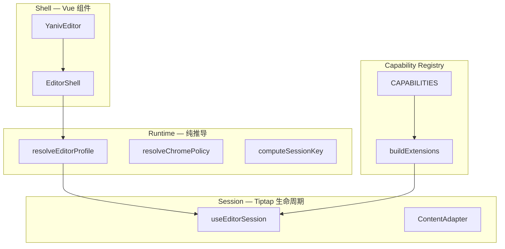

# 架构设计

本文档是 [`ARCHITECTURE.md`](https://github.com/YanivWang/yaniv-editor/blob/main/ARCHITECTURE.md) 的**阅读导读**。完整 normative 规范（伪代码、验收清单、历史迁移）见仓库根目录原文。

## 分层总览



| 层           | 职责                                   | 禁止                          |
| ------------ | -------------------------------------- | ----------------------------- |
| **Shell**    | 布局、slot、expose、BlockMenuHost      | 直接 initEditor、散落 watch   |
| **Runtime**  | props → profile / chromePolicy / gates | 操作 Tiptap 实例              |
| **Session**  | sessionKey 重建、phase、受控内容       | UI 显隐逻辑                   |
| **Registry** | 能力 → 扩展 + toolbar 映射             | import NodeView 自 components |

## 配置模型

四条轴合并为 `EditorRuntimeProfile`：

- **Phase** — `mode: edit | preview`
- **Preset** — `basic | full | notion` → 默认 features + layout
- **Appearance** — `appearance` + `colorMode`
- **Overrides** — `features`（显式 true/false；undefined 继承 preset）

`mergeFeatures` 是唯一合并入口。

## ChromePolicy {#chromepolicy}

`resolveChromePolicy(profile, layout, gates)` 决定 chrome 显隐。Shell **只读** policy，禁止模板内写 `mode === 'preview'`。

preview 时：`showEditChrome=false`，顶栏/底栏/块菜单/上下文条隐藏；扩展集合不变。

大纲展开状态由 `provideOutlinePanel` 持有，**不在** chromePolicy 中。初始状态由 `defaultOutlineExpanded` prop 控制（v0.1.1 起默认 `false`）。

## Session 与 sessionKey

**触发 rebuild**：extension gates、locale、inline toolbar 签名、Inline 的 `placeholder` / `extraExtensions`、schema 相关选项。

**不触发 rebuild**：phase、appearance、colorMode、upload/gallery/aiConfig、`defaultOutlineExpanded`、`zIndexBase` 等集成 props。

rebuild 流程：快照 content → destroy → loading skeleton → async buildExtensions → create Editor。

## Phase 切换 {#phase-切换}

统一入口 `requestPhaseTransition`：

- edit → preview：**先 emit 清理**，再 `setEditable(false)`
- preview → edit：**先** `setEditable(true)`，**再 emit**

`ContentAdapter` 用 raw transaction + `BYPASS_GUARD_META`，禁止 `commands.setContent`。

## Capability Registry

`src/capabilities/registry.ts` 是唯一能力真相源。`buildExtensions(host, ctx)` 同时服务 Full / Inline。

Extension tier：

| Tier          | 示例              | Phase 行为       |
| ------------- | ----------------- | ---------------- |
| core          | StarterKit, Link  | 始终             |
| content       | Image, Table, AI  | preview 仍展示   |
| interaction   | DragHandle, Slash | editable 守卫    |
| auxiliary     | SearchReplace     | phase 切换清状态 |
| chromeCoupled | Outline           | DOM late-binding |

## Provide 树

核心 context 挂在 **EditorShell 根**（preview 不会卸载）：

- `provideEditorRuntime`
- `provideYanivEditor`
- `provideEditorRoot` / `provideOverlayPortal`（z-index token 与浮层挂载）
- `provideEditorLocale`
- `provideBlockMenuHost`
- `provideOutlinePanel`

## Z-Index 与浮层

- z-index token 定义在 `.yaniv-editor`（`variables.css`），基准 `--ye-z-base` 默认 `1000`，由 `zIndexBase` prop 写入根节点。
- `EditorShell` 在根内渲染 `.yaniv-editor__overlay-portal`；bubble menu、BlockPicker、mention、AI popover、Tippy 等均挂载于此，**不**使用 `document.body`。
- 详见 [Z-Index 与浮层](../guide/z-index.md)。

## 架构不变量（摘要）

1. DOM 属性仅声明式绑定（`data-phase`、`data-color-mode`）
2. 仅 sessionKey 触发 rebuild
3. Chrome 显隐只读 chromePolicy
4. 每实例独立 locale / appearance
5. 扩展禁止全局 `t()`，走 `ctx.locale`
6. AI config 用 getter，configure 阶段不 capture 静态值
7. 浮层挂载 overlay portal，z-index 从编辑器根读取，禁止挂 `body` 或使用全局 z-index fallback

完整不变量见根目录 `ARCHITECTURE.md`。

## 目录结构

```
src/core/runtime/     profile, chrome, sessionKey
src/core/session/     useEditorSession, ContentAdapter
src/core/shell/       EditorShell, chrome 子组件
src/capabilities/     registry, buildExtensions
src/extensions/       Tiptap 扩展实现
src/components/       工具栏与 UI 控件
```

详见 [项目结构](./project-structure.md)。

## 测试

运行时纯函数与 Session 行为有 vitest 覆盖：`runtime.test.ts`、`contentAdapter.test.ts`、`useEditorSession.test.ts`。

运行：`pnpm test`
