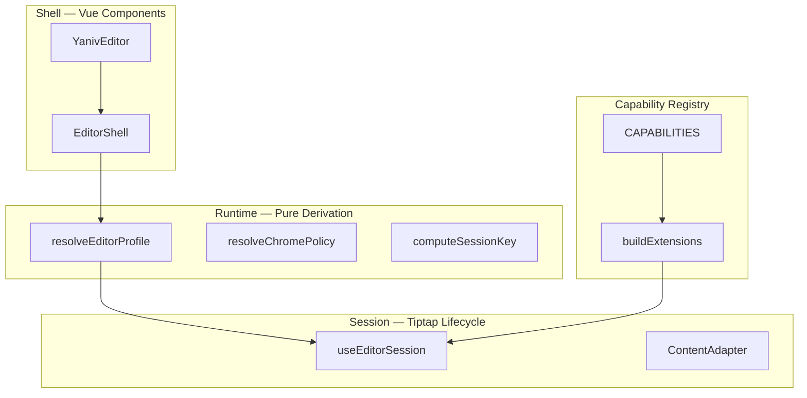

# Architecture

This page is a **reading guide** for [`ARCHITECTURE.md`](https://github.com/YanivWang/yaniv-editor/blob/main/ARCHITECTURE.md). The full normative spec (pseudocode, acceptance checklist, migration history) lives in the repository root.

## Layer Overview



| Layer        | Responsibility                                | Forbidden                            |
| ------------ | --------------------------------------------- | ------------------------------------ |
| **Shell**    | Layout, slots, expose, BlockMenuHost          | Direct initEditor, scattered watches |
| **Runtime**  | props → profile / chromePolicy / gates        | Operating Tiptap instances           |
| **Session**  | sessionKey rebuild, phase, controlled content | UI visibility logic                  |
| **Registry** | Capability → extension + toolbar mapping      | Import NodeView from components      |

## Configuration Model

Four axes merge into `EditorRuntimeProfile`:

- **Phase** — `mode: edit | preview`
- **Preset** — `basic | full | notion` → default features + layout
- **Appearance** — `appearance` + `colorMode`
- **Overrides** — `features` (explicit true/false; undefined inherits preset)

`mergeFeatures` is the single merge entry point.

## ChromePolicy {#chromepolicy}

`resolveChromePolicy(profile, layout, gates)` determines chrome visibility. Shell **reads** policy only—no `mode === 'preview'` checks in templates.

In preview: `showEditChrome=false`; header/footer/block menu/context bars hidden; extension set unchanged.

Outline expanded state is held by `provideOutlinePanel` and is **not** in chromePolicy. Initial state comes from the `defaultOutlineExpanded` prop (default `false` since v0.1.1).

## Session and sessionKey

**Triggers rebuild**: extension gates, locale, inline toolbar signature, Inline `placeholder` / `extraExtensions`, schema-related options.

**Does not trigger rebuild**: phase, appearance, colorMode, upload/gallery/aiConfig, `defaultOutlineExpanded`, `zIndexBase`, and other integration props.

Rebuild flow: snapshot content → destroy → loading skeleton → async buildExtensions → create Editor.

## Phase Transition {#phase-transition}

Unified entry `requestPhaseTransition`:

- edit → preview: **emit cleanup first**, then `setEditable(false)`
- preview → edit: **`setEditable(true)` first**, then emit

`ContentAdapter` uses raw transactions + `BYPASS_GUARD_META`; do not use `commands.setContent`.

## Capability Registry

`src/capabilities/registry.ts` is the single source of truth. `buildExtensions(host, ctx)` serves both Full and Inline.

Extension tiers:

| Tier          | Examples          | Phase behavior              |
| ------------- | ----------------- | --------------------------- |
| core          | StarterKit, Link  | always                      |
| content       | Image, Table, AI  | still shown in preview      |
| interaction   | DragHandle, Slash | editable guards             |
| auxiliary     | SearchReplace     | clear state on phase switch |
| chromeCoupled | Outline           | DOM late-binding            |

## Provide Tree

Core context is mounted at **EditorShell root** (not unmounted in preview):

- `provideEditorRuntime`
- `provideYanivEditor`
- `provideEditorRoot` / `provideOverlayPortal` (z-index tokens and overlay mounting)
- `provideEditorLocale`
- `provideBlockMenuHost`
- `provideOutlinePanel`

## Z-Index and Overlays

- Z-index tokens are scoped to `.yaniv-editor` (`variables.css`); base `--ye-z-base` defaults to `1000`, set via `zIndexBase` prop on the root.
- `EditorShell` renders `.yaniv-editor__overlay-portal` inside the root; bubble menus, BlockPicker, mention, AI popover, Tippy, etc. mount there—not on `document.body`.
- See [Z-Index & Overlays](../guide/z-index.md).

## Architecture Invariants (Summary)

1. DOM attributes are declarative bindings only (`data-phase`, `data-color-mode`)
2. Only sessionKey triggers rebuild
3. Chrome visibility reads chromePolicy only
4. Each instance has independent locale / appearance
5. Extensions must not call global `t()`—use `ctx.locale`
6. AI config uses getters; do not capture static values at configure time
7. Overlays mount to overlay portal; z-index reads from editor root—no `body` mount or global fallback

See root `ARCHITECTURE.md` for all invariants.

## Directory Structure

```
src/core/runtime/     profile, chrome, sessionKey
src/core/session/     useEditorSession, ContentAdapter
src/core/shell/       EditorShell, chrome subcomponents
src/capabilities/     registry, buildExtensions
src/extensions/       Tiptap extension implementations
src/components/       toolbar and UI controls
```

See [Project Structure](./project-structure.md) for details.

## Testing

Runtime pure functions and session behavior have vitest coverage: `runtime.test.ts`, `contentAdapter.test.ts`, `useEditorSession.test.ts`.

Run: `pnpm test`
